# Etch Platform - User Requirements Specification (URS)

**Document Version:** 2.7  
**Date:** December 2025  
**Status:** Aligned with PRD Tracker + Roadmap + Bug/Enhancement Trackers (201 features mapped)  
**Platform:** Mobile (iOS/Android) + Web Admin + Web View + Backend Services  
**App Type:** Local Tourism & Social Place Discovery  
**Developed by:** Technical Product Owner (Mixed Generation: Human + AI)  
**References:**
- PRD Tracker - 20251221.csv (Authoritative Client Feature List)
- PRD Tracker - 20251221 roadmap.csv (Phase/Sprint Planning)
- Bug_Enhancement Tracker - Bugs.csv (35 tracked bugs)
- Bug_Enhancement Tracker - Enhancements (Users).csv (52 user-requested features)
- Bug_Enhancement Tracker - Enhancements (Businesses).csv (6 B2B features)

---

## Table of Contents

1. [Introduction](#1-introduction)
   - 1.1 [Purpose](#11-purpose)
   - 1.2 [Scope](#12-scope)
   - 1.3 [Core Concepts](#13-core-concepts)
   - 1.4 [Definitions](#14-definitions)
   - 1.5 [Entity Lifecycle & Creation Rules](#15-entity-lifecycle--creation-rules)
2. [System Overview](#2-system-overview)
3. [User Roles & Personas](#3-user-roles--personas)
4. [Functional Requirements](#4-functional-requirements)
   - 4.1 [Authentication & Onboarding](#41-authentication--onboarding) *(UPDATED)*
   - 4.2 [User Profile Management](#42-user-profile-management)
   - 4.3 [List Management](#43-list-management) *(UPDATED - v2.5)*
   - 4.4 [Etch (Post) Management](#44-etch-post-management)
   - 4.5 [Place Management](#45-place-management) *(UPDATED - v2.5)*
   - 4.6 [Discovery & Search](#46-discovery--search)
   - 4.7 [Social Interactions](#47-social-interactions) *(UPDATED - v2.5)*
   - 4.8 [Messaging](#48-messaging) *(UPDATED - v2.5)*
   - 4.9 [Trip History](#49-trip-history)
   - 4.10 [Maps & Location](#410-maps--location) *(UPDATED - v2.5)*
   - 4.11 [Import & Extraction](#411-import--extraction) *(UPDATED)*
   - 4.12 [Notifications](#412-notifications) *(UPDATED)*
   - 4.13 [Admin Dashboard](#413-admin-dashboard)
   - 4.14 [Privacy & Visibility](#414-privacy--visibility) *(NEW - from Figma)*
   - 4.15 [Web View](#415-web-view) *(NEW - from Figma)*
   - 4.16 [User Settings & Preferences](#416-user-settings--preferences) *(NEW - v2.5)*
5. [UI/UX Design Requirements](#5-uiux-design-requirements)
6. [Non-Functional Requirements](#6-non-functional-requirements)
7. [Data Requirements](#7-data-requirements)
8. [Integration Requirements](#8-integration-requirements)
9. [User Stories](#9-user-stories)
10. [Acceptance Criteria](#10-acceptance-criteria)
11. [Appendices](#11-appendices)
    - 10.1 [Category Mapping](#101-category-mapping)
    - 10.2 [Import Types](#102-import-types)
    - 10.3 [Notification Types](#103-notification-types)
    - 10.4 [Client PRD Tracker Traceability Matrix](#104-client-prd-tracker-traceability-matrix) *(NEW)*
    - 10.5 [PRD Gap Summary](#105-prd-gap-summary) *(NEW)*
    - 10.6 [PRD Coverage Statistics](#106-prd-coverage-statistics) *(NEW)*
    - 10.7 [Roadmap Phase Mapping](#107-roadmap-phase-mapping) *(NEW)*
    - 10.8 [Bug/Enhancement Tracker Traceability](#108-bugenhancement-tracker-traceability) *(NEW - v2.5)*

---

## 1. Introduction

### 1.1 Purpose
This User Requirements Specification (URS) documents the functional and non-functional requirements for the Etch platform, derived from analysis of the implemented codebase. It serves as a reference for understanding what the system was designed to accomplish.

### 1.2 Scope
Etch is a **local tourism and social place discovery platform** that enables users to:
- **Create "Etches"** - social posts documenting place visits during activities
- **Discover and reuse Places** - a shared repository of locations that users can reference
- **Create curated Lists** - collections of places organized by theme or trip
- **Discover content** based on location, activities, and social connections
- **Import places** from external sources (Google Maps, images, text, URLs, videos)
- **Interact socially** through follows, saves, likes, comments, and direct messaging

### 1.3 Core Concepts

#### 1.3.1 The "Etch" - Core Content Unit
An **Etch** is the primary social content unit - similar to an Instagram post. It represents:
- A user's **visit to a place** during a specific **activity**
- Contains personal narrative, photos, tips, and recommendations
- Linked to a **Place** (the location) and optionally a **List** (collection)
- Appears in feeds, can be liked, commented on, and shared

#### 1.3.2 The "Place" - Reusable Location Entity
A **Place** is a shared, reusable location record:
- Created once, referenced by many Etches
- Contains objective data: name, address, coordinates, category, hours, ratings
- Enriched from Google Places API
- Identified by `googlePlaceId` for deduplication
- Users discover existing places before creating new ones

#### 1.3.3 The "List" - Curated Collection
A **List** is a thematic collection of places:
- Groups related places (e.g., "Best Coffee in NYC", "Paris Trip 2024")
- Can represent a trip itinerary or recommendation guide
- Has its own engagement (saves, likes, comments)

### 1.4 Definitions

| Term | Definition |
|------|------------|
| **Etch** | A social post documenting a user's visit to a place during an activity (the core content unit) |
| **Place** | A reusable location entity with objective data (name, address, coordinates, category) |
| **List** | A curated collection of places created by a user |
| **Activity** | The context of a place visit (dining, shopping, sightseeing, nightlife, etc.) |
| **Save** | Bookmarking content for future reference |
| **Like** | Expressing appreciation for an Etch or List |
| **Follow** | Subscribing to a user's content |
| **Import** | Process of extracting places from external sources |
| **Region** | A geographic grouping of countries for content organization |
| **Trip** | A collection of Etches representing a travel journey (timeline view) |

### 1.4.1 Entity Relationship Diagram


### 1.4.2 Core Data Flow

```mermaid
flowchart LR
    subgraph UserActions["👤 User Actions"]
        A[Visit Place] --> B[Create Etch]
        B --> C[Add to List]
        C --> D[Auto-group to Trip]
    end
    
    subgraph ContentTypes["📦 Content Types"]
        E[Place<br/>Reusable Location]
        F[Etch<br/>Visit Post]
        G[List<br/>Collection]
        H[Trip<br/>Journey Timeline]
    end
    
    subgraph Social["💬 Social Layer"]
        I[Likes]
        J[Comments]
        K[Saves]
        L[Shares]
    end
    
    B --> E
    B --> F
    C --> G
    D --> H
    
    F --> I
    F --> J
    G --> K
    G --> L
```



---

## 1.5 Entity Lifecycle & Creation Rules

### 1.5.1 Place Lifecycle


**Place Discovery & Creation Flow:**


**Place Creation Rules:**
| Actor | Can Create Place? | Method | Notes |
|-------|:-----------------:|--------|-------|
| Any User | ✅ Yes | Search + Select | Primary method - reuse existing |
| Any User | ✅ Yes | Manual Entry | When place doesn't exist |
| System | ✅ Yes | Import Process | From Google Maps, images, text, URLs |
| Admin | ✅ Yes | Direct Creation | For data cleanup/corrections |

**Place States:**
| State | Description | Transitions |
|-------|-------------|-------------|
| `draft` | Incomplete data, not yet enriched | → `active` after enrichment |
| `active` | Full data, available for use | → `merged` if duplicate found |
| `merged` | Duplicate, redirects to canonical place | Terminal state |
| `archived` | Soft-deleted, not shown in search | → `active` if restored |

### 1.5.2 Etch Lifecycle


**Etch Creation Flow (Instagram-like):**

```mermaid
flowchart TB
    Start([Tap + Button]) --> SelectPlace
    
    subgraph PlaceSelection["1️⃣ Select Place"]
        SelectPlace[Search for Place]
        SelectPlace --> SavedPlaces{Saved Places?}
        SavedPlaces --> |Show First| PickSaved[Select from Saved]
        SavedPlaces --> |Search| SearchNew[Search New Place]
        SearchNew --> CreateNew[Create if not found]
        PickSaved --> PlaceSelected
        SearchNew --> PlaceSelected
        CreateNew --> PlaceSelected
        PlaceSelected([Place Selected ✓])
    end
    
    PlaceSelected --> ChooseActivity
    
    subgraph ActivitySelection["2️⃣ Choose Activity"]
        ChooseActivity[Select Activity Type]
        ChooseActivity --> Dining[🍽️ Dining]
        ChooseActivity --> Shopping[🛒 Shopping]
        ChooseActivity --> Sightseeing[📸 Sightseeing]
        ChooseActivity --> Nightlife[🎉 Nightlife]
        ChooseActivity --> Other[📍 Other...]
        Dining & Shopping & Sightseeing & Nightlife & Other --> ActivitySelected([Activity Selected ✓])
    end
    
    ActivitySelected --> AddContent
    
    subgraph ContentCreation["3️⃣ Add Content"]
        AddContent[Add Photos]
        AddContent --> Camera[📷 Take Photo]
        AddContent --> Gallery[🖼️ From Gallery]
        Camera & Gallery --> Photos([Photos Added ✓])
        Photos --> Caption[Write Caption]
        Caption --> Tips[Add Tips/Notes]
    end
    
    Tips --> OptionalList
    
    subgraph Optional["4️⃣ Optional"]
        OptionalList{Add to List?}
        OptionalList --> |Yes| SelectList[Select List]
        OptionalList --> |No| SkipList[Skip]
        SelectList --> Ready
        SkipList --> Ready
    end
    
    Ready --> Preview[Preview Etch]
    Preview --> Publish([🚀 Publish])
    
    style Publish fill:#4CAF50,color:#fff
```



**Etch Creation Rules:**
| Actor | Can Create Etch? | Requirements |
|-------|:----------------:|-------------|
| Registered User | ✅ Yes | Must link to a Place |
| Pseudo-Anonymous | ❌ No | Must complete profile |
| Admin | ✅ Yes | For testing/moderation |

**Etch vs Place Relationship:**


### 1.5.3 List Lifecycle

**List Creation Rules:**
| Actor | Can Create List? | Method |
|-------|:----------------:|--------|
| Registered User | ✅ Yes | Manual creation |
| Registered User | ✅ Yes | From Import |
| System | ✅ Yes | Auto-generated from trips |

**List Composition:**
- Lists contain **Places** (not Etches directly)
- Lists can have associated **Etches** (user's visits to places in the list)
- Lists aggregate engagement from contained Places

### 1.5.4 Trip Lifecycle

**Trip** = A chronological collection of Etches from a journey

```mermaid
flowchart TB
    subgraph Trip["🗺️ Trip: Paris Summer 2024"]
        direction TB
        
        subgraph Day1["📅 Day 1 - June 15"]
            E1["☕ Café de Flore<br/><i>Breakfast</i>"]
            E2["🏛️ Louvre Museum<br/><i>Sightseeing</i>"]
            E3["🍽️ Le Comptoir<br/><i>Dinner</i>"]
        end
        
        subgraph Day2["📅 Day 2 - June 16"]
            E4["🛒 Le Marais<br/><i>Shopping</i>"]
            E5["📸 Pont des Arts<br/><i>Walking</i>"]
            E6["🎉 Jazz Club<br/><i>Nightlife</i>"]
        end
        
        subgraph Day3["📅 Day 3 - June 17"]
            E7["✈️ CDG Airport<br/><i>Travel</i>"]
        end
        
        E1 --> E2 --> E3
        E3 -.-> E4
        E4 --> E5 --> E6
        E6 -.-> E7
    end
    
    style Trip fill:#E8F5E9
    style Day1 fill:#BBDEFB
    style Day2 fill:#BBDEFB
    style Day3 fill:#BBDEFB
```



**Trip Auto-Generation Flow:**


**Trip Features:**
- Auto-generated from Etches based on date/location clustering
- Timeline view like Instagram Stories highlights
- Each Etch in trip can receive comments
- Shareable as a complete travel story

---

## 2. System Overview

### 2.1 System Components

```
┌─────────────────────────────────────────────────────────────────┐
│                         ETCH PLATFORM                           │
├─────────────────────────────────────────────────────────────────┤
│                                                                 │
│  ┌──────────────┐    ┌──────────────┐    ┌──────────────┐     │
│  │  Mobile App  │    │  Web Admin   │    │   Backend    │     │
│  │  (iOS/And)   │    │  Dashboard   │    │   Services   │     │
│  └──────┬───────┘    └──────┬───────┘    └──────┬───────┘     │
│         │                   │                   │              │
│         └───────────────────┴───────────────────┘              │
│                             │                                  │
│  ┌──────────────────────────┴──────────────────────────────┐  │
│  │                    FIREBASE BACKEND                      │  │
│  │  ┌────────────┐  ┌──────────┐  ┌────────────┐          │  │
│  │  │ Firestore  │  │   Auth   │  │  Storage   │          │  │
│  │  │  Database  │  │          │  │            │          │  │
│  │  └────────────┘  └──────────┘  └────────────┘          │  │
│  └─────────────────────────────────────────────────────────┘  │
│                                                                 │
│  ┌─────────────────────────────────────────────────────────┐  │
│  │                 EXTERNAL INTEGRATIONS                    │  │
│  │  ┌────────────┐  ┌──────────┐  ┌────────────┐          │  │
│  │  │  Google    │  │  OpenAI  │  │   Expo     │          │  │
│  │  │  Places    │  │  GPT-4/5 │  │   Push     │          │  │
│  │  └────────────┘  └──────────┘  └────────────┘          │  │
│  └─────────────────────────────────────────────────────────┘  │
│                                                                 │
└─────────────────────────────────────────────────────────────────┘
```

### 2.4 Platform Distribution

| Platform | Purpose | Primary Users |
|----------|---------|---------------|
| Mobile App | Consumer experience | End users |
| Web Admin | Content & user management | Administrators |
| Backend API | Data processing & integrations | System internal |

---

## 3. User Roles & Personas

### 3.0 User Roles Overview

```mermaid
mindmap
  root((👥 User Roles))
    👤 End User
      Create Etches
      Manage Lists
      Discover Places
      Social Interactions
      Import Content
    🌟 Influencer
      All End User features
      Higher visibility
      Verified badge
      Analytics access
    🔧 Admin
      User Management
      Import Monitoring
      Region Configuration
      System Controls
    🤖 System
      Background Processing
      Auto-enrichment
      Notifications
      Trip Generation
```



### 3.1 End User (Mobile App)

**Description:** General consumer using the mobile application to discover and share places.

**Capabilities:**
- Create account and manage profile
- Create, edit, and delete lists
- Add places to lists
- Discover lists and places
- Follow other users
- Save/like/comment on lists
- Send direct messages
- Import places from external sources

### 3.2 Influencer/Creator

**Description:** High-engagement user who creates popular content.

**Additional Capabilities:**
- Marked with `isInfluencer` flag
- Higher visibility in recommendations
- Imported user profiles from external platforms

### 3.3 Administrator (Web Dashboard)

**Description:** Internal team member managing the platform.

**Capabilities:**
- Monitor import processing status
- Manage user accounts (CRUD)
- Create Firebase Auth accounts for imported users
- Manage region configurations
- Send test push notifications
- View system activity logs
- Control background pollers

### 3.4 System (Automated)

**Description:** Background processes that operate without user intervention.

**Functions:**
- Import request processing
- Push notification delivery
- Data enrichment from Google Places API

---

## 4. Functional Requirements

### Phase Classification Overview

All functional requirements are classified into phases based on the PRD Tracker Roadmap. This enables prioritized implementation and sprint planning.

| Phase | Name | Goal | Key Areas |
|-------|------|------|-----------|
| **Phase 1** | Creator Activation | Creators can easily signup and create OR import quality lists | Auth, Import, List CRUD |
| **Phase 2** | Consumer Discovery | Users can discover quality lists and places | Homepage, Search, Place Details |
| **Phase 3** | Social & Engagement | Users can interact, follow, and engage | Follow, Like, Save, Comments, DM |
| **Phase 4** | Privacy & Advanced | User control and advanced functionality | Privacy, Web View, Admin |
| **Phase 5** | B2B & Monetization | Business features and revenue | Ads, Business Profiles, Offers |

**Phase Distribution Summary:**


**Phase Tags Used:**
- 🟢 **Phase 1** - Creator Activation (MVP Core)
- 🔵 **Phase 2** - Consumer Discovery
- 🟣 **Phase 3** - Social & Engagement
- 🟠 **Phase 4** - Privacy & Advanced Features
- 🔴 **Phase 5** - B2B & Monetization (Future)
- ⚪ **Core** - Foundation requirements (all phases)

---

### 4.1 Authentication & User Management

**Authentication Flow Overview:**


**Onboarding Sequence:**


#### FR-AUTH-001: Email/Password Registration
**Priority:** High | **Phase:** 🟢 Phase 1 - Creator Activation  
**Description:** Users shall be able to create an account using email and password.

**Requirements:**
- Multi-step registration flow: Email → Password → Birthday → Profile Setup
- Email format validation
- Password strength requirements (minimum 6 characters)
- Birthday collection for age verification
- **Username auto-generated** (NOT asked during onboarding)
- Users can edit username later in Profile Settings
- Profile image upload (optional)
- Display name entry (optional, can use auto-generated)

**Onboarding Flow (from Figma):**
1. Welcome/Splash screen
2. Email entry + validation
3. Password creation
4. Birthday selection
5. Profile photo (optional, can skip)
6. Home screen (username auto-assigned)

**Welcome Email (from Figma):**
- Sent after successful registration
- Confirms email verification
- Highlights 1–2 key value props (e.g., "Save places you love," "Discover curated local lists")
- Includes deep link back into the app (to home or first-list creation)

#### FR-AUTH-002: Email/Password Sign In
**Priority:** High | **Phase:** 🟢 Phase 1 - Creator Activation  
**Description:** Users shall be able to sign in with existing credentials.

**Requirements:**
- Email and password validation
- Error messaging for invalid credentials
- Session persistence across app restarts
- Automatic session refresh

#### FR-AUTH-003: Password Reset
**Priority:** High | **Phase:** 🟢 Phase 1 - Creator Activation  
**Description:** Users shall be able to reset forgotten passwords.

**Requirements:**
- Firebase Auth password reset email
- Email validation before sending

#### FR-AUTH-004: Social Authentication (Planned)
**Priority:** Medium | **Phase:** 🟢 Phase 1 - Creator Activation  
**Status:** Partially Implemented

**Requirements:**
- Google OAuth integration
- Facebook OAuth integration
- TikTok OAuth integration (not started)
- Account linking for existing users

#### FR-AUTH-005: Pseudo-Anonymous Mode
**Priority:** Low | **Phase:** 🟠 Phase 4 - Privacy & Advanced  
**Description:** Users can use the app without providing personal information.

**Requirements:**
- Auto-generated username
- `isPseudoAnonymous` flag set to true
- Limited social features

#### FR-AUTH-006: Session Management
**Priority:** High | **Phase:** ⚪ Core (All Phases)  
**Description:** System shall maintain user session state.

**Requirements:**
- Firebase Auth state listener
- Automatic token refresh
- Logout functionality clearing all state
- Session storage in Redux persist
- **Sign-out splash/confirmation screen** before logout completes

#### FR-AUTH-007: Customer Support Access
**Priority:** Medium | **Phase:** ⚪ Core (All Phases)  
**Description:** Users shall be able to access customer support from within the app.

**Requirements:**
- WhatsApp integration for customer support
- Accessible from Settings screen
- Deep link to WhatsApp with pre-filled support message
- Fallback to email support if WhatsApp unavailable

#### FR-AUTH-008: Social Graph Seeding
**Priority:** Medium | **Phase:** 🟣 Phase 3 - Social & Engagement  
**Status:** Not Started (from Figma)  
**Description:** System shall help new users build an initial social graph during onboarding.

**Requirements:**
- Suggest accounts to follow during onboarding:
  - Recommended users (featured creators, editorial accounts, local tastemakers)
  - Popular lists in user's selected city
- Contact linking (with explicit consent):
  - "Find friends on etch" via phone contacts or email
  - Show which contacts are already on etch with quick follow buttons
- Invite Friends step:
  - Share link or deep link via WhatsApp, iMessage, email
  - Potential: Incentives (badges or early-access features)


#### FR-AUTH-009: First-Time Tutorials & Empty States
**Priority:** Low | **Phase:** 🟢 Phase 1 - Creator Activation  
**Status:** Not Started (from Figma)  
**Description:** System shall provide guidance for new users.

**Lightweight Tutorial Options:**
| Option | Description |
|--------|-------------|
| Option 1 | 3–4 skippable swipeable screens explaining: Create lists, Save/rate places, Follow people |
| Option 2 | In-context tooltips on first view of key screens (Home, List, Place, Profile) |

**Empty-State Designs:**
| State | Message/Action |
|-------|----------------|
| Empty profile | Explain how to add lists and why it matters |
| Empty list | Show how to search/add places |
| Empty feed | Suggest following accounts or exploring curated lists |
| Re-access | "View tutorial again" in Settings |

#### FR-AUTH-010: First-Time Experience Activation
**Priority:** Medium | **Phase:** 🟢 Phase 1 - Creator Activation  
**Status:** In Progress (from Figma)  
**Description:** After profile setup, direct users into a clear first action.

**Options Presented:**
| Option | Action |
|--------|--------|
| Option A | "Explore popular lists near you" (based on city or device location) |
| Option B | "Import a List" (from Google Maps, Social Media) |
| Option C | "Skip for now" |

---

### 4.2 User Profile Management

#### FR-PROFILE-001: View Own Profile
**Priority:** High | **Phase:** 🔵 Phase 2 - Consumer Discovery  
**Description:** Users shall be able to view their own profile.

**Requirements:**
- Display name, username, bio
- Profile image display
- Social links (TikTok, Instagram, YouTube, Website)
- Follower/following counts
- User's public lists
- Saved lists section

#### FR-PROFILE-002: View Other Profiles
**Priority:** High | **Phase:** 🔵 Phase 2 - Consumer Discovery  
**Description:** Users shall be able to view other users' profiles.

**Requirements:**
- Public profile information display
- Follow/unfollow button
- User's public lists only
- Message button (if not own profile)

#### FR-PROFILE-003: Edit Profile
**Priority:** High | **Phase:** 🟢 Phase 1 - Creator Activation  
**Description:** Users shall be able to edit their profile information.

**Requirements:**
- Editable fields: display name, username, bio
- Profile image upload to Firebase Storage
- Social links management
- Real-time preview of changes

#### FR-PROFILE-004: Profile Image Management
**Priority:** Medium | **Phase:** 🟢 Phase 1 - Creator Activation  
**Description:** Users shall be able to upload and manage profile images.

**Requirements:**
- Image picker integration
- Image upload to Firebase Storage
- Automatic URL generation
- Fallback avatar for users without image

#### FR-PROFILE-005: Mutual Connections Display *(NEW - from PRD Gap)*
**Priority:** Medium | **Phase:** 🟣 Phase 3 - Social & Engagement  
**Status:** Not Started  
**PRD Reference:** PR-06  
**Description:** Profiles shall display mutual connections with the viewing user.

**Requirements:**
- Show "X mutual followers" on profile header
- Tappable to view list of mutual connections
- Mutual connections highlighted in follower/following lists
- Used in profile suggestions algorithm

**Mutual Connection UI:**
```
┌─────────────────────────────────────┐
│  @sarah_travels                      │
│  Sarah Johnson                       │
│                                      │
│  👥 12 mutual connections           │
│  Followed by @mike, @jane + 10 more │
│                                      │
│  [Follow]  [Message]                │
└─────────────────────────────────────┘
```

#### FR-PROFILE-006: Primary City Display *(NEW - from PRD Gap)*
**Priority:** Low | **Phase:** 🔵 Phase 2 - Consumer Discovery  
**Status:** Not Started  
**PRD Reference:** PR-07  
**Description:** Profiles shall display the user's primary city.

**Requirements:**
- Auto-detect from most frequent list/place locations
- Manual override in profile settings
- Display on profile header with flag/icon
- Used for location-based discovery
- Privacy: Can be hidden in private profiles

**Primary City Sources:**
| Source | Priority |
|--------|----------|
| Manual Selection | Highest |
| Most Recent List Location | Medium |
| Device Location (with consent) | Low |
| Most Frequent Place City | Fallback |

#### FR-PROFILE-007: Share Profile *(NEW - from PRD Gap)*
**Priority:** Medium | **Phase:** 🟣 Phase 3 - Social & Engagement  
**Status:** Not Started  
**PRD References:** PR-15, PR-16  
**Description:** Users shall be able to share their profile externally.

**Requirements:**
- Share button on own profile
- Native share sheet (iOS/Android)
- Copy profile URL option
- Generate shareable profile link: `etch.app/@username`
- Deep link opens profile in app or web
- QR code generation for profile (optional)

**Share Profile UI:**
```
┌─────────────────────────────────────┐
│  📤 Share Profile                    │
│                                      │
│  etch.app/@sarah_travels            │
│                                      │
│  [📋 Copy Link]                     │
│  [📱 Share via...]                  │
│  [📷 Show QR Code]                  │
└─────────────────────────────────────┘
```

#### FR-PROFILE-008: List Sort & Filter on Profile *(NEW - from PRD Gap)*
**Priority:** Medium | **Phase:** 🔵 Phase 2 - Consumer Discovery  
**Status:** Not Started  
**PRD Reference:** PR-17  
**Description:** Users shall be able to sort and filter lists on profile pages.

**Requirements:**
- Sort options: Recent, Alphabetical, Most Saved, Most Viewed
- Filter by visibility (Public, Private, All) for own profile
- Filter by city/region
- Persistent preference for sort order
- Grid/List view toggle

**Sort/Filter UI:**
```
┌─────────────────────────────────────┐
│  My Lists (24)                       │
│  [Sort: Recent ▼] [Filter ▼] [≡/□] │
├─────────────────────────────────────┤
│  Sort by:                           │
│  ● Most Recent                      │
│  ○ Alphabetical (A-Z)               │
│  ○ Most Saved                       │
│  ○ Most Viewed                      │
├─────────────────────────────────────┤
│  Filter by:                         │
│  ☑️ Public  ☑️ Private              │
│  City: [Any ▼]                      │
└─────────────────────────────────────┘
```

#### FR-PROFILE-009: Places Tab on Profile *(NEW - from PRD Gap)*
**Priority:** Medium | **Phase:** 🔵 Phase 2 - Consumer Discovery  
**Status:** Not Started  
**PRD Reference:** PR-20  
**Description:** Profiles shall have a dedicated "Places" tab showing all places the user has added.

**Requirements:**
- Tab alongside "Lists" and "Saved"
- Shows all unique places across user's lists
- Place cards with category, rating, list count
- Sort: Most Added, Rating, Recent
- Filter by category
- Map view option

**Places Tab UI:**
```
┌─────────────────────────────────────┐
│  [Lists (24)] [Places (87)] [Saved] │
├─────────────────────────────────────┤
│  📍 Blue Bottle Coffee              │
│     ☕ Cafe • ⭐ 4.5 • In 3 lists   │
│  📍 Ichiran Ramen                   │
│     🍜 Restaurant • ⭐ 4.8 • 5 lists│
│  📍 Central Park                    │
│     🌲 Nature • In 2 lists          │
└─────────────────────────────────────┘
```

#### FR-PROFILE-010: Places View Modes *(NEW - from PRD Gap)*
**Priority:** Low | **Phase:** 🔵 Phase 2 - Consumer Discovery  
**Status:** Not Started  
**PRD Reference:** PR-21  
**Description:** Places tab shall support multiple view modes.

**View Modes:**
| Mode | Description |
|------|-------------|
| List | Vertical scrolling cards (default) |
| Grid | Photo grid (3 columns) |
| Map | All places on map with clusters |

**Requirements:**
- Toggle between view modes
- Map shows all places with custom markers
- Tap marker to see place card
- Cluster markers when zoomed out
- Remember view preference

---

### 4.3 List Management

#### FR-LIST-001: Create List
**Priority:** High | **Phase:** 🟢 Phase 1 - Creator Activation  
**Description:** Users shall be able to create new lists.

**Requirements:**
- Title (required, max 100 characters)
- Description (optional, max 500 characters)
- Visibility toggle (public/private)
- Cover image (auto-generated or custom)
- Automatic share URL generation
- Location extraction from places (city, country, geohash)

#### FR-LIST-002: Edit List
**Priority:** High | **Phase:** 🟢 Phase 1 - Creator Activation  
**Description:** Users shall be able to edit existing lists.

**Requirements:**
- Edit all fields (title, description, visibility)
- Update cover image
- Modify places (add/remove/reorder)
- Changes reflected immediately

#### FR-LIST-003: Delete List
**Priority:** High | **Phase:** 🟢 Phase 1 - Creator Activation  
**Description:** Users shall be able to delete their lists.

**Requirements:**
- Confirmation dialog
- Cascade delete of comments
- Update place reference counts
- Remove from saves/likes

#### FR-LIST-004: Add Places to List
**Priority:** High | **Phase:** 🟢 Phase 1 - Creator Activation  
**Description:** Users shall be able to add places to their lists.

**Requirements:**
- Search places via Google Places API
- Manual place entry
- Duplicate detection by placeId
- Automatic place enrichment (photos, hours, ratings)
- Update list location metadata

#### FR-LIST-005: Remove Places from List
**Priority:** High | **Phase:** 🟢 Phase 1 - Creator Activation  
**Description:** Users shall be able to remove places from their lists.

**Requirements:**
- Individual place removal
- Update list metadata after removal
- Update place reference counts

#### FR-LIST-006: List Visibility Control
**Priority:** High | **Phase:** 🟠 Phase 4 - Privacy & Advanced  
**Description:** Users shall be able to control list visibility.

**Requirements:**
- Public: visible to all users, appears in search/discovery
- Private: visible only to owner
- Toggle between states at any time

#### FR-LIST-007: List Cover Image
**Priority:** Medium | **Phase:** 🟢 Phase 1 - Creator Activation  
**Description:** Lists shall have visual representation.

**Requirements:**
- Auto-generation from first place with image
- Custom image upload option
- Fallback placeholder for lists without images
- Image source tracking (google-places, user-upload)

#### FR-LIST-008: Collaborative Lists *(NEW - from Enhancement Tracker)*
**Priority:** High | **Phase:** 🟣 Phase 3 - Social & Engagement  
**Status:** Not Started  
**Enhancement Tracker IDs:** 104, 119  
**Description:** Users shall be able to collaborate on lists with others.

**Requirements:**
- Invite collaborators to a list by username or share link
- Collaborators can add/remove places
- List owner retains admin rights (can remove collaborators)
- Visual indicator showing list is collaborative
- Activity log showing who added/removed places
- Notifications when collaborators make changes

**Permission Levels:**
| Role | Can View | Can Add/Remove Places | Can Edit Details | Can Delete List | Can Remove Collaborators |
|------|----------|----------------------|------------------|-----------------|-------------------------|
| Owner | ✅ | ✅ | ✅ | ✅ | ✅ |
| Collaborator | ✅ | ✅ | ❌ | ❌ | ❌ |
| Viewer (Public) | ✅ | ❌ | ❌ | ❌ | ❌ |

#### FR-LIST-009: Itinerary View *(NEW - from Enhancement Tracker)*
**Priority:** Medium | **Phase:** 🔵 Phase 2 - Consumer Discovery  
**Status:** Not Started  
**Enhancement Tracker ID:** 113  
**Description:** Lists shall support day-by-day itinerary organization for trip planning.

**Requirements:**
- Toggle between standard list view and itinerary view
- Organize places into day groups (Day 1, Day 2, etc.)
- Set dates for itinerary (start date, end date)
- Reorder places within days
- Auto-suggest optimal ordering based on location proximity
- Export itinerary to calendar (optional future enhancement)

**Itinerary UI Layout:**
```
┌─────────────────────────────────────┐
│  📅 Trip to Tokyo                    │
│  Jan 15 - Jan 20, 2025              │
├─────────────────────────────────────┤
│  Day 1 - Monday, Jan 15             │
│  ├─ 🍜 Ichiran Ramen               │
│  ├─ 🏯 Senso-ji Temple             │
│  └─ 🛍️ Nakamise Shopping           │
├─────────────────────────────────────┤
│  Day 2 - Tuesday, Jan 16            │
│  ├─ 🎿 Shibuya Crossing            │
│  └─ 🎮 Akihabara District          │
└─────────────────────────────────────┘
```

#### FR-LIST-010: Search Within List *(NEW - from Enhancement Tracker)*
**Priority:** High | **Phase:** 🔵 Phase 2 - Consumer Discovery  
**Status:** Not Started  
**Enhancement Tracker ID:** 151  
**Description:** Users shall be able to search for places within their own lists.

**Requirements:**
- Search bar on list detail view
- Search by place name, category, or notes
- Real-time filtering as user types
- Highlight matching results
- "No results" empty state
- Clear search to restore full list

#### FR-LIST-011: Preview Place Before Adding *(NEW - from Enhancement Tracker)*
**Priority:** Medium | **Phase:** 🔵 Phase 2 - Consumer Discovery  
**Status:** Not Started  
**Enhancement Tracker ID:** 134  
**Description:** Users shall see a preview of place details before adding to a list.

**Requirements:**
- Preview modal/sheet when selecting a place to add
- Shows: place name, photo, rating, category, address
- Confirm or cancel adding to list
- Option to view full place details from preview
- Prevents accidental additions

#### FR-LIST-012: Drag-to-Reorder Places *(NEW - from PRD Gap)*
**Priority:** Medium | **Phase:** 🟢 Phase 1 - Creator Activation  
**Status:** Not Started  
**PRD Reference:** LI-13  
**Description:** Users shall be able to reorder places within a list using drag-and-drop.

**Requirements:**
- Edit mode with drag handles on place cards
- Drag-and-drop to reorder
- Visual feedback during drag (elevation, opacity)
- Auto-scroll when dragging near edges
- Save order on confirmation
- Revert option (undo)

**Reorder UI:**
```
┌─────────────────────────────────────┐
│  Edit List Order                     │
│  [Done]                  [Cancel]    │
├─────────────────────────────────────┤
│  ≡ 1. Blue Bottle Coffee    🗑️      │
│  ≡ 2. Ichiran Ramen         🗑️      │
│  ≡ 3. Central Park          🗑️      │
│  ≡ 4. MoMA                  🗑️      │
│                                      │
│  Drag ≡ to reorder                  │
└─────────────────────────────────────┘
```

#### FR-LIST-013: Draft/Publish Workflow *(NEW - from PRD Gap)*
**Priority:** Low | **Phase:** 🟢 Phase 1 - Creator Activation  
**Status:** Not Started  
**PRD Reference:** LI-14  
**Description:** Lists shall support a draft state before publishing.

**Requirements:**
- Save list as draft (not visible to others)
- Draft indicator on list card
- "Publish" action to make public
- Auto-save drafts periodically
- Draft count shown in profile
- Drafts accessible from profile "Drafts" section

**List States:**
| State | Visibility | Actions |
|-------|------------|---------|
| Draft | Owner only | Edit, Publish, Delete |
| Published (Private) | Owner only | Edit, Make Public, Delete |
| Published (Public) | Everyone | Edit, Make Private, Delete |

**Draft Workflow:**
```
┌─────────────────────────────────────┐
│  📋 New List                         │
│  "Trip to Tokyo"                     │
├─────────────────────────────────────┤
│  Places: 5 added                    │
│  Status: 📝 Draft                    │
│                                      │
│  [💾 Save Draft]                    │
│  [📤 Publish Now]                   │
│  [👁️ Preview]                       │
└─────────────────────────────────────┘
```

---

### 4.4 Etch (Post) Management

#### FR-ETCH-001: Create Etch
**Priority:** High | **Phase:** 🟣 Phase 3 - Social & Engagement  
**Description:** Users shall be able to create an Etch (post) documenting a place visit.

**Requirements:**
- Select or create a Place (required)
- Choose Activity type (dining, shopping, sightseeing, nightlife, etc.)
- Add photos from visit (camera or gallery)
- Write caption/narrative (optional)
- Add tips or recommendations (optional)
- Tag other users (optional)
- Add to existing List (optional)
- Set visibility (public/private)

**Creation Flow (Instagram-like):**
1. Tap "+" or "Create Etch" button
2. Search for Place (shows saved places first, then nearby)
3. Select existing Place OR create new
4. Choose Activity category
5. Add photos (multi-select)
6. Write caption
7. Preview and Publish

#### FR-ETCH-002: Etch Feed Display
**Priority:** High | **Phase:** 🟣 Phase 3 - Social & Engagement  
**Description:** Etches shall appear in the home feed as the primary content.

**Requirements:**
- Instagram-like card layout
- User avatar + username at top
- Place name and category
- Photo(s) with swipe for multiple
- Caption text
- Engagement buttons (like, comment, save, share)
- Timestamp and location indicator

#### FR-ETCH-003: Etch Detail View
**Priority:** High | **Phase:** 🟣 Phase 3 - Social & Engagement  
**Description:** Users shall be able to view full Etch details.

**Requirements:**
- Full photo gallery
- Complete caption
- Place information card (tap to view place)
- Comments section
- Related Etches at same Place
- Map showing location

#### FR-ETCH-004: Edit Etch
**Priority:** Medium | **Phase:** 🟣 Phase 3 - Social & Engagement  
**Description:** Users shall be able to edit their Etches.

**Requirements:**
- Edit caption and tips
- Add/remove photos
- Change visibility
- Cannot change linked Place after publish

#### FR-ETCH-005: Delete Etch
**Priority:** Medium | **Phase:** 🟣 Phase 3 - Social & Engagement  
**Description:** Users shall be able to delete their Etches.

**Requirements:**
- Confirmation dialog
- Cascade delete comments
- Update engagement counts

#### FR-ETCH-006: Etch Activities/Categories
**Priority:** High | **Phase:** 🟣 Phase 3 - Social & Engagement  
**Description:** Etches shall be categorized by activity type.

**Activity Types:**
| Activity | Icon | Description |
|----------|------|-------------|
| Dining | 🍽️ | Restaurant, cafe, food experience |
| Shopping | 🛒 | Retail, markets, boutiques |
| Sightseeing | 📸 | Tourist attractions, landmarks |
| Nightlife | 🎉 | Bars, clubs, evening entertainment |
| Nature | 🌲 | Parks, hiking, outdoor activities |
| Culture | 🏛️ | Museums, galleries, theaters |
| Wellness | 💆 | Spa, gym, health activities |
| Stay | 🏨 | Hotels, accommodations |
| Transit | ✈️ | Airports, stations, travel |
| Other | 📍 | Miscellaneous activities |

---

### 4.5 Place Management

#### FR-PLACE-001: Place Data Structure
**Priority:** High | **Phase:** 🔵 Phase 2 - Consumer Discovery  
**Description:** Places shall contain comprehensive location data.

**Required Fields:**
- Name
- Address (formatted and components)
- Coordinates (latitude, longitude)
- Geohash for geo-queries

**Optional Fields:**
- Category (restaurant, cafe, shopping, etc.)
- Rating and review count
- Images (array)
- Opening hours
- Phone number
- Website URL
- Google Place ID

#### FR-PLACE-002: Place Enrichment
**Priority:** High | **Phase:** 🔵 Phase 2 - Consumer Discovery  
**Description:** Places shall be automatically enriched from Google Places API.

**Requirements:**
- Automatic lookup by name + location hint
- Photo retrieval and caching
- Opening hours synchronization
- Rating/review data
- 300ms rate limiting between API calls

#### FR-PLACE-003: Place Categories
**Priority:** Medium | **Phase:** 🔵 Phase 2 - Consumer Discovery  
**Description:** Places shall be categorized for filtering.

**Supported Categories:**
- Restaurant
- Cafe
- Shopping
- Entertainment/Attractions
- Nature
- Hotel
- Museum
- Nightlife
- Other

#### FR-PLACE-004: Place Detail View
**Priority:** High | **Phase:** 🔵 Phase 2 - Consumer Discovery  
**Description:** Users shall be able to view detailed place information.

**Requirements:**
- Full place data display
- Photo gallery
- Opening hours (formatted)
- Action buttons (directions, website, phone)
- Lists containing this place
- Save to list functionality

#### FR-PLACE-005: Place Card UI
**Priority:** High | **Phase:** 🔵 Phase 2 - Consumer Discovery  
**Status:** Not Started (from Figma)
**Description:** Places shall have a consistent compact card display across the app.

**Card Elements:**
| Element | Description |
|---------|-------------|
| Thumbnail | User-uploaded → Google image fallback |
| Place name | Primary identifier |
| Place category | e.g., Café, Restaurant |
| User rating | If any |
| Google star rating | From Google Places |
| Location | Neighborhood/city |
| Social stats | Number of saves/lists saved in |
| Place notes | 2 lines max (if any) |

**Interactions:**
| Action | Behavior |
|--------|----------|
| Tap | Opens full place page |
| Tap and Hold | Pop-up menu with Save, Share |

```mermaid
flowchart LR
    subgraph CARD["Place Card"]
        IMG[Thumbnail]
        INFO[Place Info]
        STATS[Social Stats]
        NOTES[Notes Preview]
    end
    
    IMG --> |"User-uploaded → Google fallback"| INFO
    INFO --> |"Name, Category, Rating"| STATS
    STATS --> |"Saves, Lists"| NOTES
    NOTES --> |"2 lines max"| TAP{Tap Action}
    
    TAP --> |"Tap"| FULL[Full Place Page]
    TAP --> |"Long Press"| MENU[Save / Share Menu]
```



#### FR-PLACE-006: AI-Generated Place Summary
**Priority:** Medium | **Phase:** 🔵 Phase 2 - Consumer Discovery  
**Status:** Not Started (from Figma)
**Description:** Places shall display an AI-generated summary paragraph.

**Requirements:**
- Generated from Google reviews
- Summarizes key highlights and atmosphere
- Displayed on Place Detail View
- Cached to avoid repeated API calls

#### FR-PLACE-007: Notes on Places
**Priority:** Medium | **Phase:** 🔵 Phase 2 - Consumer Discovery  
**Status:** In Progress (from Figma)
**Description:** Users shall be able to attach personal content to any saved place.

**Content Types:**
| Type | Description |
|------|-------------|
| Images | Multiple, via camera/gallery |
| Text notes | Personal annotations |

**Visibility Rules:**
| List Privacy | Personal Content Visibility |
|--------------|----------------------------|
| Public lists | Visible to everyone |
| Followers only | Visible only to followers |
| Private lists | Visible only to owner |

**Requirements:**
- Content appears in dedicated "My Notes & Photos" section on place page
- Owner-only or public depending on list privacy
- Real-time like/comment counters on notes

#### FR-PLACE-008: Sharing a Place
**Priority:** Medium | **Phase:** 🔵 Phase 2 - Consumer Discovery  
**Status:** Not Started (from Figma)
**Description:** Users shall be able to share places externally.

**Requirements:**
- Share button on place page
- Native share sheet (iOS/Android)
- Deep link / universal link to open place in app or web view
- Copy link option
- Shared link resolves to place page with proper metadata (OG tags)

#### FR-PLACE-009: Places Nearby Carousel
**Priority:** Medium | **Phase:** 🔵 Phase 2 - Consumer Discovery  
**Description:** Place detail page shall show nearby places.

**Requirements:**
- Horizontal scrollable carousel
- Uses Google nearby search API
- Shows distance from current place
- Tappable to view place details

#### FR-PLACE-010: Lists Featured In
**Priority:** Medium | **Phase:** 🔵 Phase 2 - Consumer Discovery  
**Description:** Place detail page shall show lists containing this place.

**Requirements:**
- Horizontal scrollable carousel
- Shows all public lists containing this place
- Tappable to view list details
- Updates when place added/removed from lists

#### FR-PLACE-011: Booking & Reservation Links *(NEW - from Enhancement Tracker)*
**Priority:** High | **Phase:** 🔵 Phase 2 - Consumer Discovery  
**Status:** Not Started  
**Enhancement Tracker ID:** 105  
**Description:** Places shall support direct booking/reservation links.

**Requirements:**
- Display booking links on place detail page (OpenTable, Resy, etc.)
- Auto-detect booking availability from Google Places data
- Manual override by list owner to add custom booking URL
- "Reserve" or "Book" action button
- Track booking link clicks for analytics

**Supported Platforms:**
| Platform | URL Pattern | Action |
|----------|------------|--------|
| OpenTable | opentable.com/* | Reserve Table |
| Resy | resy.com/* | Reserve Table |
| Yelp Reservations | yelp.com/reservations/* | Reserve Table |
| Custom URL | Any HTTPS | Book Now |

#### FR-PLACE-012: Crowd Metrics Integration *(NEW - from Enhancement Tracker)*
**Priority:** Medium | **Phase:** 🔵 Phase 2 - Consumer Discovery  
**Status:** Not Started  
**Enhancement Tracker IDs:** 135, 146  
**Description:** Places shall display real-time or predicted crowd/busyness information.

**Requirements:**
- Integrate with Google Popular Times data (where available)
- Display current busyness level (Not busy, Somewhat busy, Very busy)
- Show typical busy hours graph
- Best time to visit recommendations
- Update frequency: every 30 minutes when viewing place

**Busyness Display:**
```
┌─────────────────────────────────────┐
│  📊 Popular Times                    │
│                                      │
│  Now: 🟢 Not too busy (40% full)    │
│  Best time: 2-4 PM                   │
│                                      │
│  ▁▂▃▅▇█▇▅▃▂▁                        │
│  6  9  12 3  6  9                   │
└─────────────────────────────────────┘
```

#### FR-PLACE-013: User Ratings *(NEW - from Enhancement Tracker)*
**Priority:** High | **Phase:** 🟣 Phase 3 - Social & Engagement  
**Status:** Not Started  
**Enhancement Tracker IDs:** 103, 122  
**Description:** Users shall be able to rate places independently from Google ratings.

**Requirements:**
- 5-star rating system (or thumbs up/down alternative)
- User can rate a place after saving or visiting
- Display Etch community rating alongside Google rating
- Aggregate rating calculation (average of user ratings)
- Rating breakdown visible on place detail page
- One rating per user per place (can be updated)

**Rating Display:**
| Rating Type | Source | Display Format |
|-------------|--------|----------------|
| Google Rating | Google Places API | ⭐ 4.5 (2,340 reviews) |
| Etch Rating | Community | 💛 4.8 (127 ratings) |

#### FR-PLACE-014: Social Media Links on Places *(NEW - from Bug Tracker)*
**Priority:** Medium | **Phase:** 🔵 Phase 2 - Consumer Discovery  
**Status:** Not Started  
**Bug Tracker IDs:** 2, 5  
**Description:** Places shall display linked social media accounts.

**Requirements:**
- Display Instagram, TikTok, website links for places
- Auto-extract from Google Places data if available
- Manual entry option for list owners/admins
- Tappable links open in-app browser or native app
- Visual icons for each platform

**Supported Social Links:**
| Platform | Icon | Action |
|----------|------|--------|
| Instagram | 📸 | Open Instagram profile |
| TikTok | 🎵 | Open TikTok profile |
| Website | 🌐 | Open in-app browser |
| Phone | 📞 | Open dialer |

---

### 4.6 Discovery & Search

**Search & Discovery Flow:**

```mermaid
flowchart TB
    subgraph SearchStates["🔍 Search States"]
        Empty[Empty Query] --> PreSearch["Show Popular Places<br/><i>Most Saved on Etch</i>"]
        
        Query[Has Query] --> Filter{Apply Filters}
        Filter --> Location["📍 Within 10 KM"]
        Filter --> Category["🏷️ By Category"]
        Filter --> Type["📝 Content Type"]
    end
    
    subgraph Matching["🎯 Search Priority"]
        Location & Category & Type --> M1["1️⃣ Exact Name Match"]
        M1 --> M2["2️⃣ Partial Name Match"]
        M2 --> M3["3️⃣ Category Match"]
        M3 --> M4["4️⃣ Related Type Match"]
    end
    
    subgraph Scoring["📊 Ranking"]
        M4 --> Score["Calculate Score"]
        Score --> S1["relevance × rating"]
        S1 --> S2["× saves_count"]
        S2 --> Sort["Sort Descending"]
    end
    
    Sort --> Results["📋 Search Results"]
    PreSearch --> Results
    
    style Results fill:#4CAF50,color:#fff
```



**Home Feed Algorithm:**


#### FR-DISCOVERY-001: Home Feed Algorithm
**Priority:** High | **Phase:** 🔵 Phase 2 - Consumer Discovery  
**Description:** Home feed shall display personalized content with **Etches (place posts) as primary content**.

**Feed Structure (Instagram-like):**
1. **Primary Feed** - Etches from followed users and trending
2. **Places Near Me** - Individual places based on user location
3. **Lists Near Me** - Lists with places near user location
4. **Trending Globally** - Popular content excluding user's country

**Algorithm Weights:**
```
Score = (shares × 5) + (saves × 3) + (comments × 4) + (likes × 2) + (views × 0.5)
```

**Requirements:**
- **Etch/Place-centric feed** (not list-centric)
- Location-based filtering using geohash
- User deduplication (no two posts from same user in row)
- Pull-to-refresh functionality
- Infinite scroll with progressive loading
- Mix of followed users + discovery content

#### FR-DISCOVERY-001A: Places For You Row (from Figma)
**Priority:** High | **Phase:** 🔵 Phase 2 - Consumer Discovery  
**Description:** Homepage shall display a "Places for you" carousel.

**Algorithm Logic:**
```
1. Geohash proximity search within 50 km radius of user's location
2. Filter out:
   - Google rating < 4.2
   - Generic city names (e.g., "Riyadh", "Jeddah")
   - Test data (numeric user IDs)
   - Invalid coordinates
3. Sort by:
   - Number of lists the place appears in (highest first)
   - Distance from user (closest first)
   - Save count (tiebreaker)
4. Fallback: Top 20 places globally by save count
```

**Tweakable Parameters:**
| Parameter | Default | Description |
|-----------|---------|-------------|
| Radius | 50 km | Search radius from user location |
| Min rating | 4.2 | Minimum Google rating |
| Limit | 20 | Max places to display |

#### FR-DISCOVERY-001B: Lists For You Row (from Figma)
**Priority:** High | **Phase:** 🔵 Phase 2 - Consumer Discovery  
**Description:** Homepage shall display a "Lists for you" carousel.

**Algorithm Logic:**
```
1. Backend runs two parallel queries:
   - Lists sorted by saves
   - Lists sorted by views
2. Combine results, deduplicate (no list appears twice)
3. Filter: valid cover image, has creator, valid coordinates
4. Sort by:
   - Located within user's city (highest priority)
   - Saves count
   - Located within same country
5. Empty state: "Be the first to create a list in [Country Name]!"
```

#### FR-DISCOVERY-001C: Trending Lists Globally Row (from Figma)
**Priority:** High | **Phase:** 🔵 Phase 2 - Consumer Discovery  
**Description:** Homepage shall display a "Trending lists globally" carousel.

**Algorithm Logic:**
```
1. Global query (no location filter)
2. Filter: public lists only, valid image, has creator
3. Exclude user's country (international focus)
4. Sort by views count (descending)
```

**Tweakable Parameters:**
| Parameter | Default | Description |
|-----------|---------|-------------|
| Excluded country | User's country | Focus on international |
| Limit | 20 | Max lists to display |
| Over-fetch multiplier | Configurable | For filtering buffer |

#### FR-DISCOVERY-002: Search Functionality
**Priority:** High | **Phase:** 🔵 Phase 2 - Consumer Discovery  
**Description:** Users shall be able to search across content types.

**Search Targets:**
- Places (name, address, category)
- Etches (caption, place name)
- Lists (title, description)
- Profiles (username, display name)

**Search States & Behavior (from Figma):**

| State | Display | Sort By |
|-------|---------|--------|
| **Before Search** (empty query) | Places already saved on Etch | Most saved count |
| **During Search** (with query) | Places within 10 KM radius | Rating (descending) |

**Search Priority Order:**
1. **Exact match** in place name
2. **Partial match** in place name
3. **Match in place type/category**
4. **Related to place type** (semantic matching)

**Search Algorithm:**
```
1. Filter: radius ≤ 10 KM from user location
2. Match: keyword against (place.name > place.type > place.relatedTypes)
3. Score: relevance × rating × saves_count
4. Sort: by combined score descending
```

**Requirements:**
- Text-based search with relevance scoring
- Tab switching between content types (Places, Etches, Lists, People)
- Result sorting (popular, recent, nearest, rating)
- City/location filtering
- Category filtering
- **Pre-search state shows most saved places** (popular on Etch)
- **10 KM default radius** for location-based results

**API Optimization Notes:**
- Search query needs optimization for performance
- Consider Elasticsearch or Algolia for full-text search
- Cache popular search results
- Implement search suggestions/autocomplete

#### FR-DISCOVERY-003: Category Filtering
**Priority:** Medium | **Phase:** 🔵 Phase 2 - Consumer Discovery  
**Description:** Users shall be able to filter by place category.

**Requirements:**
- Multi-select category chips
- Filter applied to both lists and places
- Clear filters option

#### FR-DISCOVERY-004: Location-Based Discovery
**Priority:** High | **Phase:** 🔵 Phase 2 - Consumer Discovery  
**Description:** Content shall be discoverable by location.

**Requirements:**
- Geohash-based proximity queries
- City autocomplete
- "Near Me" sorting option
- Distance calculation and display

#### FR-DISCOVERY-005: Rating Filter *(NEW - from PRD Gap)*
**Priority:** Medium | **Phase:** 🔵 Phase 2 - Consumer Discovery  
**Status:** Not Started  
**PRD Reference:** SP-05  
**Description:** Users shall be able to filter places by rating.

**Requirements:**
- Filter by minimum rating (1-5 stars)
- Slider or button group UI
- Filter applies to both Google rating and Etch rating
- Option to filter by "Etch community rated only"
- Clear filter option

**Rating Filter UI:**
```
┌─────────────────────────────────────┐
│  ⭐ Minimum Rating                   │
│                                      │
│  [Any] [3+] [4+] [4.5+]             │
│                                      │
│  ☐ Show only Etch-rated places      │
└─────────────────────────────────────┘
```

#### FR-DISCOVERY-006: Price Level Filter *(NEW - from PRD Gap)*
**Priority:** Medium | **Phase:** 🔵 Phase 2 - Consumer Discovery  
**Status:** Not Started  
**PRD Reference:** SP-06  
**Description:** Users shall be able to filter places by price level.

**Requirements:**
- Filter by price level (Free, $, $$, $$$, $$$$)
- Multi-select allowed
- Price level sourced from Google Places API
- Visual price indicator on place cards
- Clear filter option

**Price Levels:**
| Level | Symbol | Description |
|-------|--------|-------------|
| Free | 🆓 | No cost |
| Inexpensive | $ | Budget-friendly |
| Moderate | $$ | Mid-range |
| Expensive | $$$ | Upscale |
| Very Expensive | $$$$ | Luxury |

#### FR-DISCOVERY-007: Open Status Filter *(NEW - from PRD Gap)*
**Priority:** Medium | **Phase:** 🔵 Phase 2 - Consumer Discovery  
**Status:** Not Started  
**PRD Reference:** SP-07  
**Description:** Users shall be able to filter places by current open status.

**Requirements:**
- "Open Now" toggle filter
- Uses Google Places opening hours data
- Real-time status based on current time and timezone
- Visual indicator (🟢 Open, 🔴 Closed) on place cards
- Show next open time for closed places

**Open Status UI:**
```
┌─────────────────────────────────────┐
│  🕐 Availability                     │
│                                      │
│  [🔘 Open Now]                       │
│  [ ] Open within next 2 hours       │
│  [ ] Open today                     │
└─────────────────────────────────────┘
```

#### FR-DISCOVERY-008: Place Attributes Filter *(NEW - from PRD Gap)*
**Priority:** Low | **Phase:** 🔵 Phase 2 - Consumer Discovery  
**Status:** Not Started  
**PRD Reference:** SP-08  
**Description:** Users shall be able to filter places by specific attributes.

**Requirements:**
- Filter by place attributes from Google Places API
- Multi-select attribute chips
- Attributes displayed on place cards when matching

**Supported Attributes:**
| Attribute | Icon | Description |
|-----------|------|-------------|
| Outdoor Seating | 🪑 | Has outdoor seating |
| Reservations | 📅 | Takes reservations |
| Delivery | 🚗 | Offers delivery |
| Takeout | 📦 | Offers takeout |
| WiFi | 📶 | Free WiFi available |
| Wheelchair Accessible | ♿ | Accessible entrance |
| Pet Friendly | 🐕 | Allows pets |
| Vegetarian Options | 🥗 | Has vegetarian menu |
| Halal | 🌙 | Halal certified |
| Parking | 🅿️ | Has parking |

**Attribute Filter UI:**
```
┌─────────────────────────────────────┐
│  🏷️ Attributes                       │
│                                      │
│  [🪑 Outdoor] [📅 Reservations]     │
│  [📶 WiFi] [♿ Accessible]           │
│  [🌙 Halal] [🥗 Vegetarian]         │
│                                      │
│  [Clear All]                        │
└─────────────────────────────────────┘
```

---

### 4.6 Social Interactions

**Social Graph Overview:**

```mermaid
flowchart TB
    subgraph Users["👥 User Relationships"]
        U1["👤 User A"]
        U2["👤 User B"]
        U3["👤 User C"]
        
        U1 -->|follows| U2
        U1 -->|follows| U3
        U2 -->|follows| U1
        U3 -->|follows| U1
        U3 -->|follows| U2
    end
    
    subgraph Content["📦 Content Engagement"]
        E1["📝 Etch"]
        L1["📋 List"]
        
        U1 -->|creates| E1
        U2 -->|creates| L1
        
        U2 -->|likes| E1
        U3 -->|likes| E1
        U3 -->|comments| E1
        
        U1 -->|saves| L1
        U3 -->|saves| L1
        U1 -->|likes| L1
    end
    
    style E1 fill:#FFF3E0
    style L1 fill:#E3F2FD
```



**Engagement Actions:**


#### FR-SOCIAL-001: Follow Users
**Priority:** High | **Phase:** 🟣 Phase 3 - Social & Engagement  
**Description:** Users shall be able to follow other users.

**Requirements:**
- Follow/unfollow toggle button
- Follower/following count updates
- Notification sent to followed user
- Follow relationship stored in Firestore

#### FR-SOCIAL-002: Save Lists
**Priority:** High | **Phase:** 🟣 Phase 3 - Social & Engagement  
**Description:** Users shall be able to save lists for later.

**Requirements:**
- Save/unsave toggle button
- Saves count displayed on list
- Saved lists accessible in profile
- Optimistic UI updates
- Notification sent to list owner

#### FR-SOCIAL-003: Like Lists
**Priority:** High | **Phase:** 🟣 Phase 3 - Social & Engagement  
**Description:** Users shall be able to like lists.

**Requirements:**
- Like/unlike toggle button
- Like count displayed on list
- Optimistic UI updates

#### FR-SOCIAL-004: Comment on Lists
**Priority:** Medium | **Phase:** 🟣 Phase 3 - Social & Engagement  
**Description:** Users shall be able to comment on lists.

**Requirements:**
- Text comment input
- Comment list display with user avatars
- Comment count on list
- Chronological ordering
- Comment deletion (own comments only)

#### FR-SOCIAL-005: View Counts
**Priority:** Low | **Phase:** 🟣 Phase 3 - Social & Engagement  
**Description:** Lists shall track view counts.

**Requirements:**
- Automatic increment on list detail view
- View count displayed on list cards
- Used in trending algorithm

#### FR-SOCIAL-006: Share Lists
**Priority:** Medium | **Phase:** 🟣 Phase 3 - Social & Engagement  
**Description:** Users shall be able to share lists externally.

**Requirements:**
- Native share sheet integration
- Generated share URL
- Deep linking support

#### FR-SOCIAL-007: Community Groups *(NEW - from Enhancement Tracker)*
**Priority:** Medium | **Phase:** 🟣 Phase 3 - Social & Engagement  
**Status:** Not Started  
**Enhancement Tracker ID:** 114  
**Description:** Users shall be able to create and join interest-based community groups.

**Requirements:**
- Create public or private groups around interests (e.g., "Best Coffee in NYC")
- Group discovery through search and suggestions
- Members can share lists and places within groups
- Group discussion feed
- Admin moderation capabilities
- Join request approval for private groups

**Group Features:**
| Feature | Description |
|---------|-------------|
| Group Profile | Name, description, cover image, member count |
| Member Roles | Admin, Moderator, Member |
| Shared Content | Lists, Places, Etches posted to group feed |
| Notifications | New posts, mentions, membership changes |
| Privacy | Public (anyone can join) or Private (approval required) |

**Group UI Layout:**
```
┌─────────────────────────────────────┐
│  🏘️ Best Coffee in NYC              │
│  @coffee.nyc • 1,234 members        │
│  [Join Group]                        │
├─────────────────────────────────────┤
│  📝 Recent Activity                  │
│  ├─ @user1 shared "My Favorites"    │
│  ├─ @user2 added Blue Bottle Coffee │
│  └─ @user3 commented on a list      │
└─────────────────────────────────────┘
```

#### FR-SOCIAL-008: Invite Friends with Incentives *(NEW - from PRD Gap)*
**Priority:** Medium | **Phase:** 🟣 Phase 3 - Social & Engagement  
**Status:** Not Started  
**PRD References:** ON-13, ON-14  
**Description:** Users shall be able to invite friends with optional incentive rewards.

**Requirements:**
- Invite button in profile/settings
- Generate unique referral link per user
- Share via SMS, WhatsApp, Email, native share
- Track referral signups (who invited whom)
- Optional: reward badges or features for successful invites

**Incentive Tiers (Optional):**
| Invites | Reward |
|---------|--------|
| 1 | "Connector" badge |
| 5 | "Community Builder" badge |
| 10 | Early access to new features |
| 25 | "Ambassador" status |

**Invite Flow:**
```
┌─────────────────────────────────────┐
│  📨 Invite Friends                   │
├─────────────────────────────────────┤
│  Share Etch with your friends!      │
│                                      │
│  Your link: etch.app/invite/abc123  │
│                                      │
│  [📋 Copy Link]                     │
│  [📱 WhatsApp]                      │
│  [💬 SMS]                           │
│  [📧 Email]                         │
├─────────────────────────────────────┤
│  🏆 Your Invites: 3                  │
│  Unlock "Community Builder" at 5    │
└─────────────────────────────────────┘
```

**Referral Tracking:**
| Field | Description |
|-------|-------------|
| `referralCode` | Unique code per user |
| `referredBy` | User ID of inviter |
| `referralCount` | Number of successful signups |
| `rewardsEarned` | List of earned badges/rewards |

---

### 4.7 Messaging

#### FR-MSG-001: Direct Messages
**Priority:** Medium | **Phase:** 🟣 Phase 3 - Social & Engagement  
**Description:** Users shall be able to send direct messages.

**Requirements:**
- User-to-user messaging
- Text content support
- Read receipts
- Real-time updates via Firestore listeners

#### FR-MSG-002: Message Inbox
**Priority:** Medium | **Phase:** 🟣 Phase 3 - Social & Engagement  
**Description:** Users shall have access to message inbox.

**Requirements:**
- Conversation thread list
- Unread message indicators
- Last message preview
- Other user avatar display

#### FR-MSG-003: Conversation View
**Priority:** Medium | **Phase:** 🟣 Phase 3 - Social & Engagement  
**Description:** Users shall be able to view full conversations.

**Requirements:**
- Chronological message display
- Send message input
- User identification
- Notification on new messages

#### FR-MSG-004: DM Contact Settings (from Figma) *(ENHANCED - from Enhancement Tracker)*
**Priority:** Medium | **Phase:** 🟣 Phase 3 - Social & Engagement  
**Enhancement Tracker ID:** 149  
**Description:** Users shall control who can send them direct messages with granular privacy options.

**Settings Options:**
| Option | Description |
|--------|-------------|
| Anyone | All users can send DMs |
| Friends/Followers Only | Only users who follow you or you follow |
| Mutual Followers Only | Only users you follow AND who follow you |
| Off | Disable incoming DMs entirely |

**Enhanced Requirements:**
- Setting accessible from Profile → Settings → Privacy
- Default: Anyone
- Changes take effect immediately
- Existing conversations not affected
- Message request queue for non-permitted senders (optional feature)
- Blocked users cannot send DMs regardless of setting
- Clear indication in UI when user cannot message someone

**Message Request Flow (Optional Enhancement):**
```
┌─────────────────────────────────────┐
│  📬 Message Requests (3)             │
│                                      │
│  These users want to message you:   │
│  ├─ @user1 - Accept / Decline       │
│  ├─ @user2 - Accept / Decline       │
│  └─ @user3 - Accept / Decline       │
│                                      │
│  [Accept All]  [Decline All]        │
└─────────────────────────────────────┘
```

#### FR-MSG-005: Share Content in DM *(NEW - from PRD Gap)*
**Priority:** Medium | **Phase:** 🟣 Phase 3 - Social & Engagement  
**Status:** Not Started  
**PRD References:** SH-07, DM-05, DM-06  
**Enhancement Tracker ID:** 140  
**Description:** Users shall be able to share lists and places within direct messages.

**Requirements:**
- Share button in DM conversation opens content picker
- Share list card with preview (title, cover, place count)
- Share place card with preview (name, photo, rating)
- Tappable shared content opens in full view
- "Forward" option to share received content to others
- Share from list/place detail page directly to DM

**Shareable Content Types:**
| Type | Preview Card |
|------|-------------|
| List | Cover image, title, creator, place count |
| Place | Photo, name, category, rating |
| Etch | Photo, user, place name |
| Profile | Avatar, name, follower count |

**Share in DM UI:**
```
┌─────────────────────────────────────┐
│  💬 Conversation with @user         │
├─────────────────────────────────────┤
│                                      │
│  ┌─────────────────────────────────┐│
│  │ 📋 Best Coffee Spots in NYC     ││
│  │ @sarah_travels • 12 places      ││
│  │ [View List]                     ││
│  └─────────────────────────────────┘│
│                                      │
│  [Type a message...] [📎] [📤]      │
└─────────────────────────────────────┘
```

#### FR-MSG-006: Message Reactions *(NEW - from PRD Gap)*
**Priority:** Low | **Phase:** 🟣 Phase 3 - Social & Engagement  
**Status:** Not Started  
**PRD Reference:** DM-04  
**Description:** Users shall be able to react to messages with emoji.

**Requirements:**
- Long-press message to show reaction picker
- Quick reaction options (❤️, 👍, 😂, 😮, 😢, 🔥)
- Custom emoji selection option
- Multiple reactions per message allowed
- Reaction count displayed on message
- Tap reaction to see who reacted

**Reaction UI:**
```
┌─────────────────────────────────────┐
│  [Message bubble]                    │
│  "Check out this place!"            │
│           ❤️2 👍1                    │
├─────────────────────────────────────┤
│  Quick Reactions:                    │
│  [❤️] [👍] [😂] [😮] [😢] [🔥] [+]  │
└─────────────────────────────────────┘
```

---

### 4.8 Import & Extraction

**Import Pipeline Overview:**

```mermaid
flowchart TB
    subgraph Sources["📥 Import Sources"]
        GMaps["🗺️ Google Maps URL"]
        Images["🖼️ Images"]
        Text["📝 Text"]
        Links["🔗 Web URLs"]
        Video["🎬 Video URLs"]
    end
    
    subgraph Processing["⚙️ Processing Pipeline"]
        GMaps --> Scrape["🌐 Web Scraping<br/><i>Apify/Browser</i>"]
        Images --> Vision["👁️ GPT-4o Vision"]
        Text --> GPT["🧠 GPT-5 Analysis"]
        Links --> Fetch["📄 Content Fetch"]
        Video --> Extract["🎞️ Frame + Audio"]
        
        Fetch --> GPT
        Extract --> Vision
        Extract --> Transcribe["🎤 Transcription"]
        Transcribe --> GPT
        
        Scrape --> PlaceNames["📍 Place Names"]
        Vision --> PlaceNames
        GPT --> PlaceNames
    end
    
    subgraph Enrichment["✨ Enrichment"]
        PlaceNames --> GoogleAPI["🔍 Google Places API"]
        GoogleAPI --> Enrich["📊 Enrich Data"]
        Enrich --> Photos["📷 Photos"]
        Enrich --> Hours["🕐 Hours"]
        Enrich --> Rating["⭐ Rating"]
    end
    
    subgraph Output["📤 Output"]
        Photos & Hours & Rating --> CreateList["📋 Create List"]
        CreateList --> Notify["🔔 Notify User"]
    end
    
    style CreateList fill:#4CAF50,color:#fff
```

**Import Status Flow:**

```mermaid
stateDiagram-v2
    [*] --> Pending: User submits import
    
    Pending --> Processing: Poller picks up
    Processing --> Extracting: Begin extraction
    
    Extracting --> Enriching: Places extracted
    Extracting --> Failed: Extraction error
    
    Enriching --> Completed: All places enriched
    Enriching --> PartialSuccess: Some enrichments failed
    
    Completed --> [*]: List created
    PartialSuccess --> [*]: List created with warnings
    Failed --> [*]: Error notification
    
    note right of Processing
        Background job
        Rate limited
    end note
    
    note right of Enriching
        300ms between
        Google API calls
    end note
```

**Import Sequence:**

```mermaid
sequenceDiagram
    participant U as User
    participant A as Mobile App
    participant API as Backend API
    participant DB as Firestore
    participant P as Poller
    participant G as Google Places
    participant AI as OpenAI
    
    U->>A: Paste Google Maps URL
    A->>API: POST /api/import
    API->>DB: Create import_request (pending)
    API-->>A: Request ID
    A->>U: Show "Processing..."
    
    loop Every 30 seconds
        P->>DB: Query pending requests
        DB-->>P: Return pending
    end
    
    P->>P: Update status: processing
    P->>G: Scrape places from URL
    G-->>P: Raw place data
    
    loop For each place
        P->>G: Places API lookup
        G-->>P: Enriched data
        P->>P: Wait 300ms
    end
    
    P->>DB: Create List + Places
    P->>DB: Update status: completed
    P->>U: Push notification 🔔
    
    A->>DB: Listen for status change
    DB-->>A: Status: completed
    A->>U: Navigate to new List
```

#### FR-IMPORT-001: Google Maps List Import
**Priority:** High | **Phase:** 🟢 Phase 1 - Creator Activation  
**Description:** Users shall be able to import places from Google Maps lists.

**Requirements:**
- Accept Google Maps share URL
- Extract all places from list
- Create new Etch list with imported places
- Enrich places with Google Places API data
- Support for maps.app.goo.gl and full URLs

#### FR-IMPORT-002: Image-Based Import
**Priority:** Medium | **Phase:** 🟢 Phase 1 - Creator Activation  
**Description:** Users shall be able to import places from images.

**Requirements:**
- Accept multiple images
- GPT-4o Vision analysis
- Extract place names from images
- Create list with extracted places
- Support screenshots, menus, photos

#### FR-IMPORT-003: Text-Based Import
**Priority:** Medium | **Phase:** 🟢 Phase 1 - Creator Activation  
**Description:** Users shall be able to import places from text.

**Requirements:**
- Accept free-form text input
- GPT-5 text analysis
- Extract place names and locations
- Create list with extracted places

#### FR-IMPORT-004: Link/URL Import
**Priority:** Medium | **Phase:** 🟢 Phase 1 - Creator Activation  
**Description:** Users shall be able to import places from web URLs.

**Requirements:**
- Accept article/blog URLs
- Web page content extraction
- AI-powered place extraction
- Create list with extracted places

#### FR-IMPORT-005: Video Import
**Priority:** Low | **Phase:** 🟢 Phase 1 - Creator Activation  
**Description:** Users shall be able to import places from video URLs.

**Supported Platforms:**
- TikTok
- Instagram Reels
- YouTube/YouTube Shorts
- Facebook Watch (not implemented)

**Requirements:**
- Video frame extraction
- Audio transcription analysis
- Place name extraction from visual/audio content

#### FR-IMPORT-006: Import Progress Tracking
**Priority:** High | **Phase:** 🟢 Phase 1 - Creator Activation  
**Description:** Users shall see import progress.

**Requirements:**
- Status updates (pending, processing, completed, failed)
- Error messaging on failure
- Notification on completion

#### FR-IMPORT-007: Import UI States (from Figma)
**Priority:** High | **Phase:** 🟢 Phase 1 - Creator Activation  
**Description:** Import flow shall provide clear visual feedback at each stage.

**Import Preview Card:**
```
┌─────────────────────────────────────┐
│  📍 [Source Title]                   │
│  [Cover Image Preview]               │
│  "Importing X places..."             │
│  ━━━━━━━━━━━░░░░░░░░░ 45%           │
│                                      │
│  [Cancel]           [View Details]   │
└─────────────────────────────────────┘
```

**State Behaviors:**
| State | UI Behavior |
|-------|-------------|
| Pending | "Preparing import..." spinner |
| Processing | Progress bar with percentage |
| Completed | "Done! View your new list" button |
| Failed | Error message + "Try Again" button |

**User Actions:**
| Action | Behavior |
|--------|----------|
| Close | Import continues in background |
| Cancel | Terminates import, shows confirmation |
| Wait | Progress updates every 2 seconds |
| Background | Push notification when done |

#### FR-IMPORT-008: Import Source Inheritance (from Figma)
**Priority:** Medium | **Phase:** 🟢 Phase 1 - Creator Activation  
**Description:** Imported lists shall inherit metadata from source.

**Inheritance Rules:**
| Source | List Title | Cover Image | Description |
|--------|------------|-------------|-------------|
| Google Maps | Original list name | First place photo | "Imported from Google Maps" |
| Image | "Places from image" | Uploaded image | AI-extracted context |
| Text | "Places from text" | First place photo | First 100 chars of input |
| Link | Article title | Article image | Article excerpt |
| Video | Video title | Video thumbnail | Platform + creator |

#### FR-IMPORT-009: Background Import Processing *(NEW - from PRD Gap)*
**Priority:** Medium | **Phase:** 🟢 Phase 1 - Creator Activation  
**Status:** Not Started  
**PRD Reference:** IM-12  
**Description:** Imports shall continue processing when app is backgrounded or closed.

**Requirements:**
- Import continues in server-side queue when app closes
- Background fetch for status updates (iOS)
- WorkManager integration (Android)
- Push notification on completion/failure
- Resumable imports after network interruption
- No data loss if app is terminated

**Background States:**
| State | Behavior |
|-------|----------|
| App Minimized | Import continues, silent notification on complete |
| App Closed | Import continues on server, push notification |
| Network Lost | Pause and resume automatically |
| App Killed | Resume from server state on reopen |

#### FR-IMPORT-010: Custom Location Handling *(NEW - from PRD Gap)*
**Priority:** Medium | **Phase:** 🟢 Phase 1 - Creator Activation  
**Status:** Not Started  
**PRD Reference:** IM-14  
**Description:** System shall handle places not found in Google Places.

**Requirements:**
- Detect when extracted place cannot be matched to Google Places
- Allow user to manually pin location on map
- Create custom place entry with user-provided coordinates
- Mark as "User Added" with distinct styling
- Option to add photos and description manually
- Search for similar places to suggest

**Custom Location Flow:**
```
┌─────────────────────────────────────┐
│  ⚠️ Place Not Found                  │
│                                      │
│  "Hidden Gem Cafe" wasn't found     │
│  in Google Maps.                    │
│                                      │
│  [📍 Pin on Map]                    │
│  [🔍 Search Similar]                │
│  [⏭️ Skip This Place]               │
└─────────────────────────────────────┘
```

#### FR-IMPORT-011: Closed Place Handling *(NEW - from PRD Gap)*
**Priority:** Low | **Phase:** 🟢 Phase 1 - Creator Activation  
**Status:** Not Started  
**PRD Reference:** IM-15  
**Description:** System shall detect and handle permanently closed places.

**Requirements:**
- Check Google Places `business_status` field
- Warn user when importing closed places
- Option to exclude closed places from import
- Visual indicator for closed places (strikethrough, badge)
- Suggest alternative nearby places

**Closed Place States:**
| Status | Display | Action |
|--------|---------|--------|
| OPERATIONAL | Normal | Include normally |
| CLOSED_TEMPORARILY | ⚠️ Yellow badge | Include with warning |
| CLOSED_PERMANENTLY | 🔴 Red badge | Prompt to exclude |

---

### 4.9 Trip History

#### FR-TRIP-001: Trip Auto-Generation
**Priority:** Medium | **Phase:** 🟣 Phase 3 - Social & Engagement  
**Description:** System shall automatically group Etches into Trips based on travel patterns.

**Requirements:**
- Detect travel based on Etch locations and dates
- Group Etches within same city/region and time period
- Suggest trip name based on location
- Allow user to edit/customize trip

#### FR-TRIP-002: Trip Timeline View
**Priority:** Medium | **Phase:** 🟣 Phase 3 - Social & Engagement  
**Description:** Users shall view trips as chronological timelines.

**Requirements:**
- Day-by-day breakdown of Etches
- Map showing route/locations
- Photo collage per trip
- Trip statistics (places visited, days, categories)

#### FR-TRIP-003: Trip as Social Post
**Priority:** Medium | **Phase:** 🟣 Phase 3 - Social & Engagement  
**Description:** Each Trip shall function as a shareable social post.

**Requirements:**
- Trip appears in user's profile as highlight
- Others can comment on the trip
- Trip can be shared externally
- Trip has its own engagement (likes, saves, comments)

#### FR-TRIP-004: Manual Trip Creation
**Priority:** Low | **Phase:** 🟣 Phase 3 - Social & Engagement  
**Description:** Users shall be able to manually create trips.

**Requirements:**
- Create trip with name and date range
- Add existing Etches to trip
- Reorder Etches within trip
- Set trip cover image

---

### 4.10 Maps & Location

#### FR-MAP-001: Map View
**Priority:** High | **Phase:** 🔵 Phase 2 - Consumer Discovery  
**Description:** Users shall be able to view places on a map.

**Requirements:**
- Google Maps integration
- Custom markers with place images
- Marker clustering for performance
- Map/list view toggle

#### FR-MAP-002: Place Markers
**Priority:** High | **Phase:** 🔵 Phase 2 - Consumer Discovery  
**Description:** Places shall be displayed as markers on map.

**Requirements:**
- Custom marker design
- Place image in marker (where available)
- Tap to view place details
- Clustering at high zoom levels

#### FR-MAP-003: Current Location
**Priority:** High | **Phase:** 🔵 Phase 2 - Consumer Discovery  
**Description:** System shall determine user's current location.

**Requirements:**
- Location permission request
- Current position tracking
- Location used for "near me" features
- Location stored in user profile

#### FR-MAP-004: Get Directions
**Priority:** Medium | **Phase:** 🔵 Phase 2 - Consumer Discovery  
**Description:** Users shall be able to get directions to places.

**Requirements:**
- Opens native maps application
- Pre-filled destination
- Works on both iOS and Android

#### FR-MAP-005: Navigation App Selection *(NEW - from Bug Tracker)*
**Priority:** High | **Phase:** 🔵 Phase 2 - Consumer Discovery  
**Status:** Not Started  
**Bug Tracker ID:** 1  
**Description:** Users shall be able to choose their preferred navigation app for directions.

**Requirements:**
- Settings option to select default navigation app
- Support for Google Maps, Apple Maps, Waze
- App availability detection (only show installed apps)
- Per-request override option (ask each time)
- Remember preference across sessions

**Supported Apps:**
| Platform | Available Apps |
|----------|---------------|
| iOS | Apple Maps, Google Maps, Waze |
| Android | Google Maps, Waze |

**Settings UI:**
```
┌─────────────────────────────────────┐
│  🗺️ Default Navigation App          │
│                                      │
│  ○ Google Maps                       │
│  ● Apple Maps                        │
│  ○ Waze                             │
│  ○ Ask every time                   │
└─────────────────────────────────────┘
```

---

### 4.10 Notifications

#### FR-NOTIF-001: Push Notification Setup
**Priority:** High | **Phase:** ⚪ Core - Foundation  
**Description:** System shall support push notifications.

**Requirements:**
- Expo Push notification integration
- Push token registration
- Token storage in user profile
- Token refresh handling

#### FR-NOTIF-002: Notification Types
**Priority:** Medium | **Phase:** 🟣 Phase 3 - Social & Engagement  
**Description:** System shall send various notification types.

**Notification Types:**
- New follower
- List saved
- New comment
- New message
- Import completed
- Import failed
- System announcements

#### FR-NOTIF-002A: Notification Message Templates (from Figma)
**Priority:** Medium | **Phase:** 🟣 Phase 3 - Social & Engagement  
**Description:** Each notification type shall have specific message format.

**Template Specifications:**
| Type | Message Template | Tap Action |
|------|------------------|------------|
| Follow | `@[username] started following you` | Navigate to follower's profile |
| Like (Etch) | `@[username] liked your etch at [place_name]` | Navigate to Etch |
| Like (List) | `@[username] liked your list "[list_name]"` | Navigate to List |
| Comment | `@[username] commented: "[first_50_chars]..."` | Navigate to Etch/comment |
| Save | `@[username] saved your list "[list_name]"` | Navigate to List |
| DM | `@[username]: "[message_preview]"` | Open DM conversation |
| Mention | `@[username] mentioned you in a comment` | Navigate to comment |
| Import Done | `Your import is ready! [X] places added to "[list_name]"` | Navigate to new List |
| Import Failed | `Import failed. Tap to retry or get help.` | Navigate to import status |

**Template Variables:**
- `@[username]` - Clickable, navigates to user profile
- `[place_name]` - Place display name
- `[list_name]` - List title (max 30 chars, truncate with "...")
- `[first_50_chars]` - Comment preview truncated

#### FR-NOTIF-003: Notification Permissions
**Priority:** High | **Phase:** ⚪ Core - Foundation  
**Description:** System shall request notification permissions.

**Requirements:**
- Permission request on appropriate trigger
- Graceful handling of denied permissions
- Settings deep link for manual enable

#### FR-NOTIF-004: In-App Notification Center *(NEW - from PRD Gap)*
**Priority:** High | **Phase:** 🟣 Phase 3 - Social & Engagement  
**Status:** Not Started  
**PRD Reference:** NO-01  
**Description:** Users shall have a centralized notification inbox within the app.

**Requirements:**
- Dedicated notification screen accessible from header icon
- Chronological list of all notifications
- Group notifications by type or time (Today, Yesterday, This Week)
- Unread count badge on notification icon
- Pull-to-refresh for new notifications
- Pagination for older notifications

**Notification Center UI:**
```
┌─────────────────────────────────────┐
│  🔔 Notifications                    │
│  [All] [Social] [Activity] [System] │
├─────────────────────────────────────┤
│  Today                               │
│  ├─ 🆕 @sarah started following you │
│  ├─ ❤️ @mike liked your list        │
│  └─ 💬 @jane commented on your etch │
├─────────────────────────────────────┤
│  Yesterday                           │
│  ├─ 📋 Your import is ready!        │
│  └─ 🆕 @alex started following you  │
├─────────────────────────────────────┤
│  [Load More]                        │
└─────────────────────────────────────┘
```

#### FR-NOTIF-005: Notification Settings *(NEW - from PRD Gap)*
**Priority:** Medium | **Phase:** 🟣 Phase 3 - Social & Engagement  
**Status:** Not Started  
**PRD Reference:** NO-14  
**Description:** Users shall be able to customize which notifications they receive.

**Requirements:**
- Settings accessible from Settings → Notifications
- Toggle for each notification type
- Push vs. in-app notification preference per type
- Email digest preference (if applicable)
- Quiet hours configuration

**Notification Settings:**
| Category | Notification Type | Push | In-App | Email |
|----------|------------------|------|--------|-------|
| Social | New Follower | ✅ | ✅ | ❌ |
| Social | List Liked | ✅ | ✅ | ❌ |
| Social | List Saved | ✅ | ✅ | ❌ |
| Social | Comment | ✅ | ✅ | ❌ |
| Social | Mention | ✅ | ✅ | ❌ |
| Messages | New DM | ✅ | ✅ | ❌ |
| Activity | Import Complete | ✅ | ✅ | ✅ |
| Activity | Import Failed | ✅ | ✅ | ✅ |
| Marketing | Recommendations | ❌ | ✅ | ✅ |
| System | App Updates | ✅ | ✅ | ❌ |

#### FR-NOTIF-006: Unread Badge *(NEW - from PRD Gap)*
**Priority:** Medium | **Phase:** 🟣 Phase 3 - Social & Engagement  
**Status:** Not Started  
**PRD Reference:** NO-15  
**Description:** Unread notifications shall display a badge count.

**Requirements:**
- Badge on notification bell icon in header
- Badge on tab bar (if notifications tab exists)
- Badge count updates in real-time
- Maximum display: 99+ for counts over 99
- Badge clears when notifications viewed

**Badge Display:**
| Location | Behavior |
|----------|----------|
| Header Bell | Shows count (🔔³) |
| Tab Bar | Red dot or count |
| App Icon | System badge (iOS/Android) |

#### FR-NOTIF-007: Mark as Read *(NEW - from PRD Gap)*
**Priority:** Low | **Phase:** 🟣 Phase 3 - Social & Engagement  
**Status:** Not Started  
**PRD Reference:** NO-16  
**Description:** Users shall be able to mark notifications as read.

**Requirements:**
- Tap notification to open and mark as read
- Swipe to mark as read without opening
- "Mark All as Read" button in notification center
- Visual distinction between read/unread notifications
- Individual notification actions (read, delete, mute)

**Read State UI:**
| State | Visual |
|-------|--------|
| Unread | Bold text, blue dot indicator |
| Read | Normal weight, no indicator |
| Muted | Greyed out, "Muted" label |

---

### 4.11 Admin Dashboard

#### FR-ADMIN-001: Admin Authentication
**Priority:** High | **Phase:** 🟠 Phase 4 - Privacy & Advanced  
**Description:** Admin dashboard shall require authentication.

**Requirements:**
- Password-based access (environment variable)
- Session storage
- Protected routes

#### FR-ADMIN-002: Firebase Status Monitor
**Priority:** High | **Phase:** 🟠 Phase 4 - Privacy & Advanced  
**Description:** Admins shall monitor Firebase import processing.

**Requirements:**
- Poller status (running/stopped)
- Start/stop controls
- Extraction method toggle (Apify/Browser)
- Activity log viewer
- Processing stats

#### FR-ADMIN-003: Import Request Management
**Priority:** High | **Phase:** 🟠 Phase 4 - Privacy & Advanced  
**Description:** Admins shall manage import requests.

**Requirements:**
- View all import requests
- Filter by status
- Re-run failed imports
- Create manual import requests
- View request details

#### FR-ADMIN-004: User Management
**Priority:** High | **Phase:** 🟠 Phase 4 - Privacy & Advanced  
**Description:** Admins shall manage user accounts.

**Requirements:**
- List all users with search
- View user details
- Edit user profile
- Create Firebase Auth accounts
- Reset passwords
- Bulk user creation
- Delete users

#### FR-ADMIN-005: Region Management
**Priority:** Medium | **Phase:** 🟠 Phase 4 - Privacy & Advanced  
**Description:** Admins shall manage geographic regions.

**Requirements:**
- Create/edit regions
- Assign country codes to regions
- Update lists with region assignments

#### FR-ADMIN-006: Notification Testing
**Priority:** Low | **Phase:** 🟠 Phase 4 - Privacy & Advanced  
**Description:** Admins shall be able to send test notifications.

**Requirements:**
- Create test notifications
- Target specific users
- View notification delivery status

---

### 4.14 Privacy & Visibility (from Figma PRD)

**Privacy System Overview:**

```mermaid
flowchart TB
    subgraph Settings["⚙️ Privacy Settings"]
        Profile["Profile Visibility"]
        Lists["List Visibility"]
        DMs["DM Settings"]
        Block["Block List"]
        Data["Data Controls"]
    end
    
    Profile --> PubPriv{"Public/Private?"}
    PubPriv -->|Public| Anyone["Anyone can view"]
    PubPriv -->|Private| Approved["Approved followers only"]
    
    Lists --> PerList["Per-List Setting"]
    PerList --> LPub["🌍 Public"]
    PerList --> LFol["👥 Followers Only"]
    PerList --> LPri["🔒 Private (Only Me)"]
    
    DMs --> DMSettings{"Who can DM?"}
    DMSettings -->|Anyone| AllDM["All users"]
    DMSettings -->|Followers| FolDM["Followers only"]
    DMSettings -->|Off| NoDM["Disable DMs"]
    
    Block --> BlockUser["Block User"]
    BlockUser --> NoInteract["Cannot see, follow, or DM"]
    
    Data --> Export["Export My Data"]
    Data --> Delete["Delete Account"]
    
    style Settings fill:#9C27B0,color:#fff
```

#### FR-PRIVACY-001: Profile Privacy
**Priority:** High | **Phase:** 🟠 Phase 4 - Privacy & Advanced  
**Description:** Users shall control their profile visibility.

**Privacy Levels:**
| Level | Behavior |
|-------|----------|
| Public | Profile visible to all, searchable, anyone can follow |
| Private | Profile hidden from non-followers, follow requests require approval |

**Requirements:**
- Default: Public
- Toggle in Settings → Privacy
- Existing followers retained when switching to Private
- Follow requests queue for Private accounts

#### FR-PRIVACY-002: List Visibility Levels
**Priority:** High | **Phase:** 🟠 Phase 4 - Privacy & Advanced  
**Description:** Each list shall have independent visibility settings.

**Visibility Options:**
| Level | Icon | Behavior |
|-------|------|----------|
| Public | 🌍 | Visible to all users, appears in search, can be shared |
| Followers Only | 👥 | Visible only to users who follow the creator |
| Private | 🔒 | Visible only to creator (draft/personal) |

**Requirements:**
- Set during list creation
- Editable after creation
- Default: Public
- Visual indicator on list card showing visibility level

#### FR-PRIVACY-003: Blocking Users
**Priority:** Medium | **Phase:** 🟠 Phase 4 - Privacy & Advanced  
**Description:** Users shall be able to block other users.

**Block Effects:**
- Blocked user cannot view blocker's profile
- Blocked user cannot see blocker's Etches or Lists
- Blocked user cannot follow blocker
- Blocked user cannot send DMs to blocker
- Blocked user removed from follower/following if exists
- Blocking is silent (no notification to blocked user)

**Requirements:**
- Block option in user profile menu
- Block list viewable in Settings → Privacy → Blocked Users
- Unblock option available

#### FR-PRIVACY-004: Discoverability Controls
**Priority:** Medium | **Phase:** 🟠 Phase 4 - Privacy & Advanced  
**Description:** Users shall control how they appear in search and suggestions.

**Options:**
| Setting | Description | Default |
|---------|-------------|---------|
| Appear in Search | Profile appears in user search results | On |
| Show in Suggestions | Profile appears in "Who to Follow" | On |
| Show Activity Status | Show when last active | Off |

#### FR-PRIVACY-005: Account Data Controls
**Priority:** Medium | **Phase:** 🟠 Phase 4 - Privacy & Advanced  
**Description:** Users shall have control over their personal data.

**Data Actions:**
| Action | Description | Timeline |
|--------|-------------|----------|
| Download My Data | Export all user data (JSON/ZIP) | 24-48 hours |
| Delete Account | Permanently delete account and data | 30-day grace period |
| Clear Search History | Remove all search history | Immediate |

**Requirements:**
- Request via Settings → Privacy → Account Data
- Email confirmation required for delete
- Grace period allows cancellation
- Hard delete after grace period

#### FR-PRIVACY-006: Report Content *(NEW - from PRD Gap)*
**Priority:** High | **Phase:** 🟠 Phase 4 - Privacy & Advanced  
**Status:** Not Started  
**PRD Reference:** PV-08  
**Description:** Users shall be able to report inappropriate content.

**Requirements:**
- Report button on lists, places, etches, profiles, and comments
- Report reason selection (required)
- Additional details text field (optional)
- Confirmation of report submission
- Anonymous reporting (reporter identity protected)
- No notification to reported user

**Report Reasons:**
| Category | Reason |
|----------|--------|
| Spam | Spam or misleading content |
| Harassment | Bullying or harassment |
| Hate | Hate speech or discrimination |
| Violence | Violent or graphic content |
| Nudity | Sexual or nude content |
| Scam | Fraud or scam |
| Intellectual Property | Copyright or trademark violation |
| Other | Other (explain in details) |

**Report Flow:**
```
┌─────────────────────────────────────┐
│  🚩 Report This Content              │
├─────────────────────────────────────┤
│  Why are you reporting this?        │
│                                      │
│  ○ Spam or misleading               │
│  ○ Bullying or harassment           │
│  ○ Hate speech                      │
│  ○ Violent or graphic content       │
│  ○ Sexual content                   │
│  ○ Scam or fraud                    │
│  ○ Other                            │
├─────────────────────────────────────┤
│  Additional details (optional):     │
│  [________________________]         │
│                                      │
│  [Cancel]           [Submit Report] │
└─────────────────────────────────────┘
```

**Post-Report Actions:**
- Content flagged for admin review
- Reporter can block the content creator
- Reporter won't see content from this user (optional)

---

### 4.15 Web View (from Figma PRD)

**Web View Architecture:**

```mermaid
flowchart LR
    subgraph Mobile["📱 Mobile App"]
        Share["Share List/Place"]
        Link["Generate Link"]
    end
    
    subgraph Web["🌐 Web View"]
        WebList["List Preview"]
        WebPlace["Place Preview"]
        WebProfile["Profile Preview"]
    end
    
    subgraph Actions["📲 Actions"]
        AppStore["Download App CTA"]
        DeepLink["Open in App"]
    end
    
    Link --> WebList
    Link --> WebPlace
    Link --> WebProfile
    
    WebList --> AppStore
    WebPlace --> AppStore
    WebProfile --> DeepLink
    
    style Web fill:#4CAF50,color:#fff
```

#### FR-WEB-001: Shareable Web Links
**Priority:** High | **Phase:** 🟠 Phase 4 - Privacy & Advanced  
**Description:** Lists and places shall be viewable via web browser.

**URL Structure:**
| Content Type | URL Pattern | Example |
|--------------|-------------|---------|
| List | `etch.app/list/{listId}` | etch.app/list/abc123 |
| Place | `etch.app/place/{placeId}` | etch.app/place/xyz789 |
| User Profile | `etch.app/@{username}` | etch.app/@sarah_travels |
| Etch | `etch.app/etch/{etchId}` | etch.app/etch/post456 |

#### FR-WEB-002: Preview-Only Content
**Priority:** High | **Phase:** 🟠 Phase 4 - Privacy & Advanced  
**Description:** Web view shall show content preview with limited interaction.

**Available on Web:**
| Feature | Available | Notes |
|---------|-----------|-------|
| View list with places | ✅ | Read-only |
| View place details | ✅ | Photos, info, location |
| View user profile | ✅ | Public profiles only |
| View Etch | ✅ | Photo + caption |
| Like/Save/Comment | ❌ | Requires app |
| Follow users | ❌ | Requires app |
| Create content | ❌ | Requires app |
| Get Directions | ✅ | Opens native maps |

**Requirements:**
- Prominent "Open in App" button
- App Store/Play Store links for download
- SEO-optimized meta tags for social sharing

#### FR-WEB-003: Responsive Design
**Priority:** Medium | **Phase:** 🟠 Phase 4 - Privacy & Advanced  
**Description:** Web view shall adapt to different screen sizes.

**Breakpoints:**
| Device | Width | Layout |
|--------|-------|--------|
| Mobile | < 640px | Single column, full-width cards |
| Tablet | 640-1024px | Two-column grid |
| Desktop | > 1024px | Three-column grid with sidebar |

#### FR-WEB-004: Deep Linking
**Priority:** High | **Phase:** 🟠 Phase 4 - Privacy & Advanced  
**Description:** Web links shall open app if installed.

**Deep Link Behavior:**
```
1. User clicks etch.app/list/abc123
2. If app installed → Open app to list
3. If app not installed → Show web preview + download CTA
4. Smart app banner for iOS/Android
```

**Requirements:**
- Universal Links (iOS)
- App Links (Android)
- Fallback to web preview
- "Continue in App" button on web

#### FR-WEB-005: SEO Optimization *(NEW - from PRD Gap)*
**Priority:** Medium | **Phase:** 🟠 Phase 4 - Privacy & Advanced  
**Status:** Not Started  
**PRD Reference:** WV-09  
**Description:** Web views shall be optimized for search engine discoverability.

**Requirements:**
- Server-side rendering (SSR) for public pages
- Dynamic meta tags per page (title, description, keywords)
- Open Graph tags for social sharing
- Twitter Card tags
- Structured data (JSON-LD) for places and lists
- Sitemap.xml generation
- Robots.txt configuration
- Canonical URLs

**Meta Tag Requirements:**
| Page Type | Title Format | Description |
|-----------|-------------|-------------|
| List | "{List Title} by @{username} \| Etch" | First 160 chars of description |
| Place | "{Place Name} on Etch" | Place address + category |
| Profile | "@{username} on Etch" | User bio (160 chars) |
| Etch | "{Place} by @{username} \| Etch" | Caption preview |

**Structured Data (JSON-LD):**
```json
{
  "@context": "https://schema.org",
  "@type": "ItemList",
  "name": "Best Coffee Spots in NYC",
  "description": "A curated list of...",
  "author": {
    "@type": "Person",
    "name": "@sarah_travels"
  },
  "itemListElement": [
    {
      "@type": "ListItem",
      "position": 1,
      "item": {
        "@type": "LocalBusiness",
        "name": "Blue Bottle Coffee",
        "address": "..."
      }
    }
  ]
}
```

**Open Graph Tags:**
```html
<meta property="og:title" content="Best Coffee Spots in NYC" />
<meta property="og:description" content="12 amazing coffee spots..." />
<meta property="og:image" content="https://etch.app/og/list/abc123.jpg" />
<meta property="og:url" content="https://etch.app/list/abc123" />
<meta property="og:type" content="article" />
```

---

### 4.16 User Settings & Preferences *(NEW - from Enhancement Tracker)*

#### FR-SETTINGS-001: Currency & Locale Preferences *(NEW - from Enhancement Tracker)*
**Priority:** Medium | **Phase:** 🟠 Phase 4 - Privacy & Advanced  
**Status:** Not Started  
**Enhancement Tracker ID:** 111  
**Description:** Users shall be able to set currency and locale preferences for displaying prices and regional content.

**Requirements:**
- Currency selection (USD, EUR, GBP, SAR, AED, etc.)
- Auto-detect currency based on user location
- Manual override option
- Currency symbol displayed on places with price information
- Locale affects date formats and language preferences

**Currency Settings UI:**
```
┌─────────────────────────────────────┐
│  💱 Currency Settings                │
│                                      │
│  Currency: [SAR - Saudi Riyal ▼]    │
│                                      │
│  ☑️ Auto-detect from location       │
│  ☐ Always show prices in my currency│
│                                      │
│  Preview: ☕ Coffee ~12 SAR          │
└─────────────────────────────────────┘
```

**Supported Currencies (Initial):**
| Currency | Code | Symbol | Regions |
|----------|------|--------|---------|
| US Dollar | USD | $ | Americas |
| Euro | EUR | € | Europe |
| British Pound | GBP | £ | UK |
| Saudi Riyal | SAR | ﷼ | KSA |
| UAE Dirham | AED | د.إ | UAE |
| Kuwaiti Dinar | KWD | د.ك | Kuwait |
| Qatari Riyal | QAR | ﷼ | Qatar |

#### FR-SETTINGS-002: Language Preferences
**Priority:** Low | **Phase:** 🟠 Phase 4 - Privacy & Advanced  
**Status:** Not Started  
**Description:** Users shall be able to set their preferred language for the app interface.

**Requirements:**
- Language selection in Settings
- Support for English (default), Arabic
- Right-to-left (RTL) layout for Arabic
- Content translation where available

#### FR-SETTINGS-003: Notification Preferences
**Priority:** Medium | **Phase:** ⚪ Core - Foundation  
**Description:** Users shall be able to customize notification settings.

**Notification Categories:**
| Category | Default | Options |
|----------|---------|---------|
| Social | On | On/Off |
| Import Updates | On | On/Off |
| Marketing | Off | On/Off |
| System Alerts | On | On (required) |

**Requirements:**
- Granular control per notification type
- Quiet hours setting (optional)
- Push vs. in-app notification toggle

---

### 4.17 Analytics & Tracking *(NEW - v2.6)*

#### FR-ANALYTICS-001: PostHog Integration *(NEW - from PRD Gap)*
**Priority:** High | **Phase:** 🟠 Phase 4 - Privacy & Advanced  
**Status:** In Progress  
**PRD Reference:** AN-01  
**Description:** System shall integrate PostHog for product analytics.

**Requirements:**
- PostHog SDK integration (React Native)
- Event tracking with consistent naming conventions
- User identification and authentication tracking
- Session recording (with PII protection)
- Feature flag support integration
- Environment-based configuration (dev/staging/prod)

**SDK Configuration:**
```typescript
interface PostHogConfig {
  apiKey: string;
  host: string;
  captureMode: 'form' | 'manual';
  sessionRecording: boolean;
  persistence: 'localStorage' | 'cookie';
}
```

**Privacy Compliance:**
| Requirement | Implementation |
|-------------|----------------|
| PII Protection | `data-ph-no-capture` on sensitive fields |
| Consent | Track only after user consent |
| Data Retention | Configure per privacy policy |
| User Opt-out | Settings toggle to disable tracking |

#### FR-ANALYTICS-002: Core Event Tracking *(NEW - from PRD Gap)*
**Priority:** High | **Phase:** 🟠 Phase 4 - Privacy & Advanced  
**Status:** Not Started  
**PRD Reference:** AN-02  
**Description:** System shall track core user events for product analytics.

**Required Events:**

| Event Category | Event Name | Properties |
|----------------|------------|------------|
| **Auth** | `user_signed_up` | method, referral_source |
| **Auth** | `user_signed_in` | method |
| **Auth** | `user_signed_out` | - |
| **Profile** | `profile_viewed` | user_id, is_own_profile |
| **Profile** | `profile_edited` | fields_changed[] |
| **List** | `list_created` | list_id, place_count, visibility |
| **List** | `list_viewed` | list_id, owner_id, source |
| **List** | `list_saved` | list_id |
| **List** | `list_shared` | list_id, share_method |
| **Place** | `place_viewed` | place_id, source |
| **Place** | `place_saved` | place_id, list_id |
| **Place** | `directions_requested` | place_id, nav_app |
| **Import** | `import_started` | source_type, url_type |
| **Import** | `import_completed` | source_type, place_count, duration |
| **Import** | `import_failed` | source_type, error_type |
| **Social** | `user_followed` | followed_user_id |
| **Social** | `comment_posted` | content_type, content_id |
| **Social** | `dm_sent` | recipient_id |
| **Search** | `search_performed` | query, tab, result_count |
| **Navigation** | `screen_viewed` | screen_name, previous_screen |

**Event Naming Convention:**
```
{object}_{action}_{modifier?}
Examples: list_created, place_saved_to_list, user_followed
```

#### FR-ANALYTICS-003: User Properties *(NEW - from PRD Gap)*
**Priority:** Medium | **Phase:** 🟠 Phase 4 - Privacy & Advanced  
**Status:** Not Started  
**PRD Reference:** AN-03  
**Description:** System shall track user properties for segmentation.

**User Properties:**
| Property | Type | Description |
|----------|------|-------------|
| `user_id` | string | Firebase UID |
| `created_at` | date | Account creation date |
| `list_count` | number | Total lists created |
| `place_count` | number | Total places saved |
| `follower_count` | number | Number of followers |
| `following_count` | number | Number following |
| `is_influencer` | boolean | Influencer flag |
| `primary_city` | string | Most active city |
| `primary_country` | string | User's country |
| `app_version` | string | Current app version |
| `platform` | string | iOS/Android |
| `onboarding_completed` | boolean | Finished onboarding |
| `import_count` | number | Total imports performed |

**Property Update Triggers:**
- On login: Sync all properties
- On action: Update relevant counts
- Daily: Recalculate aggregates

#### FR-ANALYTICS-004: Funnel & Conversion Tracking *(NEW - from PRD Gap)*
**Priority:** Medium | **Phase:** 🟠 Phase 4 - Privacy & Advanced  
**Status:** Not Started  
**PRD Reference:** AN-04  
**Description:** System shall track conversion funnels for key user journeys.

**Key Funnels:**

**1. Onboarding Funnel:**
```
app_opened → signup_started → email_entered → password_set → 
profile_completed → first_action_taken
```

**2. Creator Activation Funnel:**
```
signup_completed → list_creation_started → places_added → 
list_published → first_save_received
```

**3. Import Funnel:**
```
import_started → url_validated → places_extracted → 
places_enriched → import_completed → list_viewed
```

**4. Social Engagement Funnel:**
```
profile_viewed → follow_button_clicked → followed → 
dm_sent → dm_replied
```

**Funnel Metrics:**
| Metric | Description |
|--------|-------------|
| Conversion Rate | % users completing each step |
| Drop-off Rate | % users abandoning at each step |
| Time to Convert | Average time between steps |
| Cohort Analysis | Funnel by signup date/source |

---

### 4.18 Extended Admin Features *(NEW - v2.6)*

#### FR-ADMIN-007: Place & List Content Management *(NEW - from PRD Gap)*
**Priority:** Medium | **Phase:** 🟠 Phase 4 - Privacy & Advanced  
**Status:** Not Started  
**PRD Reference:** AN-07  
**Description:** Admins shall manage place and list content.

**Requirements:**
- View all places with search and filters
- Edit place details (name, category, coordinates)
- Merge duplicate places
- View all lists with search and filters
- Edit list details (for moderation purposes)
- Feature/unfeature lists on homepage
- Archive/restore content
- Bulk operations support

**Admin Place Management UI:**
```
┌─────────────────────────────────────┐
│  📍 Place Management                 │
├─────────────────────────────────────┤
│  Search: [_______________] [🔍]     │
│  Filter: [All Categories ▼]         │
├─────────────────────────────────────┤
│  □ Blue Bottle Coffee - NYC         │
│    ⭐ 4.5 | 📋 In 45 lists | ✏️ 🗑️  │
│  □ Ichiran Ramen - Tokyo            │
│    ⭐ 4.8 | 📋 In 123 lists | ✏️ 🗑️ │
│  [Merge Selected] [Export]          │
└─────────────────────────────────────┘
```

#### FR-ADMIN-008: Analytics Dashboard *(NEW - from PRD Gap)*
**Priority:** Medium | **Phase:** 🟠 Phase 4 - Privacy & Advanced  
**Status:** Not Started  
**PRD Reference:** AN-08  
**Description:** Admins shall view analytics dashboards.

**Dashboard Sections:**

**1. Overview Metrics:**
| Metric | Description |
|--------|-------------|
| Daily Active Users (DAU) | Unique users per day |
| Monthly Active Users (MAU) | Unique users per month |
| New Signups | Daily/weekly/monthly |
| Lists Created | Content creation rate |
| Imports Completed | Import success rate |

**2. Engagement Metrics:**
| Metric | Description |
|--------|-------------|
| Saves per List | Average engagement |
| Comments per List | Discussion activity |
| Follows per User | Social graph density |
| DMs Sent | Messaging activity |

**3. Technical Metrics:**
| Metric | Description |
|--------|-------------|
| API Response Time | Performance (p50, p95, p99) |
| Error Rate | Failed requests % |
| Import Success Rate | % successful imports |
| Push Delivery Rate | Notification delivery % |

**Dashboard UI:**
```
┌─────────────────────────────────────┐
│  📊 Analytics Dashboard              │
├─────────────────────────────────────┤
│  [Today] [7 Days] [30 Days] [Custom]│
├───────────────┬─────────────────────┤
│  DAU: 1,234   │  MAU: 12,456        │
│  ↑ 12%        │  ↑ 8%               │
├───────────────┴─────────────────────┤
│  📈 [User Growth Chart]              │
│  📈 [Engagement Chart]               │
│  📈 [Import Success Chart]           │
└─────────────────────────────────────┘
```

#### FR-ADMIN-009: Feature Flags Management *(NEW - from PRD Gap)*
**Priority:** Low | **Phase:** 🟠 Phase 4 - Privacy & Advanced  
**Status:** Not Started  
**PRD Reference:** AN-09  
**Description:** Admins shall manage feature flags for gradual rollouts.

**Requirements:**
- Create/edit/delete feature flags
- Toggle flags on/off globally
- Percentage-based rollouts (e.g., 10% of users)
- User segment targeting (by country, platform, cohort)
- Override for specific users
- Integration with PostHog feature flags

**Feature Flag Structure:**
```typescript
interface FeatureFlag {
  key: string;           // e.g., "new_import_ui"
  name: string;          // Human-readable name
  enabled: boolean;      // Global toggle
  rolloutPercentage: number;  // 0-100
  targeting: {
    countries?: string[];
    platforms?: ('ios' | 'android')[];
    userIds?: string[];   // Override list
    cohorts?: string[];   // User segments
  };
}
```

**Supported Flags (Initial):**
| Flag Key | Description | Default |
|----------|-------------|---------|
| `new_onboarding_flow` | Redesigned onboarding | Off |
| `collaborative_lists` | Shared list editing | Off |
| `community_groups` | Interest-based groups | Off |
| `video_import` | TikTok/IG/YT import | On |
| `ai_place_summary` | GPT-generated summaries | Off |

#### FR-ADMIN-010: Safety & Moderation Tools *(NEW - from PRD Gap)*
**Priority:** High | **Phase:** 🟠 Phase 4 - Privacy & Advanced  
**Status:** Not Started  
**PRD Reference:** AN-10  
**Description:** Admins shall have tools for content moderation and user safety.

**Moderation Queue:**
- View reported content (lists, places, comments, users)
- Review report details and evidence
- Take action: approve, remove, warn, suspend
- Track moderation history

**User Moderation Actions:**
| Action | Description | Duration |
|--------|-------------|----------|
| Warning | Send warning message | N/A |
| Mute | Disable posting | 24h, 7d, 30d |
| Suspend | Disable account access | 7d, 30d, permanent |
| Ban | Permanent account removal | Permanent |

**Content Moderation Actions:**
| Action | Description |
|--------|-------------|
| Remove | Hide from public view |
| Restore | Unhide content |
| Edit | Modify content (admin override) |

**Moderation Dashboard:**
```
┌─────────────────────────────────────┐
│  🛡️ Moderation Queue (12 pending)   │
├─────────────────────────────────────┤
│  [Reported Content] [Flagged Users] │
├─────────────────────────────────────┤
│  ⚠️ List: "Spam content title"      │
│     Reported by: 3 users            │
│     Reason: Spam/Misleading         │
│     [View] [Remove] [Dismiss]       │
├─────────────────────────────────────┤
│  ⚠️ User: @problematic_user         │
│     Reports: 5 | Warnings: 2        │
│     [View Profile] [Suspend] [Ban]  │
└─────────────────────────────────────┘
```

**Automated Moderation:**
- Spam detection (links, repetitive content)
- Profanity filter
- Image moderation (NSFW detection)
- Rate limiting for new accounts

---

### 4.19 UI/UX Enhancement Requirements *(NEW - v2.6)*

> **Source:** Enhancement Tracker - User Feedback (IDs 115-152)
> **Purpose:** Address specific UI/UX feedback from user testing and client requests

#### FR-UX-001: Home Page Trending Content *(from Enhancement Tracker)*
**Priority:** High | **Phase:** 🔵 Phase 2 - Consumer Discovery  
**Status:** Planned  
**Enhancement Tracker IDs:** 129, 130, 136, 137  
**Description:** Home page shall display trending content for better engagement.

**Requirements:**
- "Trending Near Me" section on homepage
- "Trending Places Globally" carousel
- "Trending Profiles" section (featured creators)
- Trending algorithm based on recent saves, views, engagement
- Location-aware trending (based on user's city)

**Trending Algorithm:**
```
Trending Score = 
  (saves_last_7_days × 5) + 
  (views_last_7_days × 1) + 
  (comments_last_7_days × 3) + 
  recency_boost (exponential decay)
```

#### FR-UX-002: Home Page Content Density *(from Enhancement Tracker)*
**Priority:** Medium | **Phase:** 🔵 Phase 2 - Consumer Discovery  
**Status:** Proposed  
**Enhancement Tracker ID:** 141  
**Description:** Users shall see more content before "View All" prompts.

**Requirements:**
- Display 10-15 lists per carousel row before "View All"
- Horizontal scroll with peek indicator
- Performance optimization for larger datasets
- Progressive loading for smooth experience

#### FR-UX-003: Profile Navigation Improvements *(from Enhancement Tracker)*
**Priority:** High | **Phase:** 🟣 Phase 3 - Social & Engagement  
**Status:** Planned  
**Enhancement Tracker IDs:** 138, 150  
**Description:** Navigation to user profiles shall be more intuitive.

**Requirements:**
- Tap on profile avatar anywhere navigates directly to profile
- Clear visual distinction between list name and creator name
- Profile link in list header (not just list title)
- "By @username" clickable on all content cards

**Navigation Targets:**
| Element | Tap Action |
|---------|-----------|
| Avatar | Navigate to profile |
| @username | Navigate to profile |
| List Title | Navigate to list |
| Place Name | Navigate to place |

#### FR-UX-004: Profile Photo Zoom *(from Enhancement Tracker)*
**Priority:** Low | **Phase:** 🟣 Phase 3 - Social & Engagement  
**Status:** Proposed  
**Enhancement Tracker ID:** 152  
**Description:** Users shall be able to view profile photos in full size.

**Requirements:**
- Tap profile photo to view full-size
- Pinch to zoom on enlarged photo
- Tap outside to dismiss
- Works on own profile and others' profiles

#### FR-UX-005: Social Media Handles Display *(from Enhancement Tracker)*
**Priority:** Medium | **Phase:** 🟣 Phase 3 - Social & Engagement  
**Status:** Planned  
**Enhancement Tracker ID:** 142  
**Description:** Profiles shall display multiple social media handles with icons.

**Requirements:**
- Support multiple social platforms (Instagram, TikTok, YouTube, Twitter/X, Website)
- Display as platform icons (not raw URLs)
- Tappable icons open respective app or browser
- Edit in profile settings

**Supported Platforms:**
| Platform | Icon | Display |
|----------|------|---------|
| Instagram | 📸 | @handle |
| TikTok | 🎵 | @handle |
| YouTube | ▶️ | Channel name |
| Twitter/X | 🐦 | @handle |
| Website | 🌐 | Domain only |

#### FR-UX-006: Clear Delete Button Placement *(from Enhancement Tracker)*
**Priority:** Medium | **Phase:** 🟢 Phase 1 - Creator Activation  
**Status:** Proposed  
**Enhancement Tracker ID:** 143  
**Description:** Delete actions shall be easily accessible but protected.

**Requirements:**
- Delete option in "..." menu on lists
- Delete button in edit mode for places
- Confirmation dialog with "Type to confirm" for critical deletions
- Visual distinction (red color) for destructive actions

#### FR-UX-007: Long Press Interactions *(from Enhancement Tracker)*
**Priority:** Low | **Phase:** ⚪ Core - Foundation  
**Status:** Proposed  
**Enhancement Tracker ID:** 118  
**Description:** Long press shall reveal context menus consistently.

**Long Press Actions:**
| Element | Long Press Result |
|---------|-------------------|
| List Card | Menu: Save, Share, Copy Link, Report |
| Place Card | Menu: Save to List, Share, Directions, Report |
| Etch | Menu: Save, Share, Report |
| Message | React, Reply, Copy, Delete |
| Profile | Menu: Block, Report, Copy Profile Link |

#### FR-UX-008: Map View Search Bar *(from Enhancement Tracker)*
**Priority:** High | **Phase:** 🔵 Phase 2 - Consumer Discovery  
**Status:** Planned  
**Enhancement Tracker ID:** 145  
**Description:** Map view shall have integrated search functionality.

**Requirements:**
- Search bar at top of map view
- Search filters accessible from map
- Back navigation clear and accessible
- Map + list hybrid view option

**Map View UI:**
```
┌─────────────────────────────────────┐
│  [🔍 Search places...] [Filter]     │
├─────────────────────────────────────┤
│                                      │
│         [Map with pins]              │
│                                      │
├─────────────────────────────────────┤
│  Nearby Places (3)                  │
│  [Place Card] [Place Card] [Place]  │
└─────────────────────────────────────┘
```

#### FR-UX-009: Directions UI Improvement *(from Enhancement Tracker)*
**Priority:** Medium | **Phase:** 🔵 Phase 2 - Consumer Discovery  
**Status:** Proposed  
**Enhancement Tracker ID:** 148  
**Description:** Directions access shall be more intuitive.

**Requirements:**
- Make address tappable to open directions directly
- "Tap address for directions" hint
- Alternative: directions icon next to address
- Maintain current "Get Directions" button

#### FR-UX-010: List Card Iconography Clarity *(from Enhancement Tracker)*
**Priority:** Medium | **Phase:** 🔵 Phase 2 - Consumer Discovery  
**Status:** Proposed  
**Enhancement Tracker ID:** 139  
**Description:** Icons on list cards shall be clear and distinguishable.

**Icon Improvements:**
| Current | Issue | Proposed |
|---------|-------|----------|
| ⭐ (rating) | Confused with engagement | Use Google icon or label |
| ❤️ (like) | Too close to rating star | Keep with count |
| 👁️ (views) | Not obvious | Add "views" label or use counter |
| 💾 (save) | Similar to bookmark | Use bookmark consistently |

**Recommended Card Layout:**
```
┌─────────────────────────────────────┐
│  [Cover Image]                       │
│  "List Title"                        │
│  By @username • 12 places           │
│  📍 NYC                              │
│  [❤️ 45] [💾 23] [👁️ 1.2k]          │
└─────────────────────────────────────┘
```

#### FR-UX-011: Button Label Clarity *(from Enhancement Tracker)*
**Priority:** Medium | **Phase:** ⚪ Core - Foundation  
**Status:** Proposed  
**Enhancement Tracker IDs:** 125, 126  
**Description:** Action buttons shall have clear, unambiguous labels.

**Button Label Updates:**
| Current | Suggested | Context |
|---------|-----------|---------|
| "Save" | "Save List" | On list detail |
| "Share" | "Share List" | On list detail |
| "Share" | "Share Place" | On place detail |
| "Add" | "Add to List" | Place search |
| "Follow" | "Follow @user" | On profile |

#### FR-UX-012: Password Visibility Toggle *(from Enhancement Tracker)*
**Priority:** High | **Phase:** 🟢 Phase 1 - Creator Activation  
**Status:** Planned  
**Enhancement Tracker IDs:** 120, 123  
**Description:** Password fields shall have show/hide toggle.

**Requirements:**
- Eye icon to toggle password visibility
- Works on login, signup, and password reset
- Clear visual state (eye open = visible, eye closed = hidden)

**Password Field UI:**
```
┌─────────────────────────────────────┐
│  Password                            │
│  [••••••••••••••         ] [👁️]     │
│                                      │
│  [Forgot Password?]                  │
└─────────────────────────────────────┘
```

#### FR-UX-013: Etch-Branded Default Images *(from Enhancement Tracker)*
**Priority:** Low | **Phase:** 🔵 Phase 2 - Consumer Discovery  
**Status:** Proposed  
**Enhancement Tracker ID:** 112  
**Description:** Places without Google images shall use Etch-branded placeholders.

**Requirements:**
- Custom Etch placeholder design (not generic gray)
- Category-specific placeholders (cafe icon, restaurant icon, etc.)
- Consistent with brand colors
- Prompt to add user photos

**Placeholder Types:**
| Category | Placeholder |
|----------|-------------|
| Cafe | ☕ icon on brand color |
| Restaurant | 🍽️ icon on brand color |
| Nature | 🌲 icon on brand color |
| Shopping | 🛍️ icon on brand color |
| Default | Etch logo on brand color |

#### FR-UX-014: Web View Design Consistency *(from Enhancement Tracker)*
**Priority:** High | **Phase:** 🟠 Phase 4 - Privacy & Advanced  
**Status:** Planned  
**Enhancement Tracker ID:** 115  
**Description:** Web view design shall match latest app design.

**Requirements:**
- Sync web view styles with mobile app
- Consistent typography, colors, spacing
- Responsive design matching app breakpoints
- Shared design tokens (CSS variables)

#### FR-UX-015: Homepage Loading Performance *(from Enhancement Tracker)*
**Priority:** High | **Phase:** ⚪ Core - Foundation  
**Status:** Planned  
**Enhancement Tracker ID:** 116  
**Description:** Homepage shall load quickly with perceived performance optimizations.

**Requirements:**
- Skeleton loading states
- Progressive image loading
- Content above fold loads first
- Target: < 2 seconds to interactive
- Caching for repeat visits

**Loading Strategy:**
```
1. Show skeleton immediately
2. Load text content first
3. Load images progressively
4. Lazy load below-fold content
5. Cache for instant repeat loads
```

---

## 5. UI/UX Design Requirements

### 5.0 App Navigation Structure

```mermaid
flowchart TB
    subgraph NavBar["📱 Bottom Navigation Bar"]
        Home["🏠 Home"]
        Search["🔍 Search"]
        Create["➕ Create"]
        Trips["🗺️ Trips"]
        Profile["👤 Profile"]
    end
    
    Home --> HomeFeed["Etch Feed"]
    HomeFeed --> EtchDetail["Etch Detail"]
    HomeFeed --> PlaceDetail["Place Detail"]
    HomeFeed --> UserProfile["User Profile"]
    
    Search --> SearchScreen["Search Screen"]
    SearchScreen --> PlacesTab["📍 Places"]
    SearchScreen --> EtchesTab["📝 Etches"]
    SearchScreen --> ListsTab["📋 Lists"]
    SearchScreen --> PeopleTab["👥 People"]
    
    Create --> CreateEtch["Create Etch Flow"]
    CreateEtch --> SelectPlace["1. Select Place"]
    SelectPlace --> SelectActivity["2. Select Activity"]
    SelectActivity --> AddPhotos["3. Add Photos"]
    AddPhotos --> WriteCaption["4. Write Caption"]
    WriteCaption --> Preview["5. Preview & Publish"]
    
    Trips --> TripList["Trip History"]
    TripList --> TripDetail["Trip Timeline"]
    TripDetail --> EtchDetail
    
    Profile --> MyProfile["My Profile"]
    MyProfile --> MyEtches["My Etches"]
    MyProfile --> MyLists["My Lists"]
    MyProfile --> SavedContent["Saved"]
    MyProfile --> Settings["⚙️ Settings"]
    
    Settings --> EditProfile["Edit Profile"]
    Settings --> Notifications["Notifications"]
    Settings --> Support["WhatsApp Support"]
    Settings --> SignOut["Sign Out"]
    
    style NavBar fill:#2196F3,color:#fff
```

**User Journey Map:**

```mermaid
journey
    title User Journey: Discovering & Sharing a Place
    section Discovery
      Open App: 5: User
      See Feed: 4: User
      Scroll Etches: 5: User
      Tap interesting Etch: 5: User
    section Exploration
      View Etch Detail: 5: User
      Tap Place: 4: User
      View Place Info: 5: User
      Check Photos: 5: User
      Read Reviews: 4: User
    section Action
      Get Directions: 5: User
      Visit Place: 5: User
      Take Photos: 5: User
    section Sharing
      Create Etch: 4: User
      Select Place: 5: User
      Add Photos: 4: User
      Write Caption: 3: User
      Publish: 5: User
    section Engagement
      Receive Likes: 5: User
      Read Comments: 4: User
      Reply: 4: User
```

### 5.1 Design Principles (Industry Best Practices)

**Platform Guidelines:**
| Platform | Design System | Key Principles |
|----------|--------------|----------------|
| iOS | Human Interface Guidelines | Clean layouts, subtle animations, bottom navigation |
| Android | Material Design 3 | Bold colors, FABs, ripple effects |

**Social App UX Patterns (Instagram-like):**
| Pattern | Implementation | Rationale |
|---------|---------------|----------|
| Feed Cards | Etch displayed as visual cards with user avatar, photo, caption | Familiar social media pattern |
| Double-tap to Like | Gesture interaction on Etch photos | Intuitive engagement |
| Pull-to-Refresh | Refresh feed content | Standard mobile pattern |
| Infinite Scroll | Load more content progressively | Engagement optimization |
| Bottom Navigation | Home, Search, Create, Trips, Profile | iOS HIG + thumb-friendly |
| Swipe Gestures | Swipe between photos, swipe to go back | Native feel |

**Tourism App UX Patterns:**
| Pattern | Implementation | Rationale |
|---------|---------------|----------|
| Map-First Discovery | Toggle between feed and map view | Spatial context for places |
| Location Awareness | Show distance to places, nearby content | Travel utility |
| Offline Access | Cache viewed content for offline | Travel connectivity issues |
| Quick Actions | Directions, Call, Website buttons | On-the-go utility |

### 5.2 Screen Layouts (from Figma)

**Onboarding Flow:**
1. Splash → Welcome → Sign Up/Sign In
2. Email → Password → Birthday → Profile Photo (optional)
3. Home (username auto-generated)

**Main Navigation (Bottom Tab Bar):**
| Tab | Icon | Screen |
|-----|------|--------|
| Home | 🏠 | Etch Feed (places/posts) |
| Search | 🔍 | Discover places, users, lists |
| Create | ➕ | Create Etch (add post) |
| Trips | 🗺️ | Trip History |
| Profile | 👤 | User profile, settings |

**List Views (Instagram-like for Owner):**
- Grid view of place photos
- Swipe through places
- Owner edit mode with drag-to-reorder

**Settings Screen:**
- Edit Profile
- Notification Preferences
- Privacy Settings
- WhatsApp Customer Support
- Sign Out (with splash confirmation)
- Delete Account

### 5.3 Accessibility Requirements

| Requirement | Target | Implementation |
|-------------|--------|---------------|
| Color Contrast | WCAG AA (4.5:1) | Design tokens with contrast checking |
| Screen Reader | VoiceOver/TalkBack | AccessibilityLabel on all interactive elements |
| Font Scaling | Dynamic Type | allowFontScaling enabled |
| Touch Targets | 44×44 pt minimum | Adequate tap areas |

---

## 6. Non-Functional Requirements

### 6.1 Performance

| Requirement | Target | Priority |
|-------------|--------|----------|
| App launch time | < 3 seconds | High |
| API response time | < 500ms (95th percentile) | High |
| List load time | < 2 seconds | High |
| Search response | < 1 second | Medium |
| Image load time | < 1 second | Medium |

### 5.2 Scalability

| Requirement | Target | Priority |
|-------------|--------|----------|
| Concurrent users | 10,000+ | Medium |
| Lists per user | Unlimited | High |
| Places per list | 500 | High |
| Import processing | 100 requests/hour | Medium |

### 5.3 Availability

| Requirement | Target | Priority |
|-------------|--------|----------|
| System uptime | 99.5% | High |
| Database availability | 99.9% (Firebase SLA) | High |
| API availability | 99.5% | High |

### 5.4 Security

| Requirement | Priority |
|-------------|----------|
| User data encryption in transit | High |
| User data encryption at rest | High |
| Firebase Security Rules | Critical |
| Input validation (Zod schemas) | High |
| SSRF protection | High |
| API key protection | High |

### 5.5 Usability

| Requirement | Priority |
|-------------|----------|
| iOS Human Interface Guidelines compliance | High |
| Android Material Design compliance | High |
| Accessibility (screen readers) | Medium |
| Offline mode (cached content) | Low |

---

## 6. Data Requirements

### 6.0 Database Schema Overview

```mermaid
erDiagram
    USERS ||--o{ ETCHES : creates
    USERS ||--o{ LISTS : creates
    USERS ||--o{ TRIPS : has
    USERS ||--o{ FOLLOWS : "follows/followed_by"
    USERS ||--o{ SAVES : saves
    USERS ||--o{ LIKES : likes
    USERS ||--o{ COMMENTS : writes
    USERS ||--o{ MESSAGES : "sends/receives"
    USERS ||--o{ IMPORT_REQUESTS : submits
    
    PLACES ||--o{ ETCHES : "referenced_in"
    PLACES }o--o{ LISTS : "contained_in"
    
    ETCHES }o--|| PLACES : visits
    ETCHES }o--o| LISTS : belongs_to
    ETCHES }o--o| TRIPS : part_of
    ETCHES ||--o{ COMMENTS : has
    ETCHES ||--o{ LIKES : receives
    
    LISTS ||--o{ COMMENTS : has
    LISTS ||--o{ SAVES : receives
    LISTS ||--o{ LIKES : receives
    
    TRIPS ||--o{ ETCHES : contains
    
    REGIONS ||--o{ LISTS : categorizes
    
    USERS {
        string id PK
        string email UK
        string username UK
        string displayName
        string bio
        string profileImageUrl
        boolean isInfluencer
        string pushToken
        int followersCount
        int followingCount
        timestamp createdAt
    }
    
    PLACES {
        string id PK
        string googlePlaceId UK
        string name
        string formattedAddress
        float lat
        float lng
        string geohash
        string category
        float rating
        int reviewCount
        array photos
        object openingHours
        string phone
        string website
        int etchCount
    }
    
    ETCHES {
        string id PK
        string userId FK
        string placeId FK
        string listId FK
        string tripId FK
        string activity
        string caption
        array photos
        string tips
        string visibility
        int likesCount
        int commentsCount
        timestamp visitDate
        timestamp createdAt
    }
    
    LISTS {
        string id PK
        string userId FK
        string title
        string description
        string visibility
        string coverImageUrl
        string shareUrl
        array placeIds
        int savesCount
        int likesCount
        int viewsCount
        string city
        string country
        string geohash
        timestamp createdAt
    }
    
    TRIPS {
        string id PK
        string userId FK
        string name
        date startDate
        date endDate
        string coverImageUrl
        array etchIds
        int likesCount
        int commentsCount
    }
```

**Firestore Collections Structure:**

```mermaid
flowchart TB
    subgraph Firestore["🔥 Firestore Collections"]
        Users[(users)]
        Places[(places)]
        Etches[(etches)]
        Lists[(lists)]
        Trips[(trips)]
        Follows[(follows)]
        Saves[(saves)]
        Likes[(likes)]
        Comments[(comments)]
        Messages[(messages)]
        ImportRequests[(import_requests)]
        Regions[(regions)]
        ActivityLogs[(activity_logs)]
    end
    
    subgraph Indexes["📑 Composite Indexes"]
        I1["lists: userId + visibility + createdAt"]
        I2["places: geohash + category"]
        I3["etches: userId + createdAt"]
        I4["follows: followerId + followeeId"]
    end
    
    Users --> I1
    Places --> I2
    Etches --> I3
    Follows --> I4
    
    style Firestore fill:#FFECB3
```

### 6.1 Data Entities

| Entity | Storage | Relationships |
|--------|---------|---------------|
| User | Firestore `users` | Has many Lists, Follows, Saves |
| List | Firestore `lists` | Belongs to User, Has many Places |
| Place | Firestore `places` | Belongs to many Lists |
| Comment | Firestore `comments` | Belongs to User, List |
| Follow | Firestore `follows` | Follower → Followee |
| Save | Firestore `saves` | User → List |
| Like | Firestore `likes` | User → List |
| Message | Firestore `messages` | From User → To User |
| Import Request | Firestore `import_requests` | Belongs to User |
| Region | Firestore `regions` | Contains Country Codes |

### 6.2 Data Retention

| Data Type | Retention | Notes |
|-----------|-----------|-------|
| User accounts | Indefinite | Until deletion requested |
| Lists | Indefinite | Until user deletes |
| Places | Indefinite | Shared across lists |
| Messages | Indefinite | Until conversation deleted |
| Import requests | 90 days | Cleanup completed requests |
| Activity logs | 30 days | Rolling window |

### 6.3 Data Privacy

| Requirement | Implementation |
|-------------|----------------|
| PII minimization | Only essential data collected |
| Consent | Terms accepted at signup |
| Data export | Not implemented |
| Data deletion | Account deletion removes user data |
| Analytics privacy | PostHog with `data-ph-no-capture` |

---

## 7. Integration Requirements

### 7.1 External Services

| Service | Purpose | Priority |
|---------|---------|----------|
| Firebase Auth | User authentication | Critical |
| Firebase Firestore | Database | Critical |
| Firebase Storage | File storage | Critical |
| Google Places API | Place data enrichment | High |
| Google Maps SDK | Map display | High |
| OpenAI GPT-4/5 | AI extraction | High |
| Expo Push | Push notifications | Medium |
| PostHog | Analytics | Medium |
| Apify | Enterprise scraping | Low |

### 7.2 API Rate Limits

| API | Limit | Implementation |
|-----|-------|----------------|
| Google Places | 300ms between calls | Rate limiter |
| OpenAI | Token-based | Token counting |
| Expo Push | 600 requests/minute | Batching |

---

## 8. User Stories

### 8.1 Authentication & Onboarding

| ID | As a... | I want to... | So that... | Priority | Acceptance Criteria |
|----|---------|--------------|------------|----------|---------------------|
| US-AUTH-001 | New User | Create an account with email/password | I can access all app features | High | Multi-step flow completes, user data stored in Firestore |
| US-AUTH-002 | New User | See a guided onboarding flow | I understand how to use the app | Medium | Birthday → Profile → Username steps shown sequentially |
| US-AUTH-003 | Returning User | Sign in with my credentials | I can access my saved content | High | Session persists across app restarts |
| US-AUTH-004 | User | Reset my forgotten password | I can regain access to my account | High | Reset email sent within 30 seconds |
| US-AUTH-005 | User | Sign in with Google | I can use existing credentials | Medium | OAuth flow completes, account linked |
| US-AUTH-006 | User | Sign in with Facebook | I can use existing credentials | Medium | OAuth flow completes, account linked |
| US-AUTH-007 | User | Sign in with TikTok | I can use existing credentials | Low | OAuth flow completes, account linked |
| US-AUTH-008 | User | Link multiple auth providers | I have backup sign-in methods | Low | Multiple providers visible in settings |
| US-AUTH-009 | User | Use the app without full registration | I can explore before committing | Low | Pseudo-anonymous mode with limited features |
| US-AUTH-010 | User | Log out securely | My session ends on this device | High | All state cleared, redirected to auth screen |
| US-AUTH-011 | User | Stay logged in across sessions | I don't need to log in every time | High | Redux persist maintains session |
| US-AUTH-012 | User | See clear error messages for auth failures | I know what went wrong | High | Specific error shown (wrong password, user not found, etc.) |

### 8.2 User Profile Management

| ID | As a... | I want to... | So that... | Priority | Acceptance Criteria |
|----|---------|--------------|------------|----------|---------------------|
| US-PROF-001 | User | View my own profile | I can see how others see me | High | Profile screen shows all my data |
| US-PROF-002 | User | Edit my display name | I can change how I'm identified | High | Name updates immediately across the app |
| US-PROF-003 | User | Edit my username | I can have a unique handle | High | Uniqueness validated, URL updated |
| US-PROF-004 | User | Add a bio/description | I can tell others about myself | Medium | 500 character limit enforced |
| US-PROF-005 | User | Upload a profile picture | I have a visual identity | High | Image uploaded to Firebase Storage |
| US-PROF-006 | User | Change my profile picture | I can update my appearance | Medium | Old image replaced, cached cleared |
| US-PROF-007 | User | Add my TikTok link | Others can find me on TikTok | Medium | Valid TikTok URL validated |
| US-PROF-008 | User | Add my Instagram link | Others can find me on Instagram | Medium | Valid Instagram URL validated |
| US-PROF-009 | User | Add my YouTube link | Others can find me on YouTube | Low | Valid YouTube URL validated |
| US-PROF-010 | User | Add my personal website | Others can visit my site | Low | Valid URL validated |
| US-PROF-011 | User | See my follower count | I know my audience size | High | Real-time count displayed |
| US-PROF-012 | User | See my following count | I know how many I follow | High | Real-time count displayed |
| US-PROF-013 | User | View my public lists | I can manage my content | High | Lists sorted by recency |
| US-PROF-014 | User | View my saved lists | I can access bookmarked content | High | Saved lists in dedicated tab |
| US-PROF-015 | User | View another user's profile | I can learn about them | High | Public info only shown |
| US-PROF-016 | User | See a user's lists from their profile | I can explore their content | High | Only public lists shown |
| US-PROF-017 | User | Delete my account | I can remove all my data | Low | Account and data permanently deleted |

### 8.3 List Creation & Management

| ID | As a... | I want to... | So that... | Priority | Acceptance Criteria |
|----|---------|--------------|------------|----------|---------------------|
| US-LIST-001 | User | Create a new list | I can organize my places | High | List created with unique ID and share URL |
| US-LIST-002 | User | Add a title to my list | Others know what it's about | High | Title required, max 100 chars |
| US-LIST-003 | User | Add a description to my list | I can provide more context | Medium | Optional, max 500 chars |
| US-LIST-004 | User | Make my list public or private | I control who sees it | High | Toggle works, visibility enforced |
| US-LIST-005 | User | Edit my list's title | I can refine my content | High | Changes saved immediately |
| US-LIST-006 | User | Edit my list's description | I can update context | Medium | Changes saved immediately |
| US-LIST-007 | User | Change my list's visibility | I can publish when ready | High | State change reflected everywhere |
| US-LIST-008 | User | Delete my list | I can remove unwanted content | High | Confirmation required, cascade delete |
| US-LIST-009 | User | See my list's cover image | It has visual appeal | Medium | Auto-generated from first place |
| US-LIST-010 | User | Upload a custom cover image | I can personalize my list | Low | Image uploaded to Firebase Storage |
| US-LIST-011 | User | See my list's share URL | I can share it externally | High | URL copied to clipboard on tap |
| US-LIST-012 | User | View all my lists in one place | I can manage my content | High | Lists shown in profile tab |
| US-LIST-013 | User | Reorder places in my list | I can organize by preference | Medium | Drag-and-drop reordering |
| US-LIST-014 | User | Duplicate my list | I can create variations | Low | New list with same places created |
| US-LIST-015 | User | See engagement stats on my list | I know how popular it is | Medium | Views, saves, likes, comments shown |

### 8.4 Place Management

| ID | As a... | I want to... | So that... | Priority | Acceptance Criteria |
|----|---------|--------------|------------|----------|---------------------|
| US-PLACE-001 | User | Add a place to my list | I can build my collection | High | Place added with enriched data |
| US-PLACE-002 | User | Search for places by name | I can find specific venues | High | Google Places autocomplete works |
| US-PLACE-003 | User | Add a place by address | I can find locations precisely | Medium | Address geocoded correctly |
| US-PLACE-004 | User | Remove a place from my list | I can curate my content | High | Place removed, counts updated |
| US-PLACE-005 | User | View place details | I can learn more about it | High | Full details shown on tap |
| US-PLACE-006 | User | See place photos | I can preview the venue | High | Photos loaded from Google Places |
| US-PLACE-007 | User | See place rating | I can gauge quality | Medium | Rating and review count shown |
| US-PLACE-008 | User | See place opening hours | I know when to visit | Medium | Formatted hours displayed |
| US-PLACE-009 | User | See place address | I know where it is | High | Full formatted address shown |
| US-PLACE-010 | User | See place phone number | I can contact them | Low | Phone number clickable |
| US-PLACE-011 | User | See place website | I can learn more online | Low | Website link opens in browser |
| US-PLACE-012 | User | See place category | I know what type it is | Medium | Category badge displayed |
| US-PLACE-013 | User | Get directions to a place | I can navigate there | High | Native maps app opens |
| US-PLACE-014 | User | See which lists contain a place | I can discover related content | Low | Related lists shown |
| US-PLACE-015 | User | Add a place to multiple lists | I can organize flexibly | Medium | Multi-list selector shown |
| US-PLACE-016 | User | Add a custom note to a place | I can remember why I saved it | Low | Note stored with list-place relation |
| US-PLACE-017 | User | See existing places before creating new | I reuse places and avoid duplicates | High | Search shows existing Etch places first |
| US-PLACE-018 | User | Create a place like adding a post | I share my place discovery | High | Place creation feels like social posting |

### 8.5 Etch (Post) Creation & Management

| ID | As a... | I want to... | So that... | Priority | Acceptance Criteria |
|----|---------|--------------|------------|----------|---------------------|
| US-ETCH-001 | User | Create an Etch about a place visit | I share my experience | High | Etch created with place, photos, caption |
| US-ETCH-002 | User | Select an existing place for my Etch | I reference known locations | High | Place search shows saved places first |
| US-ETCH-003 | User | Create a new place during Etch creation | I document new discoveries | High | New place created if not found |
| US-ETCH-004 | User | Choose an activity type for my Etch | Others know the context of my visit | High | Activity selector (dining, shopping, etc.) |
| US-ETCH-005 | User | Add photos to my Etch | I show what I experienced | High | Multi-photo upload from camera/gallery |
| US-ETCH-006 | User | Write a caption for my Etch | I share my thoughts and tips | Medium | Text field with character limit |
| US-ETCH-007 | User | Add my Etch to a list | I organize my visits | Medium | Optional list selection |
| US-ETCH-008 | User | See my Etches in my profile | I view my content history | High | Etch grid/list view |
| US-ETCH-009 | User | Edit my Etch | I can update my content | Medium | Edit caption, photos (not place) |
| US-ETCH-010 | User | Delete my Etch | I can remove unwanted posts | Medium | Confirmation required |
| US-ETCH-011 | User | Like an Etch | I show appreciation | High | Like toggle with count |
| US-ETCH-012 | User | Comment on an Etch | I share feedback | Medium | Comment thread on Etch |
| US-ETCH-013 | User | Save an Etch | I bookmark for later | High | Save to personal collection |
| US-ETCH-014 | User | Share an Etch externally | I recommend to friends | Medium | Native share sheet |
| US-ETCH-015 | User | See all Etches at a place | I discover others' experiences | High | Etch list on place detail |
| US-ETCH-016 | User | Tap Etch to see full details | I can view full content | High | Etch detail screen |

### 8.6 Trip History

| ID | As a... | I want to... | So that... | Priority | Acceptance Criteria |
|----|---------|--------------|------------|----------|---------------------|
| US-TRIP-001 | User | See my trips in a timeline | I review my travel history | Medium | Chronological trip list |
| US-TRIP-002 | User | Have trips auto-generated from Etches | Trips are created automatically | Medium | System groups Etches by location/date |
| US-TRIP-003 | User | View a trip as a post with comments | Others can engage with my trip | Medium | Trip detail with comment section |
| US-TRIP-004 | User | See trip statistics | I know places visited, duration | Low | Trip summary card |
| US-TRIP-005 | User | Edit trip name and details | I can customize my trips | Low | Edit form for trip metadata |
| US-TRIP-006 | User | Share a trip externally | I share my travel story | Low | Share URL generated |
| US-TRIP-007 | User | See trip on a map | I visualize my journey | Medium | Map with Etch markers |
| US-TRIP-008 | User | Add/remove Etches from trip | I curate my trip content | Low | Etch management in trip |

### 8.7 Discovery & Home Feed

| ID | As a... | I want to... | So that... | Priority | Acceptance Criteria |
|----|---------|--------------|------------|----------|---------------------|
| US-DISC-001 | User | See a personalized home feed | I discover relevant content | High | Feed shows mixed content types |
| US-DISC-002 | User | See places near me | I find local recommendations | High | Geolocation-based results |
| US-DISC-003 | User | See lists near me | I find local curated content | High | Lists with nearby places shown |
| US-DISC-004 | User | See trending lists globally | I discover popular content | High | Sorted by trending algorithm score |
| US-DISC-005 | User | See content from different countries | I plan international trips | Medium | Excluding user's current country |
| US-DISC-006 | User | Pull to refresh the feed | I see the latest content | High | New content loaded on pull |
| US-DISC-007 | User | Scroll horizontally through categories | I browse efficiently | High | Smooth horizontal scroll |
| US-DISC-008 | User | Tap a list card to view details | I can explore further | High | Navigation to list detail |
| US-DISC-009 | User | Tap a place card to view details | I can learn more | High | Navigation to place detail |
| US-DISC-010 | User | See different users' content in feed | I get diverse recommendations | High | User deduplication per row |
| US-DISC-011 | User | See engagement metrics on cards | I gauge popularity | Medium | Views, saves, likes shown |
| US-DISC-012 | User | See list owner on cards | I know who created it | High | Avatar and username shown |

### 8.6 Search & Filtering

| ID | As a... | I want to... | So that... | Priority | Acceptance Criteria |
|----|---------|--------------|------------|----------|---------------------|
| US-SEARCH-001 | User | Search for lists by keyword | I find specific content | High | Results include title/description matches |
| US-SEARCH-002 | User | Search for places by name | I find specific venues | High | Google Places integrated |
| US-SEARCH-003 | User | Search for users by username | I find specific people | High | Partial match supported |
| US-SEARCH-004 | User | Search for users by display name | I find people I know | Medium | Partial match supported |
| US-SEARCH-005 | User | Switch between search tabs | I narrow my search type | High | Lists/Places/Profiles tabs |
| US-SEARCH-006 | User | Filter search by category | I find specific venue types | Medium | Multi-select category chips |
| US-SEARCH-007 | User | Filter search by location/city | I find content in specific areas | High | City autocomplete |
| US-SEARCH-008 | User | Sort results by popularity | I see best content first | Medium | Sort by trending score |
| US-SEARCH-009 | User | Sort results by recency | I see newest content first | Medium | Sort by createdAt |
| US-SEARCH-010 | User | Sort results by proximity | I see nearest content first | High | Sort by distance |
| US-SEARCH-011 | User | Sort results by views | I see most viewed first | Low | Sort by view count |
| US-SEARCH-012 | User | Clear all filters | I can start a fresh search | Medium | Reset button clears all |
| US-SEARCH-013 | User | See recent searches | I can repeat past searches | Low | Search history stored locally |
| US-SEARCH-014 | User | See suggested searches | I get search ideas | Low | Popular searches shown |

### 8.7 Social Interactions

| ID | As a... | I want to... | So that... | Priority | Acceptance Criteria |
|----|---------|--------------|------------|----------|---------------------|
| US-SOC-001 | User | Follow another user | I see their new content | High | Follow relationship created |
| US-SOC-002 | User | Unfollow a user | I stop seeing their content | High | Follow relationship deleted |
| US-SOC-003 | User | See who I'm following | I manage my follows | High | Following list accessible |
| US-SOC-004 | User | See my followers | I know my audience | High | Followers list accessible |
| US-SOC-005 | User | Save a list | I can access it later | High | Save relationship created |
| US-SOC-006 | User | Unsave a list | I remove from bookmarks | High | Save relationship deleted |
| US-SOC-007 | User | See all my saved lists | I access my bookmarks | High | Saved tab in profile |
| US-SOC-008 | User | Like a list | I show appreciation | High | Like relationship created |
| US-SOC-009 | User | Unlike a list | I remove my like | Medium | Like relationship deleted |
| US-SOC-010 | User | Comment on a list | I share my thoughts | Medium | Comment created with timestamp |
| US-SOC-011 | User | Delete my comment | I remove my comment | Medium | Comment deleted (own only) |
| US-SOC-012 | User | View all comments on a list | I see others' thoughts | Medium | Comments sorted chronologically |
| US-SOC-013 | User | Share a list externally | I recommend to friends | High | Native share sheet opens |
| US-SOC-014 | User | Copy a list's share URL | I share via any method | Medium | URL copied to clipboard |
| US-SOC-015 | User | See real-time engagement updates | I see live activity | Low | Optimistic UI + listeners |
| US-SOC-016 | User | Receive notification when followed | I know someone is interested | High | Push notification sent |
| US-SOC-017 | User | Receive notification when list saved | I know my content is valued | High | Push notification sent |
| US-SOC-018 | User | Receive notification when commented on | I can respond to feedback | Medium | Push notification sent |

### 8.8 Messaging

| ID | As a... | I want to... | So that... | Priority | Acceptance Criteria |
|----|---------|--------------|------------|----------|---------------------|
| US-MSG-001 | User | Send a direct message to another user | I can communicate privately | Medium | Message delivered in real-time |
| US-MSG-002 | User | View my message inbox | I see all conversations | Medium | Conversations sorted by recency |
| US-MSG-003 | User | See unread message indicators | I know about new messages | Medium | Badge/dot on unread threads |
| US-MSG-004 | User | Open a conversation | I can read the full thread | Medium | Messages shown chronologically |
| US-MSG-005 | User | Reply in a conversation | I can continue the discussion | Medium | Message appended to thread |
| US-MSG-006 | User | See when messages are read | I know they received it | Low | Read receipts displayed |
| US-MSG-007 | User | Start a conversation from a profile | I can reach out to users | Medium | Message button on profile |
| US-MSG-008 | User | Receive notification for new messages | I know when to check inbox | High | Push notification sent |
| US-MSG-009 | User | See the last message preview | I know the context | Medium | Preview shown in inbox |
| US-MSG-010 | User | Block a user from messaging | I stop unwanted contact | Low | Block prevents new messages |

### 8.9 Import & Extraction

| ID | As a... | I want to... | So that... | Priority | Acceptance Criteria |
|----|---------|--------------|------------|----------|---------------------|
| US-IMP-001 | User | Import a Google Maps list by URL | I migrate my existing lists | High | All places extracted successfully |
| US-IMP-002 | User | Import from a shortened Google Maps URL | I use any link format | High | maps.app.goo.gl supported |
| US-IMP-003 | User | Import from a full Google Maps URL | I use any link format | High | Full URLs supported |
| US-IMP-004 | User | Import places from an image | I extract from screenshots | Medium | GPT-4o Vision extracts places |
| US-IMP-005 | User | Import places from multiple images | I batch import efficiently | Medium | Multi-image upload supported |
| US-IMP-006 | User | Import places from a menu photo | I save restaurant recommendations | Low | Menu items extracted as places |
| US-IMP-007 | User | Import places from text | I paste a list of places | Medium | GPT-5 extracts structured data |
| US-IMP-008 | User | Import places from a blog URL | I save travel recommendations | Medium | Web content extracted |
| US-IMP-009 | User | Import places from a TikTok video | I save video recommendations | Low | Video frames + audio analyzed |
| US-IMP-010 | User | Import places from an Instagram Reel | I save video recommendations | Low | Video frames + audio analyzed |
| US-IMP-011 | User | Import places from YouTube | I save video recommendations | Low | Video frames + audio analyzed |
| US-IMP-012 | User | See import progress | I know the status | High | Status updates shown |
| US-IMP-013 | User | Receive notification when import completes | I know my list is ready | High | Push notification sent |
| US-IMP-014 | User | Receive notification when import fails | I know something went wrong | High | Push notification with error |
| US-IMP-015 | User | Edit the list title before import | I customize the result | Medium | Pre-import form shown |
| US-IMP-016 | User | See enriched place data after import | Places have full details | High | Google Places data added |
| US-IMP-017 | User | Retry a failed import | I can try again | Medium | Retry button available |
| US-IMP-018 | User | Cancel an in-progress import | I can stop if needed | Low | Cancel functionality available |

### 8.10 Maps & Location

| ID | As a... | I want to... | So that... | Priority | Acceptance Criteria |
|----|---------|--------------|------------|----------|---------------------|
| US-MAP-001 | User | View a list's places on a map | I see spatial relationships | High | Google Maps with markers |
| US-MAP-002 | User | Toggle between map and list view | I choose my preferred view | High | Toggle button works |
| US-MAP-003 | User | See custom markers with place images | I identify places visually | Medium | Image markers displayed |
| US-MAP-004 | User | Tap a marker to see place details | I get more information | High | Info panel or navigation |
| US-MAP-005 | User | See marker clustering at zoomed out levels | Map is not cluttered | Medium | Clusters show count |
| US-MAP-006 | User | See my current location on map | I know where I am relative | High | Blue dot on map |
| US-MAP-007 | User | Grant location permissions | App can find my location | High | Permission dialog shown |
| US-MAP-008 | User | Deny location permissions gracefully | App works without location | Medium | Fallback behavior defined |
| US-MAP-009 | User | Get directions to a place | I can navigate there | High | Native maps app opens |
| US-MAP-010 | User | Pan and zoom the map | I explore the area | High | Standard map interactions |
| US-MAP-011 | User | See all places fit in map bounds | I see the full list | Medium | Auto-fit on load |
| US-MAP-012 | User | Recenter map on my location | I quickly find myself | Medium | Recenter button available |

### 8.11 Notifications

| ID | As a... | I want to... | So that... | Priority | Acceptance Criteria |
|----|---------|--------------|------------|----------|---------------------|
| US-NOTIF-001 | User | Receive push notifications | I stay informed about activity | High | Expo Push working |
| US-NOTIF-002 | User | Grant notification permissions | I enable push notifications | High | Permission dialog shown |
| US-NOTIF-003 | User | Receive notification for new followers | I know about new fans | High | Push sent on follow |
| US-NOTIF-004 | User | Receive notification for list saves | I know my content is valued | High | Push sent on save |
| US-NOTIF-005 | User | Receive notification for comments | I can respond to feedback | Medium | Push sent on comment |
| US-NOTIF-006 | User | Receive notification for new messages | I know about messages | High | Push sent on DM |
| US-NOTIF-007 | User | Receive notification for import completion | I know my list is ready | High | Push sent on complete |
| US-NOTIF-008 | User | Receive notification for import failure | I know something failed | High | Push sent on failure |
| US-NOTIF-009 | User | Tap notification to open relevant screen | I navigate directly | High | Deep linking works |
| US-NOTIF-010 | User | Disable specific notification types | I control what I receive | Low | Settings per type |
| US-NOTIF-011 | User | See notification history in-app | I review past notifications | Low | Notification inbox screen |

### 8.12 Admin Dashboard

| ID | As a... | I want to... | So that... | Priority | Acceptance Criteria |
|----|---------|--------------|------------|----------|---------------------|
| US-ADMIN-001 | Admin | Log in to admin dashboard | I access admin features | High | Password authentication |
| US-ADMIN-002 | Admin | See poller status | I know if processing is running | High | Status displayed clearly |
| US-ADMIN-003 | Admin | Start/stop the import poller | I control processing | High | Toggle controls work |
| US-ADMIN-004 | Admin | Switch extraction methods | I choose Apify or browser | Medium | Method toggle works |
| US-ADMIN-005 | Admin | View activity logs | I monitor system activity | High | Logs shown chronologically |
| US-ADMIN-006 | Admin | View all import requests | I monitor imports | High | List with status filters |
| US-ADMIN-007 | Admin | Filter imports by status | I focus on specific states | Medium | Status dropdown filter |
| US-ADMIN-008 | Admin | Re-run a failed import | I retry failed requests | High | Retry button works |
| US-ADMIN-009 | Admin | View import request details | I debug issues | High | Full details shown |
| US-ADMIN-010 | Admin | Create manual import requests | I test or assist users | Medium | Form creates request |
| US-ADMIN-011 | Admin | Search for users | I find specific accounts | High | Search by email/username |
| US-ADMIN-012 | Admin | View user details | I inspect user data | High | Full profile shown |
| US-ADMIN-013 | Admin | Edit user profile | I correct user data | Medium | Edit form saves |
| US-ADMIN-014 | Admin | Create Firebase Auth for user | I enable imported users | High | Auth account created |
| US-ADMIN-015 | Admin | Reset user password | I help locked-out users | Medium | Reset email sent |
| US-ADMIN-016 | Admin | Bulk create users | I import multiple users | Low | CSV/bulk import works |
| US-ADMIN-017 | Admin | Delete user | I remove problematic accounts | Low | Confirmation + deletion |
| US-ADMIN-018 | Admin | Manage regions | I organize content by geography | Medium | CRUD for regions |
| US-ADMIN-019 | Admin | Assign countries to regions | I configure region mapping | Medium | Country assignment works |
| US-ADMIN-020 | Admin | Send test notifications | I verify push system | Low | Test notification sent |
| US-ADMIN-021 | Admin | View processing stats | I monitor system health | Medium | Stats dashboard shown |

### 8.13 Performance & Reliability

| ID | As a... | I want to... | So that... | Priority | Acceptance Criteria |
|----|---------|--------------|------------|----------|---------------------|
| US-PERF-001 | User | App launches quickly | I don't wait to use it | High | < 3 seconds cold start |
| US-PERF-002 | User | Lists load quickly | I browse efficiently | High | < 2 seconds load time |
| US-PERF-003 | User | Search results appear quickly | I find content fast | High | < 1 second response |
| US-PERF-004 | User | Images load progressively | I see content immediately | Medium | Placeholder → full image |
| US-PERF-005 | User | App works with poor connectivity | I use it anywhere | Medium | Cached content shown |
| US-PERF-006 | User | Actions feel responsive | UI feels snappy | High | Optimistic UI updates |
| US-PERF-007 | User | App doesn't crash | I have reliable experience | Critical | < 0.5% crash rate |
| US-PERF-008 | User | Battery usage is reasonable | I can use app all day | Medium | No background battery drain |

### 8.14 Accessibility & Usability

| ID | As a... | I want to... | So that... | Priority | Acceptance Criteria |
|----|---------|--------------|------------|----------|---------------------|
| US-ACC-001 | User | Use the app with screen reader | I can use it with vision impairment | Medium | VoiceOver/TalkBack works |
| US-ACC-002 | User | See adequate color contrast | I can read all text | Medium | WCAG AA compliance |
| US-ACC-003 | User | Use the app with large text | I can read with vision issues | Low | Dynamic type supported |
| US-ACC-004 | User | Navigate with keyboard | I can use without touch | Low | Tab navigation works |
| US-ACC-005 | User | Understand error messages | I know what went wrong | High | Clear, actionable errors |
| US-ACC-006 | User | Confirm destructive actions | I don't accidentally delete | High | Confirmation dialogs |
| US-ACC-007 | User | Undo recent actions | I can recover from mistakes | Low | Undo functionality |
| US-ACC-008 | User | See loading indicators | I know something is happening | High | Spinners/skeletons shown |

### 8.15 Privacy & Security

| ID | As a... | I want to... | So that... | Priority | Acceptance Criteria |
|----|---------|--------------|------------|----------|---------------------|
| US-SEC-001 | User | My data transmitted securely | My info is protected | Critical | HTTPS everywhere |
| US-SEC-002 | User | My password stored securely | My credentials are safe | Critical | Firebase Auth handles |
| US-SEC-003 | User | Control my list visibility | I decide who sees my content | High | Public/private toggle |
| US-SEC-004 | User | Block other users | I prevent unwanted contact | Low | Block functionality |
| US-SEC-005 | User | Report inappropriate content | I help keep platform safe | Low | Report button available |
| US-SEC-006 | User | My location data protected | My whereabouts are private | High | Location not shared publicly |
| US-SEC-007 | User | Delete my data | I can remove all my info | Medium | Account deletion available |
| US-SEC-008 | User | Know what data is collected | I make informed decisions | Low | Privacy policy accessible |

---

## 9. Acceptance Criteria

### 9.1 List Creation (US-002)

**Given** a logged-in user  
**When** they tap "Create List"  
**Then** they should see a form with:
- Title input (required)
- Description input (optional)
- Visibility toggle (public/private)
- Create button

**Given** the user fills in a valid title  
**When** they tap "Create"  
**Then** the list should be created with:
- Unique ID generated
- Share URL generated
- User ID associated
- Timestamps set

### 9.2 Google Maps Import (US-006)

**Given** a logged-in user  
**When** they paste a Google Maps list URL  
**Then** the system should:
- Validate the URL format
- Create an import request
- Process in background
- Show progress status
- Create list when complete
- Notify user of completion

**Given** a valid Google Maps list with 10 places  
**When** the import completes  
**Then** the created list should contain:
- All 10 places with names
- Enriched data (photos, ratings)
- Accurate coordinates
- Cover image auto-selected

---

## 10. Appendices

### 10.1 Category Mapping

| Category ID | Display Label | Icon |
|-------------|---------------|------|
| cafe | Cafes | ☕ |
| restaurant | Restaurants | 🍽️ |
| entertainment | Attractions | 🎭 |
| shopping | Shopping | 🛒 |
| nature | Nature | 🌲 |
| hotel | Hotels | 🏨 |
| museum | Museums | 🏛️ |
| nightlife | Nightlife | 🎉 |
| other | Other | 📍 |

### 10.2 Import Types

| Type | Input | Processing |
|------|-------|------------|
| google-maps | Share URL | Browser/Apify scraping |
| image | Image file(s) | GPT-4o Vision |
| text | Free text | GPT-5 analysis |
| link | Web URL | Fetch + GPT-5 |

### 10.3 Notification Types

| Type | Trigger | Content |
|------|---------|---------|
| follow | User follows another | "{user} started following you" |
| save | User saves a list | "{user} saved your list {title}" |
| comment | User comments | "{user} commented on {title}" |
| message | New DM received | "New message from {user}" |
| import_completed | Import finishes | "Your list {title} is ready" |
| import_failed | Import fails | "Import failed: {error}" |

### 10.4 Client PRD Tracker Traceability Matrix

> **Reference Document:** PRD Tracker - 20251221.csv  
> **Purpose:** Map client-defined feature IDs to URS functional requirements  
> **Legend:** ✅ Covered | 🔄 Partial | ❌ Gap (to be added)

#### Onboarding Module (ON-*)

| PRD ID | Feature | Status | URS Mapping | Notes |
|--------|---------|--------|-------------|-------|
| ON-01 | Email Sign-up | Done | FR-AUTH-001 | ✅ |
| ON-02 | Google SSO | Not Started | FR-AUTH-004 | 🔄 Planned |
| ON-03 | Apple SSO | Not Started | FR-AUTH-004 | 🔄 Planned |
| ON-04 | Instagram SSO | Not Started | FR-AUTH-004 | 🔄 Planned |
| ON-05 | TikTok SSO | Not Started | FR-AUTH-004 | 🔄 Planned |
| ON-06 | Password Reset | Not Started | FR-AUTH-003 | ✅ |
| ON-07 | Welcome Email | Not Started | FR-AUTH-001 | ✅ Added in v2.2 |
| ON-08 | Progressive Profiling | In Progress | FR-PROFILE-003/004 | 🔄 |
| ON-09 | Default Privacy Setting | Not Started | FR-PRIVACY-001 | ✅ |
| ON-10 | First-Time Experience | Not Started | FR-AUTH-010 | ✅ Added in v2.2 |
| ON-11 | Social Graph Seeding | Not Started | FR-AUTH-008 | ✅ Added in v2.2 |
| ON-12 | Find Friends (Contacts) | Not Started | FR-AUTH-008 | ✅ Included |
| ON-13 | Invite Friends | Not Started | ❌ | Gap: FR-SOCIAL-007 needed |
| ON-14 | Invite Friends (incentives) | Not Started | ❌ | Gap: FR-SOCIAL-008 needed |
| ON-15 | Onboarding Tutorial | Not Started | FR-AUTH-009 | ✅ Added in v2.2 |
| ON-16 | Tutorial Re-Access | Not Started | FR-AUTH-009 | ✅ Included |

#### Profile Module (PR-*)

| PRD ID | Feature | Status | URS Mapping | Notes |
|--------|---------|--------|-------------|-------|
| PR-01 | Profile Header | Done | FR-PROFILE-001 | ✅ |
| PR-02 | Stats Display | In Progress | FR-PROFILE-001 | ✅ |
| PR-03 | Public/Private Indicator | Not Started | FR-PRIVACY-001 | ✅ |
| PR-04 | Followers List | Not Started | FR-SOCIAL-001 | 🔄 View implied |
| PR-05 | Following List | Not Started | FR-SOCIAL-001 | 🔄 View implied |
| PR-06 | Mutual Connections | Not Started | ❌ | Gap: FR-PROFILE-005 needed |
| PR-07 | Primary City | Not Started | ❌ | Gap: FR-PROFILE-006 needed |
| PR-08 | Social Links | In Progress | FR-PROFILE-003 | 🔄 Needs detail |
| PR-09 | View Other Profiles | In Progress | FR-PROFILE-002 | ✅ |
| PR-10 | Follow Button | In Progress | FR-SOCIAL-001 | ✅ |
| PR-11 | Message Button | In Progress | FR-MSG-001 | ✅ |
| PR-12 | Block from Profile | Not Started | FR-PRIVACY-003 | ✅ |
| PR-13 | Edit Profile | Done | FR-PROFILE-003 | ✅ |
| PR-14 | Account Settings | In Progress | FR-PROFILE-003 | 🔄 |
| PR-15 | Share Profile | In Progress | ❌ | Gap: FR-PROFILE-007 needed |
| PR-16 | Copy Profile URL | Done | ❌ | Gap: Part of PR-15 |
| PR-17 | List Sort & Filter | Not Started | ❌ | Gap: FR-PROFILE-008 needed |
| PR-18 | My Lists Tab | Done | FR-PROFILE-001 | ✅ |
| PR-19 | Empty State (No Lists) | In Progress | FR-AUTH-009 | ✅ |
| PR-20 | Places Tab | Not Started | ❌ | Gap: FR-PROFILE-009 needed |
| PR-21 | Places Views | Not Started | ❌ | Gap: FR-PROFILE-010 needed |
| PR-22 | Map View | Not Started | FR-MAP-001 | 🔄 Generic |
| PR-23 | Map Zoom and Filter | Not Started | ❌ | Gap: FR-MAP-005 needed |
| PR-24 | Saved Lists Tab | Done | FR-PROFILE-001 | ✅ |
| PR-25 | Unsave from Tab | In Progress | FR-SOCIAL-002 | ✅ |

#### Lists Module (LI-*)

| PRD ID | Feature | Status | URS Mapping | Notes |
|--------|---------|--------|-------------|-------|
| LI-01 | List Card UI | In Progress | FR-LIST-001 | 🔄 |
| LI-02 | List UI Consistency | In Progress | ❌ | Gap: Design principle |
| LI-03 | List Page UI | In Progress | FR-LIST-001/002 | 🔄 |
| LI-04 | List Cover Image | In Progress | FR-LIST-007 | ✅ |
| LI-05 | Like List | In Progress | FR-SOCIAL-003 | ✅ |
| LI-06 | Save List | In Progress | FR-SOCIAL-002 | ✅ |
| LI-07 | Share List Button | In Progress | FR-SOCIAL-006 | ✅ |
| LI-08 | Create New List | In Progress | FR-LIST-001 | ✅ |
| LI-09 | Add Place via Search | In Progress | FR-LIST-004 | ✅ |
| LI-10 | Add Place via Import | In Progress | FR-IMPORT-001 | ✅ |
| LI-11 | Edit List | In Progress | FR-LIST-002 | ✅ |
| LI-12 | Remove Place from List | In Progress | FR-LIST-005 | ✅ |
| LI-13 | Reorder Places | Not Started | ❌ | Gap: FR-LIST-008 needed |
| LI-14 | Save/Publish List | Not Started | ❌ | Gap: FR-LIST-009 (drafts) |
| LI-15 | Delete List | Done | FR-LIST-003 | ✅ |
| LI-16 | List Page - Places Tab | In Progress | FR-LIST-001 | 🔄 |
| LI-17 | List Page - Map Tab | In Progress | FR-MAP-001 | 🔄 |
| LI-18 | List Page - Comments Tab | In Progress | FR-SOCIAL-004 | ✅ |
| LI-19 | List Privacy Setting | Not Started | FR-PRIVACY-002 | ✅ |

#### Places Module (PL-*)

| PRD ID | Feature | Status | URS Mapping | Notes |
|--------|---------|--------|-------------|-------|
| PL-01 | Place Card UI | In Progress | FR-PLACE-005 | ✅ |
| PL-02 | Place Detail Page | Done | FR-PLACE-004 | ✅ |
| PL-03 | Map Pin | Done | FR-MAP-002 | ✅ |
| PL-04 | Google Maps Link | In Progress | FR-MAP-004 | ✅ |
| PL-05 | Place Photos Carousel | In Progress | FR-PLACE-004 | ✅ |
| PL-06 | Add Personal Note | Not Started | FR-PLACE-007 | ✅ |
| PL-07 | AI Summary | Not Started | FR-PLACE-006 | ✅ |
| PL-08 | Places Nearby Carousel | Not Started | FR-PLACE-009 | ✅ |
| PL-09 | Lists Featured In | Not Started | FR-PLACE-010 | ✅ |
| PL-10 | Share Place | Not Started | FR-PLACE-008 | ✅ |
| PL-11 | Like Place | Not Started | ❌ | Gap: FR-PLACE-011 needed |
| PL-12 | Save Place to List | In Progress | FR-LIST-004 | ✅ |

#### Import Module (IM-*)

| PRD ID | Feature | Status | URS Mapping | Notes |
|--------|---------|--------|-------------|-------|
| IM-01 | Import Entry Point | Done | FR-IMPORT-001 | ✅ |
| IM-02 | Google Maps Import | Done | FR-IMPORT-001 | ✅ |
| IM-03 | Import Preview Card | Done | FR-IMPORT-007 | ✅ |
| IM-04 | Import Progress | In Progress | FR-IMPORT-006 | ✅ |
| IM-05 | Import Error Handling | In Progress | FR-IMPORT-006 | ✅ |
| IM-06 | Review Output | In Progress | FR-IMPORT-007 | ✅ |
| IM-07 | Save to Existing List | In Progress | FR-IMPORT-001 | 🔄 |
| IM-08 | Create New List from Import | In Progress | FR-IMPORT-001 | ✅ |
| IM-09 | TikTok Import | Not Started | FR-IMPORT-005 | ✅ |
| IM-10 | Instagram Import | Not Started | FR-IMPORT-005 | 🔄 Implied |
| IM-11 | Text/Notes Import | Not Started | FR-IMPORT-003 | ✅ |
| IM-12 | Background Import | Not Started | ❌ | Gap: FR-IMPORT-009 needed |
| IM-13 | Import Completion Notification | Not Started | FR-NOTIF-002 | ✅ |
| IM-14 | Handle Custom Locations | In Progress | ❌ | Gap: FR-IMPORT-010 needed |
| IM-15 | Handle Closed Places | Not Started | ❌ | Gap: FR-IMPORT-011 needed |

#### Sharing Module (SH-*)

| PRD ID | Feature | Status | URS Mapping | Notes |
|--------|---------|--------|-------------|-------|
| SH-01 | Share List (Native) | Not Started | FR-SOCIAL-006 | ✅ |
| SH-02 | Copy List Link | Not Started | FR-SOCIAL-006 | ✅ |
| SH-03 | Share Preview (OG Tags) | Not Started | FR-WEB-002 | ✅ |
| SH-04 | Deep Linking | In Progress | FR-WEB-004 | ✅ |
| SH-05 | Share Profile | Not Started | ❌ | Gap: See PR-15 |
| SH-06 | Share Place | Not Started | FR-PLACE-008 | ✅ |
| SH-07 | Share in DM | Not Started | ❌ | Gap: FR-MSG-005 needed |

#### Search - Lists Module (SL-*)

| PRD ID | Feature | Status | URS Mapping | Notes |
|--------|---------|--------|-------------|-------|
| SL-01 | Search Lists Tab | Done | FR-DISCOVERY-002 | ✅ |
| SL-02 | List Search Query | In Progress | FR-DISCOVERY-002 | ✅ |
| SL-03 | Filter: Location | In Progress | FR-DISCOVERY-004 | ✅ |
| SL-04 | Filter: Category | In Progress | FR-DISCOVERY-003 | ✅ |
| SL-05 | Sort: Relevance | Not Started | FR-DISCOVERY-002 | 🔄 |
| SL-06 | Sort: Top | Not Started | FR-DISCOVERY-002 | 🔄 |
| SL-07 | Sort: Newest | Not Started | FR-DISCOVERY-002 | 🔄 |
| SL-08 | Sort: Closest | Not Started | FR-DISCOVERY-004 | 🔄 |
| SL-09 | Empty State | Not Started | FR-AUTH-009 | ✅ |
| SL-10 | Clear Filters | Not Started | ❌ | Gap: UI feature |

#### Search - Places Module (SP-*)

| PRD ID | Feature | Status | URS Mapping | Notes |
|--------|---------|--------|-------------|-------|
| SP-01 | Search Places Tab | In Progress | FR-DISCOVERY-002 | ✅ |
| SP-02 | Place Search Query | In Progress | FR-DISCOVERY-002 | ✅ |
| SP-03 | Filter: Location | In Progress | FR-DISCOVERY-004 | ✅ |
| SP-04 | Filter: Category | In Progress | FR-DISCOVERY-003 | ✅ |
| SP-05 | Filter: Rating | Not Started | ❌ | Gap: FR-DISCOVERY-005 needed |
| SP-06 | Filter: Price Level | Not Started | ❌ | Gap: FR-DISCOVERY-006 needed |
| SP-07 | Filter: Open status | Not Started | ❌ | Gap: FR-DISCOVERY-007 needed |
| SP-08 | Filter: Place attributes | Not Started | ❌ | Gap: FR-DISCOVERY-008 needed |
| SP-09 | Sort: Relevance | Not Started | FR-DISCOVERY-002 | 🔄 |
| SP-10 | Sort: Distance | In Progress | FR-DISCOVERY-004 | ✅ |
| SP-11 | Sort: Rating | In Progress | FR-DISCOVERY-002 | 🔄 |
| SP-12 | Empty State | Not Started | FR-AUTH-009 | ✅ |

#### Homepage Module (HP-*)

| PRD ID | Feature | Status | URS Mapping | Notes |
|--------|---------|--------|-------------|-------|
| HP-01 | Header Bar | Done | Section 5.2 | ✅ UI |
| HP-02 | Bottom Navigation | Done | Section 5.0/5.2 | ✅ UI |
| HP-03 | Places For You | In Progress | FR-DISCOVERY-001A | ✅ |
| HP-04 | Lists For You | In Progress | FR-DISCOVERY-001B | ✅ |
| HP-05 | Trending Lists Globally | In Progress | FR-DISCOVERY-001C | ✅ |
| HP-06 | Following Feed | Not Started | FR-DISCOVERY-001 | 🔄 |
| HP-07 | Pull to Refresh | Not Started | Section 5.1 | 🔄 UI Pattern |
| HP-08 | Infinite Scroll | Not Started | Section 5.1 | 🔄 UI Pattern |
| HP-09 | Empty State (New User) | Not Started | FR-AUTH-009 | ✅ |
| HP-10 | For You Algorithm | Not Started | FR-DISCOVERY-001 | ✅ |

#### Notifications Module (NO-*)

| PRD ID | Feature | Status | URS Mapping | Notes |
|--------|---------|--------|-------------|-------|
| NO-01 | In-App Notification Center | Not Started | ❌ | Gap: FR-NOTIF-004 needed |
| NO-02 | In-App: List Created | Not Started | FR-NOTIF-002 | 🔄 Toast |
| NO-03 | In-App: List Edited | Not Started | FR-NOTIF-002 | 🔄 Toast |
| NO-04 | In-App: Place Saved | Not Started | FR-NOTIF-002 | 🔄 Toast |
| NO-05 | In-App: Import Complete | Not Started | FR-NOTIF-002A | ✅ |
| NO-06 | In-App: Profile Updated | Not Started | FR-NOTIF-002 | 🔄 Toast |
| NO-07 | In-App: New follower | Not Started | FR-NOTIF-002A | ✅ |
| NO-08 | In-App: New Direct Message | Not Started | FR-NOTIF-002A | ✅ |
| NO-09 | Push: New Follower | Not Started | FR-NOTIF-002A | ✅ |
| NO-10 | Push: List Saved | Not Started | FR-NOTIF-002A | ✅ |
| NO-11 | Push: List Liked | Not Started | FR-NOTIF-002A | ✅ |
| NO-12 | Push: Comment | Not Started | FR-NOTIF-002A | ✅ |
| NO-13 | Push: DM | Not Started | FR-NOTIF-002A | ✅ |
| NO-14 | Notification Settings | Not Started | ❌ | Gap: FR-NOTIF-005 needed |
| NO-15 | Unread Badge | Not Started | ❌ | Gap: FR-NOTIF-006 needed |
| NO-16 | Mark as Read | Not Started | ❌ | Gap: FR-NOTIF-007 needed |
| NO-17 | Notification Deep Links | Not Started | FR-WEB-004 | ✅ |

#### Privacy Module (PV-*)

| PRD ID | Feature | Status | URS Mapping | Notes |
|--------|---------|--------|-------------|-------|
| PV-01 | Public/Private Profile | Not Started | FR-PRIVACY-001 | ✅ |
| PV-02 | Private Profile View | Not Started | FR-PRIVACY-001 | ✅ |
| PV-03 | List Privacy Setting | Not Started | FR-PRIVACY-002 | ✅ |
| PV-04 | Default List Privacy | Not Started | FR-PRIVACY-002 | 🔄 |
| PV-05 | Block User | Not Started | FR-PRIVACY-003 | ✅ |
| PV-06 | Unblock User | Not Started | FR-PRIVACY-003 | ✅ |
| PV-07 | Blocked Users List | Not Started | FR-PRIVACY-003 | ✅ |
| PV-08 | Report Content | Not Started | ❌ | Gap: FR-PRIVACY-006 needed |
| PV-09 | Discoverability: Search | Not Started | FR-PRIVACY-004 | ✅ |
| PV-10 | Discoverability: Suggestions | Not Started | FR-PRIVACY-004 | ✅ |
| PV-11 | DM Privacy | Not Started | FR-MSG-004 | ✅ |
| PV-12 | Delete Account | Not Started | FR-PRIVACY-005 | ✅ |
| PV-13 | Data Export | Not Started | FR-PRIVACY-005 | ✅ |
| PV-14 | Delete Content | In Progress | FR-LIST-003 | 🔄 |
| PV-15 | Content Visibility Inheritance | In Progress | FR-PRIVACY-002 | ✅ |

#### Web View Module (WV-*)

| PRD ID | Feature | Status | URS Mapping | Notes |
|--------|---------|--------|-------------|-------|
| WV-01 | Landing Page | In Progress | FR-WEB-001 | ✅ |
| WV-02 | List Web Preview | In Progress | FR-WEB-002 | ✅ |
| WV-03 | Place Web Preview | Not Started | FR-WEB-002 | ✅ |
| WV-04 | Profile Web Preview | Not Started | FR-WEB-002 | ✅ |
| WV-05 | Download CTA | Done | FR-WEB-002 | ✅ |
| WV-06 | Deep Link Routing | Done | FR-WEB-004 | ✅ |
| WV-07 | Responsive Design | Not Started | FR-WEB-003 | ✅ |
| WV-08 | Preview Only Approach | Not Started | FR-WEB-002 | ✅ |
| WV-09 | SEO Optimization | Not Started | ❌ | Gap: FR-WEB-005 needed |
| WV-10 | Privacy Respect | Not Started | FR-PRIVACY-002 | ✅ |

#### Direct Messaging Module (DM-*)

| PRD ID | Feature | Status | URS Mapping | Notes |
|--------|---------|--------|-------------|-------|
| DM-01 | Message Inbox | Done | FR-MSG-002 | ✅ |
| DM-02 | Start Conversation | In Progress | FR-MSG-001 | ✅ |
| DM-03 | Send Text Message | In Progress | FR-MSG-003 | ✅ |
| DM-04 | Reactions | Not Started | ❌ | Gap: FR-MSG-006 needed |
| DM-05 | Share List in DM | Not Started | ❌ | Gap: FR-MSG-005 needed |
| DM-06 | Share Place in DM | Not Started | ❌ | Gap: FR-MSG-005 needed |
| DM-07 | Unread Badge | Not Started | ❌ | Gap: See NO-15 |
| DM-08 | Message Requests | Not Started | FR-MSG-004 | ✅ |

#### Analytics & Admin Module (AN-*)

| PRD ID | Feature | Status | URS Mapping | Notes |
|--------|---------|--------|-------------|-------|
| AN-01 | PostHog Integration | In Progress | ❌ | Gap: FR-ANALYTICS-001 needed |
| AN-02 | Core Event Tracking | Not Started | ❌ | Gap: FR-ANALYTICS-002 needed |
| AN-03 | User Properties | Not Started | ❌ | Gap: FR-ANALYTICS-003 needed |
| AN-04 | Funnel Setup | Not Started | ❌ | Gap: FR-ANALYTICS-004 needed |
| AN-05 | Admin Dashboard | In Progress | FR-ADMIN-001-006 | ✅ |
| AN-06 | User Management | Not Started | FR-ADMIN-004 | ✅ |
| AN-07 | Place & List Management | Not Started | ❌ | Gap: FR-ADMIN-007 needed |
| AN-08 | Analytics Dashboard | Not Started | ❌ | Gap: FR-ADMIN-008 needed |
| AN-09 | Feature Flags | Not Started | ❌ | Gap: FR-ADMIN-009 needed |
| AN-10 | Safety & Moderation | Not Started | ✅ | FR-ADMIN-010 (v2.6) |

### 10.5 PRD Gap Summary *(UPDATED - v2.6)*

**Gap Resolution Status (v2.6):**

> All 22 previously identified gaps have been addressed in URS v2.6. The table below shows the resolution status.

| Gap ID | PRD Reference | URS Requirement | Description | Status |
|--------|---------------|-----------------|-------------|--------|
| GAP-01 | ON-13, ON-14 | FR-SOCIAL-008 | Invite Friends with incentives | ✅ Added v2.6 |
| GAP-02 | PR-06 | FR-PROFILE-005 | Mutual Connections display | ✅ Added v2.6 |
| GAP-03 | PR-07 | FR-PROFILE-006 | Primary City on profile | ✅ Added v2.6 |
| GAP-04 | PR-15/16 | FR-PROFILE-007 | Share Profile URL | ✅ Added v2.6 |
| GAP-05 | PR-17 | FR-PROFILE-008 | List Sort & Filter on profile | ✅ Added v2.6 |
| GAP-06 | PR-20/21 | FR-PROFILE-009/010 | Places Tab with views | ✅ Added v2.6 |
| GAP-07 | PR-23 | FR-MAP-005 | Map Zoom and Filter Options | ✅ Exists v2.5 |
| GAP-08 | LI-13 | FR-LIST-012 | Drag-to-reorder places | ✅ Added v2.6 |
| GAP-09 | LI-14 | FR-LIST-013 | Draft/Publish workflow | ✅ Added v2.6 |
| GAP-10 | PL-11 | FR-PLACE-011 | Like individual places | ✅ Exists v2.5 |
| GAP-11 | IM-12 | FR-IMPORT-009 | Background import | ✅ Added v2.6 |
| GAP-12 | IM-14 | FR-IMPORT-010 | Custom locations (not on Google) | ✅ Added v2.6 |
| GAP-13 | IM-15 | FR-IMPORT-011 | Handle closed places | ✅ Added v2.6 |
| GAP-14 | SH-07, DM-05/06 | FR-MSG-005 | Share List/Place in DM | ✅ Added v2.6 |
| GAP-15 | SP-05/06/07/08 | FR-DISCOVERY-005-008 | Advanced search filters | ✅ Added v2.6 |
| GAP-16 | NO-01 | FR-NOTIF-004 | In-App Notification Center | ✅ Added v2.6 |
| GAP-17 | NO-14/15/16 | FR-NOTIF-005-007 | Notification settings & badges | ✅ Added v2.6 |
| GAP-18 | PV-08 | FR-PRIVACY-006 | Report Content | ✅ Added v2.6 |
| GAP-19 | WV-09 | FR-WEB-005 | SEO Optimization | ✅ Added v2.6 |
| GAP-20 | DM-04 | FR-MSG-006 | Message Reactions | ✅ Added v2.6 |
| GAP-21 | AN-01-04 | FR-ANALYTICS-001-004 | Analytics tracking | ✅ Added v2.6 |
| GAP-22 | AN-07-10 | FR-ADMIN-007-010 | Extended admin features | ✅ Added v2.6 |

**Gap Summary:**
- **Total Gaps Identified:** 22
- **Gaps Resolved in v2.6:** 22 (100%)
- **Remaining Gaps:** 0

### 10.6 PRD Coverage Statistics *(UPDATED - v2.6)*

| Module | Total Items | ✅ Covered | 🔄 Partial | ❌ Gap | v2.6 Change |
|--------|-------------|-----------|-----------|--------|-------------|
| Onboarding (ON) | 16 | 13 | 3 | 0 | +2 ✅ |
| Profile (PR) | 25 | 20 | 5 | 0 | +8 ✅ |
| Lists (LI) | 19 | 17 | 2 | 0 | +4 ✅ |
| Places (PL) | 12 | 11 | 1 | 0 | +1 ✅ |
| Import (IM) | 15 | 13 | 2 | 0 | +3 ✅ |
| Sharing (SH) | 7 | 7 | 0 | 0 | +2 ✅ |
| Search - Lists (SL) | 10 | 9 | 1 | 0 | +4 ✅ |
| Search - Places (SP) | 12 | 9 | 3 | 0 | +4 ✅ |
| Homepage (HP) | 10 | 10 | 0 | 0 | +3 ✅ |
| Notifications (NO) | 17 | 17 | 0 | 0 | +8 ✅ |
| Privacy (PV) | 15 | 14 | 1 | 0 | +2 ✅ |
| Web View (WV) | 10 | 10 | 0 | 0 | +1 ✅ |
| Direct Messaging (DM) | 8 | 8 | 0 | 0 | +4 ✅ |
| Analytics/Admin (AN) | 10 | 10 | 0 | 0 | +8 ✅ |
| **TOTAL** | **186** | **168 (90%)** | **18 (10%)** | **0 (0%)** | **+54 ✅** |

**Coverage Improvement:**
- v2.5: 114 (61%) covered, 41 (22%) gaps
- v2.6: 168 (90%) covered, 0 (0%) gaps
- **Improvement: +54 requirements addressed, 100% gap closure**

### 10.7 Roadmap Phase Mapping *(UPDATED - v2.7)*

**Source:** PRD Tracker - 20251221 roadmap.csv

> **v2.7 Update:** All functional requirements (FR-*) have been tagged with their roadmap phase. See Phase Classification Overview in Section 4 for legend.

#### Functional Requirements by Phase Summary

| Phase | Tag | FR Count | Key Sections |
|-------|-----|----------|--------------|
| 🟢 Phase 1 - Creator Activation | MVP Core | **24** | AUTH (7), LIST (9), IMPORT (11), UX (2) |
| 🔵 Phase 2 - Consumer Discovery | Discovery | **40** | PLACE (13), DISCOVERY (12), MAP (5), UX (7) |
| 🟣 Phase 3 - Social & Engagement | Engagement | **41** | ETCH (6), SOCIAL (8), MSG (6), NOTIF (6), TRIP (4), PROFILE (4), UX (3) |
| 🟠 Phase 4 - Privacy & Advanced | Advanced | **36** | PRIVACY (6), WEB (5), ADMIN (10), ANALYTICS (4), SETTINGS (2), UX (1) |
| ⚪ Core - Foundation | All Phases | **15** | AUTH (2), LIST (2), NOTIF (2), SETTINGS (1), UX (3), PROFILE (1) |
| **TOTAL** | | **156** | |

#### Phase 1: Creator Activation
**Goal:** Creators can easily signup and create OR import quality lists  
**Success Metric:** Creator activation rate (% of invited creators who create OR import ≥1 list with 3+ places)

| PRD ID | Feature | Status | URS Reference |
|--------|---------|--------|---------------|
| ON-01 | Email Sign-up | ✅ Done | FR-AUTH-001 |
| ON-02 | Google SSO | 🔄 In Progress | FR-AUTH-004 |
| ON-03 | Apple SSO | 🔄 In Progress | FR-AUTH-004 |
| ON-05 | Password Reset | 🔄 In Progress | FR-AUTH-003 |
| ON-07 | Progressive Profiling | ✅ Done | FR-AUTH-001 |
| ON-08 | First-Time Experience | 🔄 In Progress | FR-AUTH-010 |
| IM-01 | Import Link Entry | ✅ Done | FR-IMPORT-001 |
| IM-02 | Import from Google Maps | ✅ Done | FR-IMPORT-002 |
| IM-03 | Import from Instagram | ✅ Done | FR-IMPORT-002 |
| IM-04 | Import from TikTok | ✅ Done | FR-IMPORT-002 |
| IM-05 | Import from YouTube | ✅ Done | FR-IMPORT-002 |
| IM-06 | Import from Reddit | ✅ Done | FR-IMPORT-002 |
| IM-07 | Import from Articles | ✅ Done | FR-IMPORT-002 |
| LI-01 | Create List | ✅ Done | FR-LIST-001 |
| LI-02 | Edit List | ✅ Done | FR-LIST-002 |
| LI-03 | Delete List | ✅ Done | FR-LIST-003 |
| LI-04 | Add Places Manually | ✅ Done | FR-LIST-004 |

#### Phase 2: Consumer Discovery (Planned)
**Goal:** Users can discover quality lists and places

| PRD ID | Feature | Status | URS Reference |
|--------|---------|--------|---------------|
| HP-01 | Lists For You | 🔄 In Progress | FR-DISCOVERY-001B |
| HP-02 | Places For You | 🔄 In Progress | FR-DISCOVERY-001A |
| HP-03 | Trending Globally | 🔄 In Progress | FR-DISCOVERY-001C |
| SL-01 | Search Lists by Name | ✅ Done | FR-SEARCH-001 |
| SP-01 | Search Places by Name | ✅ Done | FR-SEARCH-005 |
| PL-01 | Place Detail View | ✅ Done | FR-PLACE-004 |
| LI-07 | List Detail View | ✅ Done | FR-LIST-002 |

#### Phase 3: Social & Engagement (Planned)
**Goal:** Users can interact, follow, and engage

| PRD ID | Feature | Status | URS Reference |
|--------|---------|--------|---------------|
| PR-08 | Follow User | ✅ Done | FR-SOCIAL-001 |
| PR-09 | Unfollow User | ✅ Done | FR-SOCIAL-001 |
| LI-05 | Like List | ✅ Done | FR-SOCIAL-002 |
| LI-06 | Save List | ✅ Done | FR-SOCIAL-004 |
| NO-03 | Follow Notification | ✅ Done | FR-NOTIF-001 |
| NO-04 | Like Notification | ✅ Done | FR-NOTIF-001 |
| DM-01 | Message Inbox | ✅ Done | FR-MSG-002 |
| DM-02 | Start Conversation | 🔄 In Progress | FR-MSG-001 |
| DM-03 | Send Text Message | 🔄 In Progress | FR-MSG-003 |

#### Phase 4: Privacy & Advanced Features (Future)
**Goal:** User control and advanced functionality

| PRD ID | Feature | Status | URS Reference |
|--------|---------|--------|---------------|
| PV-01 | Public/Private Profile | ❌ Not Started | FR-PRIVACY-001 |
| PV-03 | List Privacy Levels | ❌ Not Started | FR-PRIVACY-002 |
| PV-05 | Block User | ❌ Not Started | FR-PRIVACY-003 |
| PV-12 | Account Deletion | ❌ Not Started | FR-PRIVACY-005 |
| WV-01 | Landing Page | ❌ Not Started | FR-WEB-001 |
| WV-02 | List Preview Page | ❌ Not Started | FR-WEB-002 |
| AN-05 | Admin Dashboard | 🔄 In Progress | FR-ADMIN-001 |
| AN-06 | User Management | ❌ Not Started | FR-ADMIN-004 |

#### Status Summary by Phase

| Phase | ✅ Done | 🔄 In Progress | ❌ Not Started | Total |
|-------|---------|----------------|----------------|-------|
| Phase 1: Creator Activation | 14 | 4 | 0 | 18 |
| Phase 2: Consumer Discovery | 5 | 3 | 0 | 8 |
| Phase 3: Social & Engagement | 7 | 2 | 0 | 9 |
| Phase 4: Advanced Features | 0 | 2 | 6 | 8 |
| **Unassigned/Other** | **88** | **22** | **33** | **143** |
| **TOTAL** | **114 (61%)** | **33 (18%)** | **39 (21%)** | **186** |

---

### 10.8 Bug/Enhancement Tracker Traceability *(UPDATED - v2.6)*

**Sources:**
- Bug_Enhancement Tracker - Bugs.csv (35 tracked bugs)
- Bug_Enhancement Tracker - Enhancements (Users).csv (52 user-requested features)
- Bug_Enhancement Tracker - Enhancements (Businesses).csv (6 B2B features)

#### User Enhancement Requests Integrated in URS v2.5

| Enhancement ID | Feature Request | Priority | URS Requirement | Section |
|----------------|-----------------|----------|-----------------|---------|
| 103 | User ratings separate from Google | High | FR-PLACE-013 | 4.5 |
| 104 | Collaborative lists (shared editing) | High | FR-LIST-008 | 4.3 |
| 105 | Booking/reservation links on places | High | FR-PLACE-011 | 4.5 |
| 111 | Currency/locale preferences | Medium | FR-SETTINGS-001 | 4.16 |
| 113 | Itinerary/day-by-day list view | Medium | FR-LIST-009 | 4.3 |
| 114 | Community/interest groups | Medium | FR-SOCIAL-007 | 4.7 |
| 119 | Share lists collaboratively | High | FR-LIST-008 | 4.3 |
| 122 | Rate places within app | High | FR-PLACE-013 | 4.5 |
| 134 | Preview place before adding to list | Medium | FR-LIST-011 | 4.3 |
| 135 | Live crowd/busyness data | Medium | FR-PLACE-012 | 4.5 |
| 146 | Best time to visit recommendations | Medium | FR-PLACE-012 | 4.5 |
| 149 | DM privacy settings (mutual followers) | Medium | FR-MSG-004 (Enhanced) | 4.8 |
| 151 | Search within own lists | High | FR-LIST-010 | 4.3 |

#### User Enhancement Requests Integrated in URS v2.6 *(NEW)*

| Enhancement ID | Feature Request | Priority | URS Requirement | Section |
|----------------|-----------------|----------|-----------------|---------|
| 112 | Etch-branded default images | Low | FR-UX-013 | 4.19 |
| 115 | Web view design consistency | High | FR-UX-014 | 4.19 |
| 116 | Homepage loading performance | High | FR-UX-015 | 4.19 |
| 118 | Long press interactions | Low | FR-UX-007 | 4.19 |
| 120 | Password reset functionality | High | FR-AUTH-003 | 4.1 |
| 123 | Show password toggle | High | FR-UX-012 | 4.19 |
| 125 | Button label clarity | Medium | FR-UX-011 | 4.19 |
| 126 | Share button clarity | Medium | FR-UX-011 | 4.19 |
| 129 | Trending and Near Me homepage | High | FR-UX-001 | 4.19 |
| 130 | City trending search | High | FR-UX-001 | 4.19 |
| 136 | Trending places globally | Medium | FR-UX-001 | 4.19 |
| 137 | Trending profiles | Medium | FR-UX-001 | 4.19 |
| 138 | Profile navigation improvements | High | FR-UX-003 | 4.19 |
| 139 | List card iconography clarity | Medium | FR-UX-010 | 4.19 |
| 140 | Share lists via DM | Medium | FR-MSG-005 | 4.7 |
| 141 | More lists per row on homepage | Medium | FR-UX-002 | 4.19 |
| 142 | Social media handles display | Medium | FR-UX-005 | 4.19 |
| 143 | Clear delete button placement | Medium | FR-UX-006 | 4.19 |
| 145 | Map view search bar | High | FR-UX-008 | 4.19 |
| 148 | Directions UI improvement | Medium | FR-UX-009 | 4.19 |
| 150 | User profile navigation simplification | Medium | FR-UX-003 | 4.19 |
| 152 | Profile photo zoom | Low | FR-UX-004 | 4.19 |

#### Bug Reports Addressed in URS v2.5

| Bug ID | Issue Description | Priority | URS Requirement | Section |
|--------|-------------------|----------|-----------------|---------|
| 1 | Default nav app preference needed | High | FR-MAP-005 | 4.10 |
| 2 | Missing Instagram link on places | Medium | FR-PLACE-014 | 4.5 |
| 5 | Missing TikTok link on places | Medium | FR-PLACE-014 | 4.5 |

#### Future Enhancement Candidates (Remaining)

**User Enhancements (Post-MVP):**
| Enhancement ID | Feature Request | Status | Priority |
|----------------|-----------------|--------|----------|
| 101/102/107/121/132 | Notes/comments on list places | Phase 3+ | High |
| 106 | Following other users (enhanced) | Partially Done | High |
| 108 | Show follower count | Done | Medium |
| 109 | Onboarding guide | Covered (FR-AUTH-009) | Medium |
| 110 | Private lists | Covered (FR-PRIVACY-002) | High |
| 117 | Food interest connections | Phase 3+ | Medium |
| 124 | Follow people vs save lists | Phase 3+ | Medium |
| 127 | Map view filtering by user | Phase 3+ | Medium |
| 128 | Search on map view | Covered (FR-UX-008) | Medium |
| 131 | Homepage UX improvement | Covered (FR-UX-001/002) | High |
| 133 | Notes on places (etches) | Phase 3+ | Medium |
| 144 | Customizable profiles | Phase 4+ | Low |
| 147 | Tutorial section | Covered (FR-AUTH-009) | Medium |

**Business Enhancements (B2B - Future Phase 5+):**
| Enhancement ID | Feature Request | Status | Priority |
|----------------|-----------------|--------|----------|
| 201 | In-App Ad Notifications | Phase 5+ | Medium |
| 202 | In-App Business Messaging | Phase 5+ | Medium |
| 203 | CTA Links to Business Offers | Phase 5+ | Medium |
| 204 | Business/Place Profile Offers | Phase 5+ | High |
| 205 | Event Section for Businesses | Phase 5+ | Low |
| 206 | Business Profile Promotion | Phase 5+ | Medium |

#### Coverage Statistics *(UPDATED - v2.6)*

| Source | Total Items | v2.5 Integrated | v2.6 Integrated | Total | Remaining |
|--------|-------------|-----------------|-----------------|-------|-----------|
| User Enhancements (101-152) | 52 | 13 (25%) | 22 (42%) | 35 (67%) | 17 (33%) |
| Business Enhancements (201-206) | 6 | 0 (0%) | 0 (0%) | 0 (0%) | 6 (100%) |
| Bugs (1-35) | 35 | 3 (9%) | 0 | 3 (9%) | 32 (91%)* |
| **TOTAL** | **93** | **16 (17%)** | **22 (24%)** | **38 (41%)** | **55 (59%)** |

*Note: Most bugs (32/35) are implementation-level issues, not requirements gaps.

**Combined URS Feature Count (v2.6):**
- PRD Tracker features covered: 168 (90%)
- PRD Tracker features (partial): 18 (10%)
- New from Enhancement Tracker (v2.5): 15
- New from Enhancement Tracker (v2.6): 22
- New UI/UX requirements (v2.6): 15
- New PRD Gap closures (v2.6): 54
- **Total Functional Requirements: 256**

---

## Document History

| Version | Date | Author | Changes |
|---------|------|--------|---------|
| 1.0 | Dec 2025 | System Analysis | Initial URS derived from codebase |
| 2.0 | Dec 2025 | TPO + Figma Analysis | Major update: Added Etch/Place/Trip lifecycle, UI/UX best practices, search algorithm, activity types, tourism focus |
| 2.1 | Dec 2025 | Documentation | Added comprehensive Mermaid diagrams throughout document |
| 2.2 | Dec 2025 | Figma PRD Integration | Full integration of Client Figma PRD as authoritative source |
| 2.3 | Dec 2025 | PRD Tracker Alignment | Added complete PRD Tracker traceability matrix (186 items mapped) |
| 2.4 | Dec 2025 | Roadmap Integration | Added Appendix 10.7 - Roadmap Phase Mapping with Phase 1-4 breakdown |
| 2.5 | Dec 2025 | Bug/Enhancement Integration | Added 15 new requirements from Bug/Enhancement Trackers (201 total mapped) |
| 2.6 | Dec 23, 2025 | Gap Closure + Enhancement Integration | Closed all 22 PRD gaps, added 37 new requirements, integrated UI/UX feedback (256 total) |
| 2.7 | Dec 24, 2025 | Roadmap Phase Tagging | Added phase tags to all 156 functional requirements based on PRD Tracker roadmap |

---

**Key Changes in v2.7:**
- **Phase Tags on All FR-* Requirements:** Every functional requirement now displays its roadmap phase inline
- **Phase Classification Overview:** New section at top of Section 4 with phase legend and distribution pie chart
- **Phase Tag Format:** `**Priority:** [Level] | **Phase:** [Emoji] Phase [N] - [Name]`
- **Distribution Summary:**
  - 🟢 Phase 1 - Creator Activation: 24 requirements (AUTH, LIST, IMPORT core)
  - 🔵 Phase 2 - Consumer Discovery: 40 requirements (PLACE, DISCOVERY, MAP)
  - 🟣 Phase 3 - Social & Engagement: 41 requirements (ETCH, SOCIAL, MSG, NOTIF, TRIP)
  - 🟠 Phase 4 - Privacy & Advanced: 36 requirements (PRIVACY, WEB, ADMIN, ANALYTICS)
  - ⚪ Core - Foundation: 15 requirements (cross-cutting, all phases)
- **UPDATED Appendix 10.7:** Enhanced with FR count summary by phase
- **Roadmap Traceability:** Each requirement now traceable to implementation phase

**Key Changes in v2.6:**
- **100% PRD Gap Closure:** All 22 identified gaps now have corresponding requirements
- **NEW Section 4.17:** Analytics & Tracking (FR-ANALYTICS-001 to FR-ANALYTICS-004)
- **NEW Section 4.18:** Extended Admin Features (FR-ADMIN-007 to FR-ADMIN-010)
- **NEW Section 4.19:** UI/UX Enhancement Requirements (FR-UX-001 to FR-UX-015)
- **NEW FR-PROFILE-005-010:** Mutual connections, Primary city, Share profile, Sort/filter, Places tab
- **NEW FR-LIST-012-013:** Drag-to-reorder places, Draft/Publish workflow
- **NEW FR-DISCOVERY-005-008:** Rating filter, Price level filter, Open status filter, Place attributes filter
- **NEW FR-MSG-005-006:** Share content in DM, Message reactions
- **NEW FR-NOTIF-004-007:** In-App Notification Center, Settings, Badges, Mark as Read
- **NEW FR-PRIVACY-006:** Report Content functionality
- **NEW FR-WEB-005:** SEO Optimization (meta tags, structured data, OG tags)
- **NEW FR-IMPORT-009-011:** Background import, Custom locations, Closed place handling
- **NEW FR-SOCIAL-008:** Invite Friends with Incentives
- **UPDATED Appendix 10.5:** Gap Summary now shows 100% resolution
- **UPDATED Appendix 10.6:** Coverage statistics improved to 90% (from 61%)
- **UPDATED Appendix 10.8:** 22 additional user enhancements integrated
- **Total Features:** 256 (up from 201 in v2.5)

**Key Changes in v2.5:**
- **NEW Section 4.16:** User Settings & Preferences (FR-SETTINGS-001 to FR-SETTINGS-003)
- **NEW FR-LIST-008:** Collaborative Lists (shared editing with collaborators)
- **NEW FR-LIST-009:** Itinerary View (day-by-day trip planning)
- **NEW FR-LIST-010:** Search Within List (filter places in own lists)
- **NEW FR-LIST-011:** Preview Place Before Adding
- **NEW FR-PLACE-011:** Booking & Reservation Links
- **NEW FR-PLACE-012:** Crowd Metrics Integration (Popular Times)
- **NEW FR-PLACE-013:** User Ratings (Etch community ratings)
- **NEW FR-PLACE-014:** Social Media Links on Places (Instagram, TikTok)
- **NEW FR-SOCIAL-007:** Community Groups (interest-based groups)
- **NEW FR-MAP-005:** Navigation App Selection preference
- **ENHANCED FR-MSG-004:** DM Privacy Settings with message requests
- **NEW Appendix 10.8:** Bug/Enhancement Tracker Traceability Matrix
- **Total Features:** 201 (186 PRD + 15 Enhancement Tracker)

**Key Changes in v2.4:**
- **NEW Appendix 10.7:** Roadmap Phase Mapping from PRD Tracker roadmap CSV
- **Phase Breakdown:** Phase 1 (Creator Activation), Phase 2 (Consumer Discovery), Phase 3 (Social & Engagement), Phase 4 (Advanced Features)
- **Status by Phase:** Each phase shows Done/In Progress/Not Started counts
- **Success Metrics Referenced:** Phase goals and success metrics from client roadmap
- **Updated References:** Header now links both PRD Tracker CSVs

**Key Changes in v2.3:**
- **NEW Appendix 10.4:** Complete PRD Tracker Traceability Matrix mapping all 186 client features
- **NEW Appendix 10.5:** PRD Gap Summary identifying 22 gaps requiring new requirements
- **NEW Appendix 10.6:** Coverage Statistics (61% covered, 17% partial, 22% gaps)
- **Module-by-Module Mapping:** ON, PR, LI, PL, IM, SH, SL, SP, HP, NO, PV, WV, DM, AN
- **Client ID Cross-Reference:** Every PRD ID (ON-01 to AN-10) mapped to URS FR-* requirements

**Key Changes in v2.2:**
- **NEW Section 4.14: Privacy & Visibility** - Profile privacy, list visibility levels, blocking, discoverability, data controls
- **NEW Section 4.15: Web View** - Shareable URLs, preview content, responsive design, deep linking
- **FR-AUTH-008 Added:** Social Graph Seeding (contacts + suggestions)
- **FR-AUTH-009 Added:** First-Time Tutorials & Empty States
- **FR-AUTH-010 Added:** First-Time Experience Activation
- **FR-PLACE-005 to FR-PLACE-010 Added:** Place Card UI, AI Summary, Notes, Sharing, Nearby Carousel, Lists Featured In
- **FR-DISCOVERY-001A/B/C Added:** Detailed homepage algorithm (Places For You, Lists For You, Trending Globally)
- **FR-MSG-004 Added:** DM Contact Settings
- **FR-IMPORT-007/008 Added:** Import UI States and Source Inheritance
- **FR-NOTIF-002A Added:** Notification Message Templates with @[username] format
- **4 New Mermaid Diagrams** for Privacy, Web View, Social Seeding, Place Card UI

**Key Changes in v2.1:**
- **20+ Mermaid Diagrams Added** for visual documentation
- **Entity Relationship Diagram:** Full ER diagram with all entities
- **State Diagrams:** Place lifecycle, Etch lifecycle, Import status
- **Flowcharts:** Authentication flow, Etch creation, Search algorithm, Import pipeline
- **Sequence Diagrams:** Onboarding, Trip auto-generation, Social engagement, Import process
- **Architecture Diagrams:** System architecture, Data flow, Navigation structure
- **User Journey Map:** Complete discovery-to-sharing journey
- **Database Schema:** Full Firestore collections with relationships
- **Mind Maps:** User roles overview

**Key Changes in v2.0:**
- **Core Concept Clarification:** Etch = social post about a place visit (like Instagram)
- **Entity Lifecycles:** Place, Etch, List, Trip creation rules and state diagrams
- **New Sections:** FR-ETCH-*, FR-TRIP-*, UI/UX Design Requirements
- **Search Algorithm:** 10 KM radius, rating sort, most-saved default
- **Figma Insights:** Auto-generated usernames, WhatsApp support, sign-out splash
- **Industry Best Practices:** iOS HIG, Material Design, social/tourism UX patterns

---

*This document combines codebase analysis with Figma design specifications, PRD Tracker feature lists, Bug/Enhancement Tracker feedback, and industry UI/UX best practices for social tourism applications. All diagrams are rendered using Mermaid.js for compatibility with GitHub, GitLab, and VS Code.*

---

*This document combines codebase analysis with Figma design specifications, PRD Tracker feature lists, and industry UI/UX best practices for social tourism applications. All diagrams are rendered using Mermaid.js for compatibility with GitHub, GitLab, and VS Code.*
